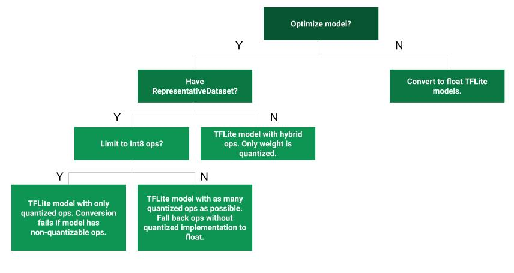

# Post-training quantization

Post-training quantization is a conversion technique that can reduce model size
while also improving CPU and hardware accelerator latency, with little
degradation in model accuracy. You can quantize an already-trained float
TensorFlow model when you convert it to TensorFlow Lite format using the
[TensorFlow Lite Converter](../convert/).

Note: The procedures on this page require TensorFlow 1.15 or higher.

### Optimization Methods

There are several post-training quantization options to choose from. Here is a
summary table of the choices and the benefits they provide:

| Technique            | Benefits                  | Hardware         |
| -------------------- | ------------------------- | ---------------- |
| Dynamic range        | 4x smaller, 2-3x speedup  | CPU              |
: quantization         :                           :                  :
| Full integer         | 4x smaller, 3x+ speedup   | CPU, Edge TPU,   |
: quantization         :                           : Microcontrollers :
| Float16 quantization | 2x smaller, potential GPU | CPU, GPU         |
:                      : acceleration              :                  :

The following decision tree can help determine which post-training quantization
method is best for your use case:

### Dynamic range quantization

The simplest form of post-training quantization statically quantizes only the
weights from floating point to integer, which has 8-bits of precision:

<pre>
import tensorflow as tf
converter = tf.lite.TFLiteConverter.from_saved_model(saved_model_dir)
<b>converter.optimizations = [tf.lite.Optimize.DEFAULT]</b>
tflite_quant_model = converter.convert()
</pre>

At inference, weights are converted from 8-bits of precision to floating point
and computed using floating-point kernels. This conversion is done once and
cached to reduce latency.

To further improve latency, "dynamic-range" operators dynamically quantize
activations based on their range to 8-bits and perform computations with 8-bit
weights and activations. This optimization provides latencies close to fully
fixed-point inference. However, the outputs are still stored using floating
point so that the speedup with dynamic-range ops is less than a full fixed-point
computation. Dynamic-range ops are available for the most compute-intensive
operators in a network:

*   `tf.keras.layers.Dense`
*   `tf.keras.layers.Conv2D`
*   `tf.keras.layers.LSTM`
*   `tf.nn.embedding_lookup`
*   `tf.compat.v1.nn.rnn_cell.BasicRNNCell`
*   `tf.compat.v1.nn.bidirectional_dynamic_rnn`
*   `tf.compat.v1.nn.dynamic_rnn`

### Full integer quantization

You can get further latency improvements, reductions in peak memory usage, and
compatibility with integer only hardware devices or accelerators by making sure
all model math is integer quantized.

For full integer quantization, you need to measure the dynamic range of
activations and inputs by supplying sample input data to the converter. Refer to
the `representative_dataset_gen()` function used in the following code.

#### Integer with float fallback (using default float input/output)

In order to fully integer quantize a model, but use float operators when they
don't have an integer implementation (to ensure conversion occurs smoothly), use
the following steps:

<pre>
import tensorflow as tf
converter = tf.lite.TFLiteConverter.from_saved_model(saved_model_dir)
<b>converter.optimizations = [tf.lite.Optimize.DEFAULT]
def representative_dataset_gen():
  for _ in range(num_calibration_steps):
    # Get sample input data as a numpy array in a method of your choosing.
    yield [input]
converter.representative_dataset = representative_dataset_gen</b>
tflite_quant_model = converter.convert()
</pre>

Note: This `tflite_quant_model` won't be compatible with integer only devices
(such as 8-bit microcontrollers) and accelerators (such as the Coral Edge TPU)
because the input and output still remain float in order to have the same
interface as the original float only model.

#### Integer only

*Creating integer only models is a common use case for
[TensorFlow Lite for Microcontrollers](https://www.tensorflow.org/lite/microcontrollers)
and [Coral Edge TPUs](https://coral.ai/).*

Additionally, to ensure compatibility with integer only devices (such as 8-bit
microcontrollers) and accelerators (such as the Coral Edge TPU), you can enforce
full integer quantization for all ops including the input and output, by using
the following steps:

<pre>
import tensorflow as tf
converter = tf.lite.TFLiteConverter.from_saved_model(saved_model_dir)
converter.optimizations = [tf.lite.Optimize.DEFAULT]
def representative_dataset_gen():
  for _ in range(num_calibration_steps):
    # Get sample input data as a numpy array in a method of your choosing.
    yield [input]
converter.representative_dataset = representative_dataset_gen
<b>converter.target_spec.supported_ops = [tf.lite.OpsSet.TFLITE_BUILTINS_INT8]</b>
<b>converter.inference_input_type = tf.int8</b>  # or tf.uint8
<b>converter.inference_output_type = tf.int8</b>  # or tf.uint8
tflite_quant_model = converter.convert()
</pre>

Note: The converter will throw an error if it encounters an operation it cannot
currently quantize.

### Float16 quantization

You can reduce the size of a floating point model by quantizing the weights to
float16, the IEEE standard for 16-bit floating point numbers. To enable float16
quantization of weights, use the following steps:

<pre>
import tensorflow as tf
converter = tf.lite.TFLiteConverter.from_saved_model(saved_model_dir)
<b>converter.optimizations = [tf.lite.Optimize.DEFAULT]
converter.target_spec.supported_types = [tf.lite.constants.FLOAT16]</b>
tflite_quant_model = converter.convert()
</pre>

The advantages of float16 quantization are as follows:

*   It reduces model size by up to half (since all weights become half of their
    original size).
*   It causes minimal loss in accuracy.
*   It supports some delegates (e.g. the GPU delegate) which can operate
    directly on float16 data, resulting in faster execution than float32
    computations.

The disadvantages of float16 quantization are as follows:

*   It does not reduce latency as much as a quantization to fixed point math.
*   By default, a float16 quantized model will "dequantize" the weights values
    to float32 when run on the CPU. (Note that the GPU delegate will not perform
    this dequantization, since it can operate on float16 data.)

### Model accuracy

Since weights are quantized post training, there could be an accuracy loss,
particularly for smaller networks. Pre-trained fully quantized models are
provided for specific networks in the
[TensorFlow Lite model repository](../models/). It is important to check the
accuracy of the quantized model to verify that any degradation in accuracy is
within acceptable limits. There is a tool to evaluate
[TensorFlow Lite model accuracy](https://github.com/tensorflow/tensorflow/blob/master/tensorflow/lite/tools/accuracy/ilsvrc/README.md){:.external}.

Alternatively, if the accuracy drop is too high, consider using
[quantization aware training](https://www.tensorflow.org/model_optimization/guide/quantization/training)
. However, doing so requires modifications during model training to add fake
quantization nodes, whereas the post-training quantization techniques on this
page use an existing pre-trained model.

### Representation for quantized tensors

8-bit quantization approximates floating point values using the following
formula.

$$real\_value = (int8\_value - zero\_point) \times scale$$

The representation has two main parts:

*   Per-axis (aka per-channel) or per-tensor weights represented by int8 two’s
    complement values in the range [-127, 127] with zero-point equal to 0.

*   Per-tensor activations/inputs represented by int8 two’s complement values in
    the range [-128, 127], with a zero-point in range [-128, 127].

For a detailed view of our quantization scheme, please see our
[quantization spec](./quantization_spec.md). Hardware vendors who want to plug
into TensorFlow Lite's delegate interface are encouraged to implement the
quantization scheme described there.
