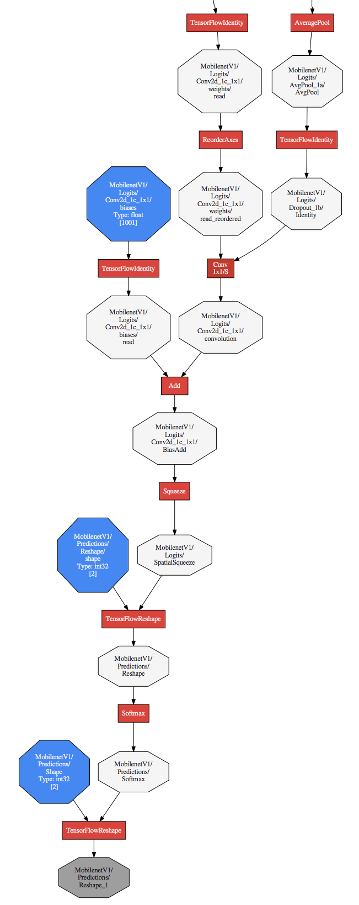
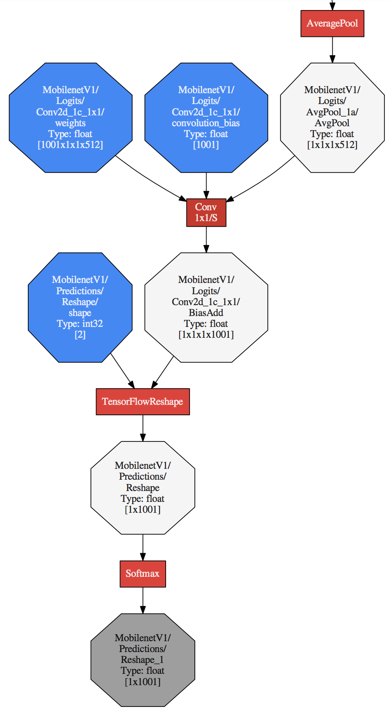

# Converter command line examples

This page shows how to use the TensorFlow Lite Converter in the command line.

_Note: If possible, use the **recommended** [Python API](python_api.md)
instead._

## Command-line tools <a name="tools"></a>

### Starting from TensorFlow 1.9

There are two approaches to running the converter in the command line.

*   `tflite_convert` (**recommended**):
    *   *Install*: TensorFlow using
        [pip](https://www.tensorflow.org/install/pip).
    *   *Example*: `tflite_convert --output_file=...`
*   `bazel`:
    *   *Install*: TensorFlow from
        [source](https://www.tensorflow.org/install/source).
    *   *Example*: `bazel run tensorflow/lite/python:tflite_convert --
        --output_file=...`

*All of the following examples use `tflite_convert` for simplicity.
Alternatively, you can replace '`tflite_convert`' with '`bazel run
tensorflow/lite/python:tflite_convert --`'*

### Prior to TensorFlow 1.9 <a name="pre_tensorflow_1.9"></a>

The recommended approach for using the converter prior to TensorFlow 1.9 is the
[Python API](python_api.md). Only in TensorFlow 1.7, a command line tool `toco`
was available (run `toco --help` for additional details).

## Usage <a name="usage"></a>

### Setup <a name="download_models"></a>

Before we begin, download the models required to run the examples in this
document:

```
echo "Download MobileNet V1"
curl https://storage.googleapis.com/download.tensorflow.org/models/mobilenet_v1_0.50_128_frozen.tgz \
  | tar xzv -C /tmp

echo "Download Inception V1"
curl https://storage.googleapis.com/download.tensorflow.org/models/inception_v1_2016_08_28_frozen.pb.tar.gz \
  | tar xzv -C /tmp
```

### Basic examples <a name="basic"></a>

The following section shows examples of how to convert a basic model from each
of the supported data formats into a TensorFlow Lite model.

#### Convert a SavedModel <a name="savedmodel"></a>

```
tflite_convert \
  --saved_model_dir=/tmp/saved_model \
  --output_file=/tmp/foo.tflite
```

#### Convert a tf.keras model <a name="keras"></a>

```
tflite_convert \
  --keras_model_file=/tmp/keras_model.h5 \
  --output_file=/tmp/foo.tflite
```

#### Convert a Frozen GraphDef <a name="graphdef"></a>

```
tflite_convert \
  --graph_def_file=/tmp/mobilenet_v1_0.50_128/frozen_graph.pb \
  --output_file=/tmp/foo.tflite \
  --input_arrays=input \
  --output_arrays=MobilenetV1/Predictions/Reshape_1
```

Frozen GraphDef models (or frozen graphs) are produced by
[freeze_graph.py](https://github.com/tensorflow/tensorflow/blob/master/tensorflow/python/tools/freeze_graph.py)
and require additional flags `--input_arrays` and `--output_arrays` as this
information is not stored in the model format.

### Advanced examples

#### Convert a quantization aware trained model into a quantized TensorFlow Lite model

If you have a quantization aware trained model (i.e, a model inserted with
`FakeQuant*` operations which record the (min, max) ranges of tensors in order
to quantize them), then convert it into a quantized TensorFlow Lite model as
shown below:

```
tflite_convert \
  --graph_def_file=/tmp/some_mobilenetv1_quantized_frozen_graph.pb \
  --output_file=/tmp/foo.tflite \
  --input_arrays=input \
  --output_arrays=MobilenetV1/Predictions/Reshape_1 \
  --inference_type=INT8 \
  --mean_values=-0.5 \
  --std_dev_values=127.7
```

*If you're setting `--inference_type=UINT8` then update `--mean_values=128` and
`--std_dev_values=127`*

#### Convert a model with \"dummy-quantization\" into a quantized TensorFlow Lite model

If you have a regular float model and only want to estimate the benefit of a
quantized model, i.e, estimate the performance of the model as if it were
quantized aware trained, then perform "dummy-quantization" using the flags
`--default_ranges_min` and `--default_ranges_max`. When specified, they will be
used as default (min, max) range for all the tensors that lack (min, max) range
information. This will allow quantization to proceed and help you emulate the
performance of a quantized TensorFlow Lite model but it will have a lower
accuracy.

The example below contains a model using Relu6 activation functions. Therefore,
a reasonable guess is that most activation ranges should be contained in [0, 6].

```
tflite_convert \
  --graph_def_file=/tmp/mobilenet_v1_0.50_128/frozen_graph.pb \
  --output_file=/tmp/foo.tflite \
  --input_arrays=input \
  --output_arrays=MobilenetV1/Predictions/Reshape_1 \
  --inference_type=INT8 \
  --mean_values=-0.5 \
  --std_dev_values=127.7 \
  --default_ranges_min=0 \
  --default_ranges_max=6
```

*If you're setting `--inference_type=UINT8` then update `--mean_values=128` and
`--std_dev_values=127`*

#### Convert a model with select TensorFlow operators.

Since TensorFlow Lite only supports a limited number of TensorFlow operators,
not every model is convertible. For details, refer to
[operator compatibility](https://www.tensorflow.org/lite/guide/ops_compatibility).
To allow conversion, users can enable the usage of
[certain TensorFlow ops](https://github.com/tensorflow/tensorflow/blob/master/tensorflow/lite/delegates/flex/allowlisted_flex_ops.cc)
in their TensorFlow Lite model, as shown in the following example.

```
tflite_convert \
  --graph_def_file=/tmp/foo.pb \
  --output_file=/tmp/foo.tflite \
  --input_arrays=input \
  --output_arrays=MobilenetV1/Predictions/Reshape_1 \
  --target_ops=TFLITE_BUILTINS,SELECT_TF_OPS
```

When building and running `tflite_convert` with `bazel`, please pass
`--define=tflite_convert_with_select_tf_ops=true` as an additional argument.

```
bazel run --define=tflite_convert_with_select_tf_ops=true tflite_convert -- \
  --graph_def_file=/tmp/foo.pb \
  --output_file=/tmp/foo.tflite \
  --input_arrays=input \
  --output_arrays=MobilenetV1/Predictions/Reshape_1 \
  --target_ops=TFLITE_BUILTINS,SELECT_TF_OPS
```

#### Convert a model with multiple input arrays

The flag `input_arrays` takes in a comma-separated list of input arrays as seen
in the example below. This is useful for models or subgraphs with multiple
inputs. Note that `--input_shapes` is provided as a colon-separated list. Each
input shape corresponds to the input array at the same position in the
respective list.

```
tflite_convert \
  --graph_def_file=/tmp/inception_v1_2016_08_28_frozen.pb \
  --output_file=/tmp/foo.tflite \
  --input_arrays=InceptionV1/InceptionV1/Mixed_3b/Branch_1/Conv2d_0a_1x1/Relu,InceptionV1/InceptionV1/Mixed_3b/Branch_2/Conv2d_0a_1x1/Relu,InceptionV1/InceptionV1/Mixed_3b/Branch_3/MaxPool_0a_3x3/MaxPool,InceptionV1/InceptionV1/Mixed_3b/Branch_0/Conv2d_0a_1x1/Relu \
  --input_shapes=1,28,28,96:1,28,28,16:1,28,28,192:1,28,28,64 \
  --output_arrays=InceptionV1/Logits/Predictions/Reshape_1
```

#### Convert a model with multiple output arrays

The flag `--output_arrays` takes in a comma-separated list of output arrays as
seen in the example below. This is useful for models or subgraphs with multiple
outputs.

```
tflite_convert \
  --graph_def_file=/tmp/inception_v1_2016_08_28_frozen.pb \
  --output_file=/tmp/foo.tflite \
  --input_arrays=input \
  --output_arrays=InceptionV1/InceptionV1/Mixed_3b/Branch_1/Conv2d_0a_1x1/Relu,InceptionV1/InceptionV1/Mixed_3b/Branch_2/Conv2d_0a_1x1/Relu
```

### Convert a model by specifying subgraphs

Any array in the input file can be specified as an input or output array in
order to extract subgraphs out of an input model file. The TensorFlow Lite
Converter discards the parts of the model outside of the specific subgraph. Use
[visualization](#visualization) to identify the input and output arrays that
make up the desired subgraph.

The follow command shows how to extract a single fused layer out of a TensorFlow
GraphDef.

```
tflite_convert \
  --graph_def_file=/tmp/inception_v1_2016_08_28_frozen.pb \
  --output_file=/tmp/foo.pb \
  --input_arrays=InceptionV1/InceptionV1/Mixed_3b/Branch_1/Conv2d_0a_1x1/Relu,InceptionV1/InceptionV1/Mixed_3b/Branch_2/Conv2d_0a_1x1/Relu,InceptionV1/InceptionV1/Mixed_3b/Branch_3/MaxPool_0a_3x3/MaxPool,InceptionV1/InceptionV1/Mixed_3b/Branch_0/Conv2d_0a_1x1/Relu \
  --input_shapes=1,28,28,96:1,28,28,16:1,28,28,192:1,28,28,64 \
  --output_arrays=InceptionV1/InceptionV1/Mixed_3b/concat_v2
```

Note that the final representation in TensorFlow Lite models tends to have
coarser granularity than the very fine granularity of the TensorFlow GraphDef
representation. For example, while a fully-connected layer is typically
represented as at least four separate operations in TensorFlow GraphDef
(Reshape, MatMul, BiasAdd, Relu...), it is typically represented as a single
"fused" op (FullyConnected) in the converter's optimized representation and in
the final on-device representation. As the level of granularity gets coarser,
some intermediate arrays (say, the array between the MatMul and the BiasAdd in
the TensorFlow GraphDef) are dropped.

When specifying intermediate arrays as `--input_arrays` and `--output_arrays`,
it is desirable (and often required) to specify arrays that are meant to survive
in the final form of the model, after fusing. These are typically the outputs of
activation functions (since everything in each layer until the activation
function tends to get fused).

## Visualization <a name="visualization"></a>

### Using `--dump_graphviz_dir`

The first way to get a Graphviz rendering is to pass the `--dump_graphviz_dir`
flag, specifying a destination directory to dump Graphviz rendering to.

```
tflite_convert \
  --graph_def_file=/tmp/mobilenet_v1_0.50_128/frozen_graph.pb \
  --output_file=/tmp/foo.tflite \
  --input_arrays=input \
  --output_arrays=MobilenetV1/Predictions/Reshape_1 \
  --dump_graphviz_dir=/tmp
```

This generates a few files in the destination directory. The two most important
files are `toco_AT_IMPORT.dot` and `/tmp/toco_AFTER_TRANSFORMATIONS.dot`.

-   `toco_AT_IMPORT.dot` represents the original model containing only the
    transformations done at import time. This tends to be a complex
    visualization with limited information about each node. It is useful in
    situations where a conversion command fails.

-   `toco_AFTER_TRANSFORMATIONS.dot` represents the model after all
    transformations were applied to it, just before it is exported. Typically,
    this is a much smaller model with more information about each node.

These can be rendered to PDFs:

```
dot -Tpdf /tmp/toco_*.dot -O
```

And the resulting `.dot.pdf` can be viewed in any PDF viewer, but we suggest one
with a good ability to pan and zoom across a very large page. Google Chrome does
well in that respect.

```
google-chrome /tmp/foo.dot.pdf
```

Sample output files can be seen here below. Note that it is the same
`AveragePool` node in the top right of each image.

<table><tr>
  <td>
    <a target="_blank" href="https://storage.googleapis.com/download.tensorflow.org/example_images/toco_AT_IMPORT.dot.pdf">
      
    </a>
  </td>
  <td>
    <a target="_blank" href="https://storage.googleapis.com/download.tensorflow.org/example_images/toco_AFTER_TRANSFORMATIONS.dot.pdf">
      
    </a>
  </td>
</tr>
<tr><td>before</td><td>after</td></tr>
</table>

### Using `--output_format=GRAPHVIZ_DOT` <a name="using_output_format_graphviz_dot"></a>

*Note: This only works when you set flag `experimental_new_converter=False`.
Also, as this format leads to loss of TFLite specific transformations, we
recommend that you use `--dump_graphviz_dir` instead to get a final
visualization with all graph transformations.*

The second way to get a Graphviz rendering is to pass `GRAPHVIZ_DOT` into
`--output_format`. This results in a plausible visualization of the model. This
reduces the requirements that exist during conversion from a TensorFlow GraphDef
to a TensorFlow Lite model. This may be useful if the conversion to TFLite is
failing.

```
tflite_convert \
  --experimental_new_converter=False
  --graph_def_file=/tmp/mobilenet_v1_0.50_128/frozen_graph.pb \
  --output_format=GRAPHVIZ_DOT \
  --output_file=/tmp/foo.dot \
  --output_format=GRAPHVIZ_DOT \
  --input_arrays=input \
  --input_shape=1,128,128,3 \
  --output_arrays=MobilenetV1/Predictions/Reshape_1

```

The resulting `.dot` file can be rendered into a PDF as follows:

```
dot -Tpdf /tmp/foo.dot -O
```

And the resulting `.dot.pdf` can be viewed in any PDF viewer, but we suggest one
with a good ability to pan and zoom across a very large page. Google Chrome does
well in that respect.

```
google-chrome /tmp/foo.dot.pdf
```

### Video logging

When `--dump_graphviz_dir` is used, one may additionally pass
`--dump_graphviz_video`. This causes a model visualization to be dumped after
each individual model transformation, resulting in thousands of files.
Typically, one would then bisect into these files to understand when a given
change was introduced in the model.

### Legend for the Visualizations <a name="graphviz_legend"></a>

*   Operators are red square boxes with the following hues of red:
    *   Most operators are
        <span style="background-color:#db4437;color:white;border:1px;border-style:solid;border-color:black;padding:1px">bright
        red</span>.
    *   Some typically heavy operators (e.g. Conv) are rendered in a
        <span style="background-color:#c53929;color:white;border:1px;border-style:solid;border-color:black;padding:1px">darker
        red</span>.
*   Arrays are octagons with the following colors:
    *   Constant arrays are
        <span style="background-color:#4285f4;color:white;border:1px;border-style:solid;border-color:black;padding:1px">blue</span>.
    *   Activation arrays are gray:
        *   Internal (intermediate) activation arrays are
            <span style="background-color:#f5f5f5;border:1px;border-style:solid;border-color:black;border:1px;border-style:solid;border-color:black;padding:1px">light
            gray</span>.
        *   Those activation arrays that are designated as `--input_arrays` or
            `--output_arrays` are
            <span style="background-color:#9e9e9e;border:1px;border-style:solid;border-color:black;padding:1px">dark
            gray</span>.
    *   RNN state arrays are green. Because of the way that the converter
        represents RNN back-edges explicitly, each RNN state is represented by a
        pair of green arrays:
        *   The activation array that is the source of the RNN back-edge (i.e.
            whose contents are copied into the RNN state array after having been
            computed) is
            <span style="background-color:#b7e1cd;border:1px;border-style:solid;border-color:black;padding:1px">light
            green</span>.
        *   The actual RNN state array is
            <span style="background-color:#0f9d58;color:white;border:1px;border-style:solid;border-color:black;padding:1px">dark
            green</span>. It is the destination of the RNN back-edge updating
            it.
