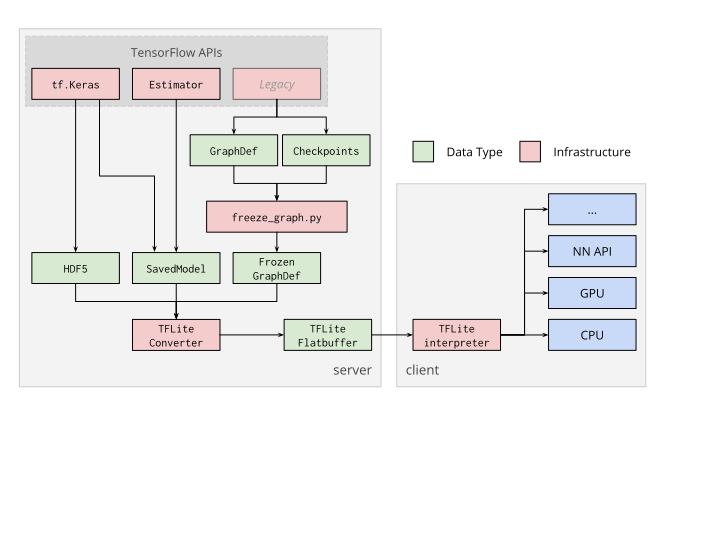

# TensorFlow Lite converter

The TensorFlow Lite converter takes a TensorFlow model and generates a
TensorFlow Lite model, which is an optimized
[FlatBuffer](https://google.github.io/flatbuffers/) (identified by the `.tflite`
file extension).

Note: This page contains documentation on the converter API for TensorFlow 1.x.
The API for TensorFlow 2.0 is available
[here](https://www.tensorflow.org/lite/models/convert).

## Options

The TensorFlow Lite Converter can be used in two ways:

*   [Python API](python_api.md) (**recommended**): Using the Python API makes it
    easier to convert models as part of a model development pipeline and helps
    mitigate compatibility issues early on.
*   [Command line](cmdline_examples.md)

## Workflow

### Why use the 'FlatBuffer' format?

FlatBuffer is an efficient open-source cross-platform serialization library. It
is similar to [protocol buffers](https://developers.google.com/protocol-buffers)
used in the TensorFlow model format, with the distinction that FlatBuffers do
not need a parsing/unpacking step to a secondary representation before data can
be accessed, avoiding per-object memory allocation. The code footprint of
FlatBuffers is an order of magnitude smaller than protocol buffers.

### Convert the model

The converter supports the following input formats:

*   [SavedModels](https://www.tensorflow.org/guide/saved_model)
*   `tf.keras` H5 models.
*   Frozen `GraphDef` models generated using
    [freeze_graph.py](https://www.tensorflow.org/code/tensorflow/python/tools/freeze_graph.py).
*   `tf.Session` models (Python API only).

### Run inference

The TensorFlow Lite model is then deployed to a client device, and the
TensorFlow Lite interpreter uses the compressed model for on-device inference.
This conversion process is shown in the diagram below:

