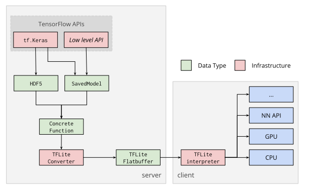

# TensorFlow Lite converter

The TensorFlow Lite converter takes a TensorFlow model represented as a
[concrete function](concrete_function.md), and generates a TensorFlow Lite
[`FlatBuffer`](https://google.github.io/flatbuffers/) file (`.tflite`).

Note: This page contains documentation on the converter API for TensorFlow 2.0.
The API for TensorFlow 1.X is available
[here](https://www.tensorflow.org/lite/convert/).

## Device deployment

The TensorFlow Lite `FlatBuffer` file is then deployed to a client device (e.g.
mobile, embedded) and run locally using the TensorFlow Lite interpreter. This
conversion process is shown in the diagram below:

## Converting models

The TensorFlow Lite converter can be used from the [Python API](python_api.md).
Using the Python API makes it easier to convert models as part of a model
development pipeline and helps mitigate
[compatibility](../../guide/ops_compatibility.md) issues early on.
