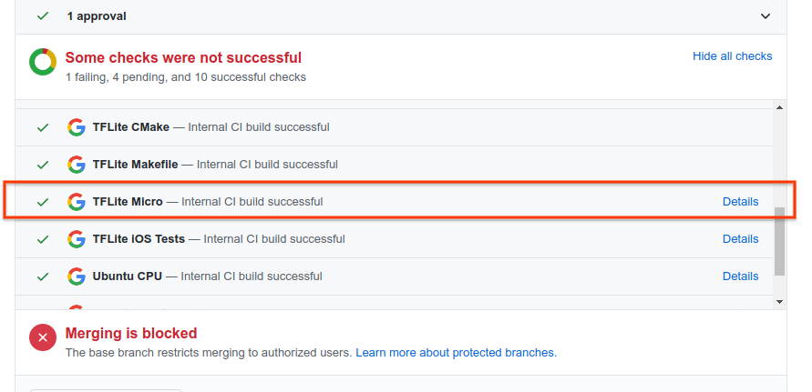

<!-- mdformat off(b/169948621#comment2) -->

<!--
Semi-automated TOC generation with instructions from
https://github.com/ekalinin/github-markdown-toc#auto-insert-and-update-toc
-->

<!--ts-->
   * [Contributing Guidelines](#contributing-guidelines)
      * [General Pull Request Guidelines](#general-pull-request-guidelines)
      * [Guidelines for Specific Contribution Categories](#guidelines-for-specific-contribution-categories)
         * [Bug Fixes](#bug-fixes)
         * [Reference Kernel Implementations](#reference-kernel-implementations)
         * [Optimized Kernel Implementations](#optimized-kernel-implementations)
         * [New Target / Platform / IDE / Examples](#new-target--platform--ide--examples)
         * [New Features](#new-features)
   * [Development Workflow Notes](#development-workflow-notes)
      * [Initial Setup](#initial-setup)
      * [Before submitting your PR](#before-submitting-your-pr)
      * [During the PR review](#during-the-pr-review)
      * [Reviewer notes](#reviewer-notes)
      * [Python notes](#python-notes)
   * [Continuous Integration System](#continuous-integration-system)

<!-- Added by: advaitjain, at: Wed 27 Jan 2021 02:25:07 PM PST -->

<!--te-->

# Contributing Guidelines

We look forward to your contributions to the TensorFlow Lite Micro codebase and
provide guidelines with the goal of enabling community contributions while still
maintaining code health, maintainability, and consistency in style.

Please note that while these guidelines may seem onerous to some developers,
they are derived from Google's software engineering best practices.

Before we describe project-specific guidelines, we recommend that external
contributors read these tips from the Google Testing Blog:

*   [Code Health: Providing Context with Commit Messages and Bug Reports](https://testing.googleblog.com/2017/09/code-health-providing-context-with.html)
*   [Code Health: Understanding Code In Review](https://testing.googleblog.com/2018/05/code-health-understanding-code-in-review.html)
*   [Code Health: Too Many Comments on Your Code Reviews?](https://testing.googleblog.com/2017/06/code-health-too-many-comments-on-your.html)
*   [Code Health: To Comment or Not to Comment?](https://testing.googleblog.com/2017/07/code-health-to-comment-or-not-to-comment.html)

We also recommend that contributors take a look at the
[Tensorflow Contributing Guidelines](https://github.com/tensorflow/tensorflow/blob/master/CONTRIBUTING.md).

## General Pull Request Guidelines

We strongly recommend that contributors:

1.  Initiate a conversation with the TFLM team via a
    [TF Lite Micro Github issue](https://github.com/tensorflow/tensorflow/issues/new?labels=comp%3Amicro&template=70-tflite-micro-issue.md)
    as early as possible.

    *   This enables us to give guidance on how to proceed, prevent duplicated
        effort and also point to alternatives as well as context if we are not
        able to accept a particular contribution at a given time.

    *   Ideally, you should make an issue ***before*** starting to work on a
        pull request and provide context on both what you want to contribute and
        why.

1.  Once step 1. is complete and it is determined that a PR from an external
    contributor is the way to go, please follow these guidelines from
    [Google's Engineering Practices documentation](https://google.github.io/eng-practices/):

    *   [Send Small Pull Requests](https://google.github.io/eng-practices/review/developer/small-cls.html)

        *   If a pull request is doing more than one thing, the reviewer will
            request that it be broken up into two or more PRs.

    *   [Write Good Pull Request Descriptions](https://google.github.io/eng-practices/review/developer/cl-descriptions.html)

        *   We require that all PR descriptions link to the github issue created
            in step 1.

        *   While github offers flexibility in linking
            [commits and issues](https://github.blog/2011-04-09-issues-2-0-the-next-generation/#commits-issues),
            we require that the PR description have a separate line with either
            `Fixes #nn` (if the PR fixes the issue) or `Issue #nn` if the PR
            addresses some aspect of an issue without fixing it.

        *   We will be adding internal checks that automate this requirement by
            matching the PR description to the regexp: `(Fixes|Issue) #`

1.  Unit tests are critical to a healthy codebase. PRs without tests should be
    the exception rather than the norm. And contributions to improve, simplify,
    or make the unit tests more exhaustive are welcome! Please refer to
    [this guideline](https://google.github.io/eng-practices/review/developer/small-cls.html#test_code)
    on how test code and writing small PRs should be reconciled.

## Guidelines for Specific Contribution Categories

We provide some additional guidelines for different categories of contributions.

### Bug Fixes

Pull requests that fix bugs are always welcome and often uncontroversial, unless
there is a conflict between different requirements from the platform, or if
fixing a bug needs a bigger architectural change.

1.  Create a
    [TF Lite Micro Github issue](https://github.com/tensorflow/tensorflow/issues/new?labels=comp%3Amicro&template=70-tflite-micro-issue.md)
    to determine the scope of the bug fix.
1.  Send a PR (if that is determined to be the best path forward).
1.  Bugfix PRs should be accompanied by a test case that fails prior to the fix
    and passes with the fix. This validates that the fix works as expected, and
    helps prevent future regressions.

### Reference Kernel Implementations

Pull requests that port reference kernels from TF Lite Mobile to TF Lite Micro
are welcome once we have enough context from the contributor on why the
additional kernel is needed.

1.  Please create a
    [TF Lite Micro Github issue](https://github.com/tensorflow/tensorflow/issues/new?labels=comp%3Amicro&template=70-tflite-micro-issue.md)
    before starting on any such PRs with as much context as possible, such as:

    *   What is the model architecture?
    *   What is the application that you are targetting?
    *   What embedded target(s) are you planning to run on?
    *   Motivate your use-case and the need for adding support for this
        additional OP.

1.  In the interest of having
    [small pull requests](https://google.github.io/eng-practices/review/developer/small-cls.html),
    limit each pull request to porting a single kernel (and the corresponding
    test).

1.  TODO(b/165627437): Create and link to a guide to porting reference ops.

### Optimized Kernel Implementations

In order to have the TFLM codebase be a central repository of optimized kernel
implementations, we would like to make some improvements to the current
infrastructure to enable adding and maintaining optimized kernel implementations
in a scalable way.

Until that work is complete, we are requesting a ***pause*** on contributions that
add new optimized kernel implementations. We plan to make these improvements by
October 2020 and will provide additional guidelines at that time.

*   If you would like to have an exception to this pause, with the understanding
    that your optimized kernels will break as we improve the underlying
    framework, then please send an email to the [SIG Micro email
    group](https://groups.google.com/a/tensorflow.org/g/micro) to figure out
    a middle ground.

*   Every optimized kernel directory must have a README.md with the github IDs
    of the maintainers and any other relevant documentation. PRs that add
    maintainers to the existing optimized kernels are always welcome.

### New Target / Platform / IDE / Examples

As discussed in the
[SIG-micro Aug 12, 2020 meeting](http://doc/1YHq9rmhrOUdcZnrEnVCWvd87s2wQbq4z17HbeRl-DBc),
we are currently ***pausing*** accepting pull requests that add new targets,
platforms, IDE integration or examples while we revisit some of the
infrastructure to enable us to make this process easier and more scalable.

In the meantime, snapshotting and/or forking the tensorflow repo could be a
viable way to prototype platform support.

Having said that, we still invite
[TF Lite Micro Github issues](https://github.com/tensorflow/tensorflow/issues/new?labels=comp%3Amicro&template=70-tflite-micro-issue.md)
on this topic as we would like to enable such integration in the future.

### New Features

As discussed in the
[SIG-micro Aug 12, 2020 meeting](http://doc/1YHq9rmhrOUdcZnrEnVCWvd87s2wQbq4z17HbeRl-DBc),
we are currently ***pausing*** accepting pull requests that add new features while
we revisit some of the infrastructure to enable us to make this process easier
and more scalable.

Having said that, we still invite feature requests via
[TF Lite Micro Github issues](https://github.com/tensorflow/tensorflow/issues/new?labels=comp%3Amicro&template=70-tflite-micro-issue.md)
to determine if the requested feature aligns with the TFLM roadmap.

# Development Workflow Notes

## Initial Setup

Below are some tips that might be useful and improve the development experience.

* Add the [Refined GitHub](https://github.com/sindresorhus/refined-github)
  plugin to make the github experience even better.

* Code search the [TfLite Micro codebase](https://sourcegraph.com/github.com/tensorflow/tensorflow@master/-/tree/tensorflow/lite/micro)
  on Sourcegraph. And optionally install the [plugin that enables GitHub integration](https://docs.sourcegraph.com/integration/github#github-integration-with-sourcegraph).

* Install [bazel](https://github.com/tensorflow/tensorflow/blob/master/tensorflow/tools/ci_build/install/install_bazel.sh) and [buildifier](https://github.com/tensorflow/tensorflow/blob/master/tensorflow/tools/ci_build/install/install_buildifier.sh).

* Install the latest clang and clang-format. For example,
  [here](https://github.com/tensorflow/tensorflow/blob/master/tensorflow/tools/ci_build/Dockerfile.micro)
  is the  what we do for the TFLM continuous integration Docker container.

* Get a copy of [cpplint](https://github.com/google/styleguide/tree/gh-pages/cpplint)

* Add a git hook to check for code style etc. prior to creating a pull request:
  ```
  cp tensorflow/lite/micro/tools/dev_setup/pre-push.tflm .git/hooks/pre-push
  ```

## Before submitting your PR

1.  Run in-place clang-format on all the files that are modified in your git
    tree with

    ```
    clang-format -i -style=google `git ls-files -m | grep "\.cc"`
    clang-format -i -style=google `git ls-files -m | grep "\.h"`
    ```

1.  Make sure your code is lint-free.

    ```
    cpplint.py `git ls-files -m`
    ```

1.  Run all the tests for x86, and any other platform that you are modifying.

    ```
    tensorflow/lite/micro/tools/ci_build/test_x86.sh
    ```

    Please check the READMEs in the optimized kernel directories for specific
    instructions.

1.  Sometimes, bugs are caught by the sanitizers that can go unnoticed
    via the Makefile. To run a test with the different sanitizers, use the
    following commands (replace `micro_interpreter_test` with the target that you
    want to test:

    ```
    CC=clang bazel run --config=asan tensorflow/lite/micro:micro_interpreter_test
    CC=clang bazel run --config=msan tensorflow/lite/micro:micro_interpreter_test
    CC=clang bazel run --config=ubsan tensorflow/lite/micro:micro_interpreter_test
    ```

## During the PR review

1.  Do not change the git version history.

    *   Always merge upstream/master (***do not rebase***) and no force-pushes
        please.

    *   Having an extra merge commit it ok as the github review tool handles
        that gracefully.

    Assuming that you forked tensorflow and added a remote called upstream with:

    `git remote add upstream https://github.com/tensorflow/tensorflow.git`

    Fetch the latest changes from upstream and merge into your local branch.

    ```
    git fetch upstream
    git merge upstream/master
    ```

    In case of a merge conflict, resolve via:

    ```
    git mergetool

    # Use your favorite diff tools (e.g. meld) to resolve the conflicts.

    git add <files that were manually resolved>

    git commit
    ```

1.  If a force push seems to be the only path forward, please stop and let your
    PR reviewer know ***before*** force pushing. We will attempt to do the merge
    for you. This will also help us better understand in what conditions a
    force-push may be unavoidable.

## Reviewer notes

*   [GIthub CLI](https://cli.github.com) can be useful to quickly checkout a PR
    to test locally.

    `gh pr checkout <PR number>`

*   Google engineers on the Tensorflow team will have the permissions to push
    edits to most PRs. This can be useful to make some small fixes as a result
    of errors due to internal checks that are not easily reproducible via
    github.

    One example of this is
    [this comment](https://github.com/tensorflow/tensorflow/pull/38634#issuecomment-683190474).

    And a sketch of the steps:

    ```
    git remote add <remote_name> git@github.com:<PR author>/tensorflow.git
    git fetch <remote_name>

    git checkout -b <local-branch-name> <remote_name>/<PR branch name>

    # make changes and commit to local branch

    # push changes to remove branch

    git push <remote_name> <PR branch name>

    # remove the temp remote to clean up your git environment.

    git remote rm <remote_name>
    ```

## Python notes

Most PRs for TensorFlow Lite Micro will be C++ only. Adding some notes on Python
that can be expanded and improved as necessary.

*   [TensorFlow guide](https://www.tensorflow.org/community/contribute/code_style#python_style)
    for Python development

*   [yapf](https://github.com/google/yapf/) should be used for formatting.

    ```
    yapf log_parser.py -i --style='{based_on_style: pep8, indent_width: 2}'
    ```

# Continuous Integration System

*   As a contributor, please make sure that the TfLite Micro build is green.
    You can click on the details link to see what the errors are:

[](https://storage.googleapis.com/tensorflow-kokoro-build-badges/tflite-micro.html)

*   Tests that are run as part of the CI are with the
    [micro/tools/ci_build/test_all.sh](https://github.com/tensorflow/tensorflow/blob/master/tensorflow/lite/micro/tools/ci_build/test_all.sh)
    script when run with the `GITHUB_PRESUBMIT` command line parameter:
    ```
    tensorflow/lite/micro/tools/ci_build/test_all.sh GITHUB_PRESUBMIT
    ```

*   If an error is not reproducible on your development machine, you can
    recreate the docker container that is used on the CI servers.

      * First, create a build a TFLM docker image with:
        ```
        tensorflow/tools/ci_build/ci_build.sh micro bash
        ```
        The second parameter to the ci_build.sh script is not important. It can
        be any command.

      * Next, mount the tensorflow repo on your machine to the docker container.
        Please be careful (or make a separate clone of tensorflow) since any
        changes docker container will also be reflected in the directory in the
        host machine.
        ```
        docker run -v `pwd`:/tensorflow -it tf_ci.micro bash
        # cd tensorflow
        ```

      * If you would prefer to not mount your local folder on the docker image,
        you can also simply download the branch:
        ```
        docker run -it tf_ci.micro bash
        # wget https://github.com/<github-username>/tensorflow/archive/<git-branch>.zip
        # unzip <git-branch>.zip
        # cd tensorflow-<git-branch>
        ```

      * Within the docker container, you can now run the TFLM test script, or
        any other command that you would like to test. For example, the following
        commands will run all of the TFLM checks:
        ```
        # tensorflow/lite/micro/tools/ci_build/test_all.sh GITHUB_PRESUBMIT
        ```

