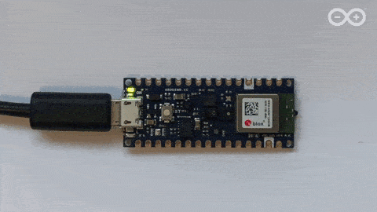

<!-- mdformat off(b/169948621#comment2) -->

# Micro Speech Example

This example shows how to run a 20 kB model that can recognize 2 keywords,
"yes" and "no", from speech data.

The application listens to its surroundings with a microphone and indicates
when it has detected a word by lighting an LED or displaying data on a
screen, depending on the capabilities of the device.



The code has a small footprint (for example, around 22 kilobytes on a Cortex
M3) and only uses about 10 kilobytes of RAM for working memory, so it's able to
run on systems like an STM32F103 with only 20 kilobytes of total SRAM and 64
kilobytes of Flash.

## Table of contents

-   [Deploy to ARC EM SDP](#deploy-to-arc-em-sdp)
-   [Deploy to Arduino](#deploy-to-arduino)
-   [Deploy to ESP32](#deploy-to-esp32)
-   [Deploy to SparkFun Edge](#deploy-to-sparkfun-edge)
-   [Deploy to STM32F746](#deploy-to-STM32F746)
-   [Deploy to NXP FRDM K66F](#deploy-to-nxp-frdm-k66f)
-   [Deploy to HIMAX WE1 EVB](#deploy-to-himax-we1-evb)
-   [Deploy to CEVA-BX1](#deploy-to-ceva-bx1)
-   [Run on macOS](#run-on-macos)
-   [Run the tests on a development machine](#run-the-tests-on-a-development-machine)
-   [Train your own model](#train-your-own-model)

## Deploy to ARC EM SDP

The following instructions will help you to build and deploy this example to
[ARC EM SDP](https://www.synopsys.com/dw/ipdir.php?ds=arc-em-software-development-platform)
board. General information and instructions on using the board with TensorFlow
Lite Micro can be found in the common
[ARC targets description](/tensorflow/lite/micro/tools/make/targets/arc/README.md).

This example uses asymmetric int8 quantization and can therefore leverage
optimized int8 kernels from the embARC MLI library

The ARC EM SDP board contains a rich set of extension interfaces. You can choose
any compatible microphone and modify
[audio_provider.cc](/tensorflow/lite/micro/examples/micro_speech/audio_provider.cc)
file accordingly to use input from your specific microphone. By default, results
of running this example are printed to the console. If you would like to instead
implement some target-specific actions, you need to modify
[command_responder.cc](/tensorflow/lite/micro/examples/micro_speech/command_responder.cc)
accordingly.

The reference implementations of these files are used by default on the EM SDP.

### Initial setup

Follow the instructions on the
[ARC EM SDP Initial Setup](/tensorflow/lite/micro/tools/make/targets/arc/README.md#ARC-EM-Software-Development-Platform-ARC-EM-SDP)
to get and install all required tools for work with ARC EM SDP.

### Generate Example Project

As default example doesn’t provide any output without real audio, it is
recommended to get started with example for mock data. The project for ARC EM
SDP platform can be generated with the following command:

```
make -f tensorflow/lite/micro/tools/make/Makefile \
TARGET=arc_emsdp TAGS=reduce_codesize  \
generate_micro_speech_mock_make_project
```

Note that `TAGS=reduce_codesize` applies example specific changes of code to
reduce total size of application. It can be omitted.

### Build and Run Example

For more detailed information on building and running examples see the
appropriate sections of general descriptions of the
[ARC EM SDP usage with TFLM](/tensorflow/lite/micro/tools/make/targets/arc/README.md#ARC-EM-Software-Development-Platform-ARC-EM-SDP).
In the directory with generated project you can also find a
*README_ARC_EMSDP.md* file with instructions and options on building and
running. Here we only briefly mention main steps which are typically enough to
get it started.

1.  You need to
    [connect the board](/tensorflow/lite/micro/tools/make/targets/arc/README.md#connect-the-board)
    and open an serial connection.

2.  Go to the generated example project director

    ```
    cd tensorflow/lite/micro/tools/make/gen/arc_emsdp_arc/prj/micro_speech_mock/make
    ```

3.  Build the example using

    ```
    make app
    ```

4.  To generate artefacts for self-boot of example from the board use

    ```
    make flash
    ```

5.  To run application from the board using microSD card:

    *   Copy the content of the created /bin folder into the root of microSD
        card. Note that the card must be formatted as FAT32 with default cluster
        size (but less than 32 Kbytes)
    *   Plug in the microSD card into the J11 connector.
    *   Push the RST button. If a red LED is lit beside RST button, push the CFG
        button.
    *   Type or copy next commands one-by-another into serial terminal: `setenv
        loadaddr 0x10800000 setenv bootfile app.elf setenv bootdelay 1 setenv
        bootcmd fatload mmc 0 \$\{loadaddr\} \$\{bootfile\} \&\& bootelf
        saveenv`
    *   Push the RST button.

6.  If you have the MetaWare Debugger installed in your environment:

    *   To run application from the console using it type `make run`.
    *   To stop the execution type `Ctrl+C` in the console several times.

In both cases (step 5 and 6) you will see the application output in the serial
terminal.

## Deploy to Arduino

The following instructions will help you build and deploy this example to
[Arduino](https://www.arduino.cc/) devices.

The example has been tested with the following devices:

- [Arduino Nano 33 BLE Sense](https://store.arduino.cc/usa/nano-33-ble-sense-with-headers)

The Arduino Nano 33 BLE Sense is currently the only Arduino with a built-in
microphone. If you're using a different Arduino board and attaching your own
microphone, you'll need to implement your own +audio_provider.cc+. It also has a
built-in LED, which is used to indicate that a word has been recognized.

### Install the Arduino_TensorFlowLite library

This example application is included as part of the official TensorFlow Lite
Arduino library. To install it, open the Arduino library manager in
`Tools -> Manage Libraries...` and search for `Arduino_TensorFlowLite`.

### Load and run the example

Once the library has been added, go to `File -> Examples`. You should see an
example near the bottom of the list named `TensorFlowLite:micro_speech`. Select
it and click `micro_speech` to load the example.

Use the Arduino IDE to build and upload the example. Once it is running, you
should see the built-in LED on your device flashing. Saying the word "yes" will
cause the LED to remain on for 3 seconds. The current model has fairly low
accuracy, so you may have to repeat "yes" a few times.

The program also outputs inference results to the serial port, which appear as
follows:

```
Heard yes (201) @4056ms
Heard no (205) @6448ms
Heard unknown (201) @13696ms
Heard yes (205) @15000ms
```

The number after each detected word is its score. By default, the program only
considers matches as valid if their score is over 200, so all of the scores you
see will be at least 200.

When the program is run, it waits 5 seconds for a USB-serial connection to be
available. If there is no connection available, it will not output data. To see
the serial output in the Arduino desktop IDE, do the following:

1. Open the Arduino IDE
1. Connect the Arduino board to your computer via USB
1. Press the reset button on the Arduino board
1. Within 5 seconds, go to `Tools -> Serial Monitor` in the Arduino IDE. You may
   have to try several times, since the board will take a moment to connect.

If you don't see any output, repeat the process again.

## Deploy to ESP32

The following instructions will help you build and deploy this example to
[ESP32](https://www.espressif.com/en/products/hardware/esp32/overview) devices
using the [ESP IDF](https://github.com/espressif/esp-idf).

The example has been tested on ESP-IDF version 4.0 with the following devices: -
[ESP32-DevKitC](http://esp-idf.readthedocs.io/en/latest/get-started/get-started-devkitc.html) -
[ESP-EYE](https://github.com/espressif/esp-who/blob/master/docs/en/get-started/ESP-EYE_Getting_Started_Guide.md)

ESP-EYE is a board which has a built-in microphone which can be used to run this
example , if you want to use other esp boards you will have to connect
microphone externally and write your own
[audio_provider.cc](esp/audio_provider.cc).
You can also edit the
[command_responder.cc](command_responder.cc)
to define your own actions after detecting command.

### Install the ESP IDF

Follow the instructions of the
[ESP-IDF get started guide](https://docs.espressif.com/projects/esp-idf/en/latest/get-started/index.html)
to setup the toolchain and the ESP-IDF itself.

The next steps assume that the
[IDF environment variables are set](https://docs.espressif.com/projects/esp-idf/en/latest/get-started/index.html#step-4-set-up-the-environment-variables) :

*   The `IDF_PATH` environment variable is set
*   `idf.py` and Xtensa-esp32 tools (e.g. `xtensa-esp32-elf-gcc`) are in `$PATH`

### Generate the examples

The example project can be generated with the following command:
```
make -f tensorflow/lite/micro/tools/make/Makefile TARGET=esp generate_micro_speech_esp_project
```

### Building the example

Go to the example project directory
```
cd tensorflow/lite/micro/tools/make/gen/esp_xtensa-esp32/prj/micro_speech/esp-idf
```

Then build with `idf.py` `idf.py build`

### Load and run the example

To flash (replace `/dev/ttyUSB0` with the device serial port):
```
idf.py --port /dev/ttyUSB0 flash
```

Monitor the serial output:
```idf.py --port /dev/ttyUSB0 monitor```

Use `Ctrl+]` to exit.

The previous two commands can be combined:
```
idf.py --port /dev/ttyUSB0 flash monitor
```

## Deploy to SparkFun Edge

The following instructions will help you build and deploy this example on the
[SparkFun Edge development board](https://sparkfun.com/products/15170).

The program will toggle the blue LED on and off with each inference. It will
switch on the yellow LED when a "yes" is heard, the red LED when a "no" is
heard, and the green LED when an unknown command is heard.

The [AI on a microcontroller with TensorFlow Lite and SparkFun Edge](https://codelabs.developers.google.com/codelabs/sparkfun-tensorflow)
walks through the deployment process in detail. The steps are also
summarized below.

### Compile the binary

The following command will download the required dependencies and then compile a
binary for the SparkFun Edge:

```
make -f tensorflow/lite/micro/tools/make/Makefile TARGET=sparkfun_edge TAGS="cmsis_nn" micro_speech_bin
```

The binary will be created in the following location:

```
tensorflow/lite/micro/tools/make/gen/sparkfun_edge_cortex-m4/bin/micro_speech.bin
```

### Sign the binary

The binary must be signed with cryptographic keys to be deployed to the device.
We'll now run some commands that will sign our binary so it can be flashed to
the SparkFun Edge. The scripts we are using come from the Ambiq SDK, which is
downloaded when the `Makefile` is run.

Enter the following command to set up some dummy cryptographic keys we can use
for development:

```
cp tensorflow/lite/micro/tools/make/downloads/AmbiqSuite-Rel2.2.0/tools/apollo3_scripts/keys_info0.py \
tensorflow/lite/micro/tools/make/downloads/AmbiqSuite-Rel2.2.0/tools/apollo3_scripts/keys_info.py
```

Next, run the following command to create a signed binary:

```
python3 tensorflow/lite/micro/tools/make/downloads/AmbiqSuite-Rel2.2.0/tools/apollo3_scripts/create_cust_image_blob.py \
--bin tensorflow/lite/micro/tools/make/gen/sparkfun_edge_cortex-m4/bin/micro_speech.bin \
--load-address 0xC000 \
--magic-num 0xCB \
-o main_nonsecure_ota \
--version 0x0
```

This will create the file `main_nonsecure_ota.bin`. We'll now run another
command to create a final version of the file that can be used to flash our
device with the bootloader script we will use in the next step:

```
python3 tensorflow/lite/micro/tools/make/downloads/AmbiqSuite-Rel2.2.0/tools/apollo3_scripts/create_cust_wireupdate_blob.py \
--load-address 0x20000 \
--bin main_nonsecure_ota.bin \
-i 6 \
-o main_nonsecure_wire \
--options 0x1
```

You should now have a file called `main_nonsecure_wire.bin` in the directory
where you ran the commands. This is the file we'll be flashing to the device.

### Flash the binary

Next, attach the board to your computer via a USB-to-serial adapter.

**Note:** If you're using the [SparkFun Serial Basic Breakout](https://www.sparkfun.com/products/15096),
you should [install the latest drivers](https://learn.sparkfun.com/tutorials/sparkfun-serial-basic-ch340c-hookup-guide#drivers-if-you-need-them)
before you continue.

Once connected, assign the USB device name to an environment variable:

```
export DEVICENAME=put your device name here
```

Set another variable with the baud rate:

```
export BAUD_RATE=921600
```

Now, hold the button marked `14` on the device. While still holding the button,
hit the button marked `RST`. Continue holding the button marked `14` while
running the following command:

```
python3 tensorflow/lite/micro/tools/make/downloads/AmbiqSuite-Rel2.2.0/tools/apollo3_scripts/uart_wired_update.py \
-b ${BAUD_RATE} ${DEVICENAME} \
-r 1 \
-f main_nonsecure_wire.bin \
-i 6
```

You should see a long stream of output as the binary is flashed to the device.
Once you see the following lines, flashing is complete:

```
Sending Reset Command.
Done.
```

If you don't see these lines, flashing may have failed. Try running through the
steps in [Flash the binary](#flash-the-binary) again (you can skip over setting
the environment variables). If you continue to run into problems, follow the
[AI on a microcontroller with TensorFlow Lite and SparkFun Edge](https://codelabs.developers.google.com/codelabs/sparkfun-tensorflow)
codelab, which includes more comprehensive instructions for the flashing
process.

The binary should now be deployed to the device. Hit the button marked `RST` to
reboot the board.

You should see the device's blue LED flashing. The yellow LED should light when
a "yes" is heard, the red LED when a "no" is heard, and the green LED when an
unknown command is heard. The current model has fairly low accuracy, so you may
have to repeat "yes" a few times.

Debug information is logged by the board while the program is running. To view
it, establish a serial connection to the board using a baud rate of `115200`.
On OSX and Linux, the following command should work:

```
screen ${DEVICENAME} 115200
```

You will see a line output for every word that is detected:

```
Heard yes (201) @4056ms
Heard no (205) @6448ms
Heard unknown (201) @13696ms
Heard yes (205) @15000ms
```

The number after each detected word is its score. By default, the program only
considers matches as valid if their score is over 200, so all of the scores you
see will be at least 200.

To stop viewing the debug output with `screen`, hit `Ctrl+A`, immediately
followed by the `K` key, then hit the `Y` key.

## Deploy to STM32F746

The following instructions will help you build and deploy the example to the
[STM32F7 discovery kit](https://os.mbed.com/platforms/ST-Discovery-F746NG/)
using [ARM Mbed](https://github.com/ARMmbed/mbed-cli).

Before we begin, you'll need the following:

- STM32F7 discovery kit board
- Mini-USB cable
- ARM Mbed CLI ([installation instructions](https://os.mbed.com/docs/mbed-os/v5.12/tools/installation-and-setup.html))
- Python 2.7 and pip

Since Mbed requires a special folder structure for projects, we'll first run a
command to generate a subfolder containing the required source files in this
structure:

```
make -f tensorflow/lite/micro/tools/make/Makefile TARGET=mbed TAGS="CMSIS disco_f746ng" generate_micro_speech_mbed_project
```

Running the make command will result in the creation of a new folder:

```
tensorflow/lite/micro/tools/make/gen/mbed_cortex-m4/prj/micro_speech/mbed
```

This folder contains all of the example's dependencies structured in the correct
way for Mbed to be able to build it.

Change into the directory and run the following commands, making sure you are
using Python 2.7.15.

First, tell Mbed that the current directory is the root of an Mbed project:

```
mbed config root .
```

Next, tell Mbed to download the dependencies and prepare to build:

```
mbed deploy
```

By default, Mbed will build the project using C++98. However, TensorFlow Lite
requires C++11. Run the following Python snippet to modify the Mbed
configuration files so that it uses C++11:

```
python -c 'import fileinput, glob;
for filename in glob.glob("mbed-os/tools/profiles/*.json"):
  for line in fileinput.input(filename, inplace=True):
    print line.replace("\"-std=gnu++98\"","\"-std=c++11\", \"-fpermissive\"")'

```

Finally, run the following command to compile:

```
mbed compile -m DISCO_F746NG -t GCC_ARM
```

This should result in a binary at the following path:

```
./BUILD/DISCO_F746NG/GCC_ARM/mbed.bin
```

To deploy, plug in your STM board and copy the file to it. On macOS, you can do
this with the following command:

```
cp ./BUILD/DISCO_F746NG/GCC_ARM/mbed.bin /Volumes/DIS_F746NG/
```

Copying the file will initiate the flashing process.

The inference results are logged by the board while the program is running.
To view it, establish a serial connection to the board
using a baud rate of `9600`. On OSX and Linux, the following command should
work, replacing `/dev/tty.devicename` with the name of your device as it appears
in `/dev`:

```
screen /dev/tty.devicename 9600
```

You will see a line output for every word that is detected:

```
Heard yes (201) @4056ms
Heard no (205) @6448ms
Heard unknown (201) @13696ms
Heard yes (205) @15000ms
```

The number after each detected word is its score. By default, the program only
considers matches as valid if their score is over 200, so all of the scores you
see will be at least 200.

To stop viewing the debug output with `screen`, hit `Ctrl+A`, immediately
followed by the `K` key, then hit the `Y` key.

## Deploy to NXP FRDM K66F

The following instructions will help you build and deploy the example to the
[NXP FRDM K66F](https://www.nxp.com/design/development-boards/freedom-development-boards/mcu-boards/freedom-development-platform-for-kinetis-k66-k65-and-k26-mcus:FRDM-K66F)
using [ARM Mbed](https://github.com/ARMmbed/mbed-cli).

1.  Download
    [the TensorFlow source code](https://github.com/tensorflow/tensorflow).
2.  Follow instructions from
    [mbed website](https://os.mbed.com/docs/mbed-os/v5.13/tools/installation-and-setup.html)
    to setup and install mbed CLI.
3.  Compile TensorFlow with the following command to generate mbed project:

    ```
    make -f tensorflow/lite/micro/tools/make/Makefile TARGET=mbed TAGS="nxp_k66f" generate_micro_speech_mbed_project
    ```

4.  Change into the following directory that has been generated:
    `tensorflow/lite/micro/tools/make/gen/mbed_cortex-m4/prj/micro_speech/mbed`

5.  Create an Mbed project using the generated files, run ensuring your
    environment is using Python 2.7: `mbed config root .`

6.  Next, tell Mbed to download the dependencies and prepare to build: `mbed
    deploy`

7.  Finally, we can run the following command to compile the code: `mbed compile
    -m K66F -t GCC_ARM`

8.  For some Mbed compilers (such as GCC), you may get compile error in
    mbed_rtc_time.cpp. Go to `mbed-os/platform/mbed_rtc_time.h` and comment line
    32 and line 37:

    ```
    //#if !defined(__GNUC__) || defined(__CC_ARM) || defined(__clang__)
    struct timeval {
    time_t tv_sec;
    int32_t tv_usec;
    };
    //#endif
    ```

9.  If your system does not recognize the board with the `mbed detect` command.
    Follow the instructions for setting up
    [DAPLink](https://armmbed.github.io/DAPLink/?board=FRDM-K66F) for the
    [K66F](https://os.mbed.com/platforms/FRDM-K66F/).

10. Connect the USB cable to the micro USB port. When the Ethernet port is
    facing towards you, the micro USB port is left of the Ethernet port.

11. To compile and flash in a single step, add the `--flash` option:

    ```
    mbed compile -m K66F -t GCC_ARM --flash
    ```

12. Disconnect USB cable from the device to power down the device and connect
    back the power cable to start running the model.

13. Connect to serial port with baud rate of 9600 and correct serial device to
    view the output from the MCU. In linux, you can run the following screen
    command if the serial device is `/dev/ttyACM0`:

    ```
    sudo screen /dev/ttyACM0 9600
    ```

14. Saying "Yes" will print "Yes" and "No" will print "No" on the serial port.

15. A loopback path from microphone to headset jack is enabled. Headset jack is
    in black color. If there is no output on the serial port, you can connect
    headphone to headphone port to check if audio loopback path is working.

## Deploy to HIMAX WE1 EVB

The following instructions will help you build and deploy this example to
[HIMAX WE1 EVB](https://github.com/HimaxWiseEyePlus/bsp_tflu/tree/master/HIMAX_WE1_EVB_board_brief)
board. To understand more about using this board, please check
[HIMAX WE1 EVB user guide](https://github.com/HimaxWiseEyePlus/bsp_tflu/tree/master/HIMAX_WE1_EVB_user_guide).

### Initial Setup

To use the HIMAX WE1 EVB, please make sure following software are installed:

#### MetaWare Development Toolkit

See
[Install the Synopsys DesignWare ARC MetaWare Development Toolkit](/tensorflow/lite/micro/tools/make/targets/arc/README.md#install-the-synopsys-designware-arc-metaware-development-toolkit)
section for instructions on toolchain installation.

#### Make Tool version

A `'make'` tool is required for deploying Tensorflow Lite Micro applications on
HIMAX WE1 EVB, See
[Check make tool version](/tensorflow/lite/micro/tools/make/targets/arc/README.md#make-tool)
section for proper environment.

#### Serial Terminal Emulation Application

There are 2 main purposes for HIMAX WE1 EVB Debug UART port

-   print application output
-   burn application to flash by using xmodem send application binary

You can use any terminal emulation program (like [PuTTY](https://www.putty.org/)
or [minicom](https://linux.die.net/man/1/minicom)).

### Generate Example Project

The example project for HIMAX WE1 EVB platform can be generated with the
following command:

Download related third party data

```
make -f tensorflow/lite/micro/tools/make/Makefile TARGET=himax_we1_evb third_party_downloads
```

Generate micro speech project

```
make -f tensorflow/lite/micro/tools/make/Makefile generate_micro_speech_make_project TARGET=himax_we1_evb
```

### Build and Burn Example

Following the Steps to run micro speech example at HIMAX WE1 EVB platform.

1.  Go to the generated example project directory.

    ```
    cd tensorflow/lite/micro/tools/make/gen/himax_we1_evb_arc/prj/micro_speech/make
    ```

2.  Build the example using

    ```
    make app
    ```

3.  After example build finish, copy ELF file and map file to image generate
    tool directory. \
    image generate tool directory located at
    `'tensorflow/lite/micro/tools/make/downloads/himax_we1_sdk/image_gen_linux_v3/'`

    ```
    cp micro_speech.elf himax_we1_evb.map ../../../../../downloads/himax_we1_sdk/image_gen_linux_v3/
    ```

4.  Go to flash image generate tool directory.

    ```
    cd ../../../../../downloads/himax_we1_sdk/image_gen_linux_v3/
    ```

    make sure this tool directory is in $PATH. You can permanently set it to
    PATH by

    ```
    export PATH=$PATH:$(pwd)
    ```

5.  run image generate tool, generate flash image file.

    *   Before running image generate tool, by typing `sudo chmod +x image_gen`
        and `sudo chmod +x sign_tool` to make sure it is executable.

    ```
    image_gen -e micro_speech.elf -m himax_we1_evb.map -o out.img
    ```

6.  Download flash image file to HIMAX WE1 EVB by UART:

    *   more detail about download image through UART can be found at
        [HIMAX WE1 EVB update Flash image](https://github.com/HimaxWiseEyePlus/bsp_tflu/tree/master/HIMAX_WE1_EVB_user_guide#flash-image-update)

After these steps, press reset button on the HIMAX WE1 EVB, you will see
application output in the serial terminal and lighting LED.


## Deploy to CEVA-BX1

The following instructions will help you build and deploy the sample to the
[CEVA-BX1](https://www.ceva-dsp.com/product/ceva-bx1-sound/)

1.  Contact CEVA at [sales@ceva-dsp.com](mailto:sales@ceva-dsp.com)
2.  Download and install CEVA-BX Toolbox v18.0.2 and run
3.  Set the TARGET_TOOLCHAIN_ROOT variable in
    /tensorflow/lite/micro/tools/make/templates/ceva_bx1/ceva_app_makefile.tpl
    To your installation location. For example: TARGET_TOOLCHAIN_ROOT :=
    /home/myuser/work/CEVA-ToolBox/V18/BX
4.  Generate the Makefile for the project: /tensorflow$ make -f
    tensorflow/lite/micro/tools/make/Makefile TARGET=ceva TARGET_ARCH=bx1
    generate_micro_speech_make_project
5.  Build the project:
    /tensorflow/lite/micro/tools/make/gen/ceva_bx1/prj/micro_speech/make$ make
6.  This should build the project and create a file called micro_speech.elf.
7.  The supplied configuration reads input from a files and expects a file
    called input.wav (easily changed in audio_provider.cc) to be placed in the
    same directory of the .elf file
8.  We used Google's speech command dataset: V0.0.2:
    http://download.tensorflow.org/data/speech_commands_v0.02.tar.gz V0.0.1:
    http://download.tensorflow.org/data/speech_commands_v0.01.tar.gz
9.  Follow CEVA Toolbox instructions for creating a debug target and running the
    project.
10. Output should look like: Heard silence (208) @352ms Heard no (201) @1696ms
    Heard yes (203) @3904ms

## Run on macOS

The example contains an audio provider compatible with macOS. If you have access
to a Mac, you can run the example on your development machine.

First, use the following command to build it:

```
make -f tensorflow/lite/micro/tools/make/Makefile micro_speech
```

Once the build completes, you can run the example with the following command:

```
tensorflow/lite/micro/tools/make/gen/osx_x86_64/bin/micro_speech
```

You might see a pop-up asking for microphone access. If so, grant it, and the
program will start.

Try saying "yes" and "no". You should see output that looks like the following:

```
Heard yes (201) @4056ms
Heard no (205) @6448ms
Heard unknown (201) @13696ms
Heard yes (205) @15000ms
Heard yes (205) @16856ms
Heard unknown (204) @18704ms
Heard no (206) @21000ms
```

The number after each detected word is its score. By default, the recognize
commands component only considers matches as valid if their score is over 200,
so all of the scores you see will be at least 200.

The number after the score is the number of milliseconds since the program was
started.

If you don't see any output, make sure your Mac's internal microphone is
selected in the Mac's *Sound* menu, and that its input volume is turned up high
enough.

## Run the tests on a development machine

To compile and test this example on a desktop Linux or macOS machine, download
[the TensorFlow source code](https://github.com/tensorflow/tensorflow), `cd`
into the source directory from a terminal, and then run the following command:

```
make -f tensorflow/lite/micro/tools/make/Makefile test_micro_speech_test
```

This will take a few minutes, and downloads frameworks the code uses like
[CMSIS](https://developer.arm.com/embedded/cmsis) and
[flatbuffers](https://google.github.io/flatbuffers/). Once that process has
finished, you should see a series of files get compiled, followed by some
logging output from a test, which should conclude with `~~~ALL TESTS PASSED~~~`.

If you see this, it means that a small program has been built and run that loads
the trained TensorFlow model, runs some example inputs through it, and got the
expected outputs.

To understand how TensorFlow Lite does this, you can look at the source in
[micro_speech_test.cc](micro_speech_test.cc).
It's a fairly small amount of code that creates an interpreter, gets a handle to
a model that's been compiled into the program, and then invokes the interpreter
with the model and sample inputs.

## Train your own model

So far you have used an existing trained model to run inference on
microcontrollers. If you wish to train your own model, follow the instructions
given in the [train/](train/) directory.
