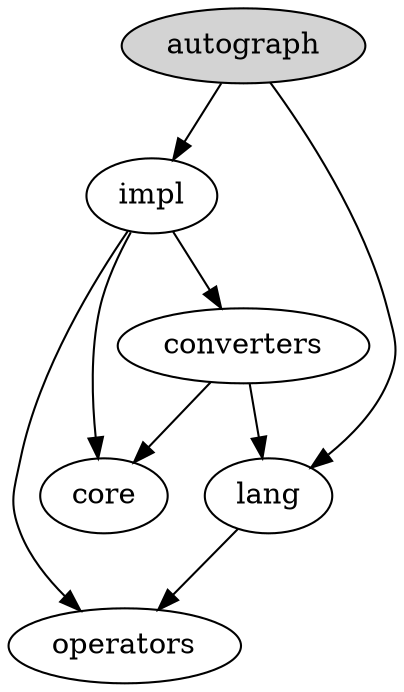

# How to contribute

We'd love to have your patches and contributions! Here are some guidelines. In general, we follow the [TensorFlow contributing guidelines](../../CONTRIBUTING.md), but have some [AutoGraph-specific style guidelines](STYLE_GUIDE.md). More details below.

### Note to active contributors

In preparation for TF 2.0, we moved the code base of AutoGraph from
`tensorflow/contrib/autograph` to `tensorflow/python/autograph`. The move
does not impact functionality, and AutoGraph will remain accessible under
`tensorflow.contrib.autograph` until `tensorflow.contrib` is retired.

## TensorFlow Code of Conduct
Please review and follow the [TensorFlow Code of Conduct](../../CODE_OF_CONDUCT.md).

## Contributor License Agreement

Contributions to this project must be accompanied by a Contributor License
Agreement. You (or your employer) retain the copyright to your contribution;
this simply gives us permission to use and redistribute your contributions as
part of the project. Head over to <https://cla.developers.google.com/> to see
your current agreements on file or to sign a new one.

You generally only need to submit a CLA once, so if you've already submitted one
(even if it was for a different project), you probably don't need to do it
again.

## Code reviews

All submissions, including submissions by project members, require review. We
use GitHub pull requests for this purpose. Consult [GitHub
Help](https://help.github.com/articles/about-pull-requests/) for more
information on using pull requests.

After a pull request is approved, we merge it. Note our merging process differs
from GitHub in that we pull and submit the change into an internal version
control system. This system automatically pushes a git commit to the GitHub
repository (with credit to the original author) and closes the pull request.

## Style

See the [AutoGraph style guide](STYLE_GUIDE.md).

## Unit tests

Please include unit tests when contributing new features ([example here](converters/continue_statements_test.py)), as they help to a) prove that your code works correctly, and b) guard against future breaking
changes to lower the maintenance cost.
It's also helpful to check that any
changes you propose do not break existing unit tests. You can run tests using the command,

```shell
bazel test --config=opt --copt=-O3 --copt=-march=native \
  //tensorflow/contrib/autograph/...
```

from the root of the `tensorflow` repository. For more details see the [main TensorFlow Contributing File](../../CONTRIBUTING.md)

## Developer info

### Module structure

The graph below describes the dependencies between AutoGraph modules (not to be mistaken with the directory structure for these modules, which is flat):



`autograph` is the sole user-visible module.

A short description of the modules:

 * `autograph`: the main module imported by the user and by the generated code; only contains declarations
 * `impl`: high level code and the implementation of the api frontend
 * `core`: base classes for the AutoGraph source code transformation logic; see in particular `converter.py`
 * `lang`: special user-visible functions that serve as extensions to the Python language
 * `converters`: collection of source code transformation modules specialized for particular AutoGraph features
 * `operators`: collection of operators that AutoGraph overloads; these correspond to Python operators as well as Python syntactic structures, like control flow

There are two additional modules, `pyct` and `utils`. These are independent of AutoGraph:

 * `pyct`: a general purpose Python source code transformation library
 * `utils`: the kitchen sync; deprecated

Note: we have a long term plan to factor out an implementation of `impl` and `converters` that is independent of autograph, into a general purpose Python operator overloading library.
