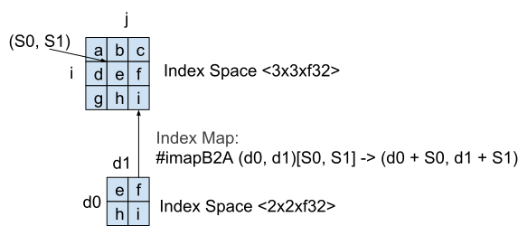

# MLIR Specification

MLIR (Multi-Level IR) is a compiler intermediate representation with
similarities to traditional three-address SSA representations (like
[LLVM IR](http://llvm.org/docs/LangRef.html) or
[SIL](https://github.com/apple/swift/blob/master/docs/SIL.rst)), but which
introduces notions from polyhedral loop optimization as first-class concepts.
This hybrid design is optimized to represent, analyze, and transform high level
dataflow graphs as well as target-specific code generated for high performance
data parallel systems. Beyond its representational capabilities, its single
continuous design provides a framework to lower from dataflow graphs to
high-performance target-specific code.

This document defines and describes the key concepts in MLIR, and is intended to
be a dry reference document - the [rationale documentation](Rationale.md),
[glossary](Glossary.md), and other content are hosted elsewhere.

MLIR is designed to be used in three different forms: a human-readable textual
form suitable for debugging, an in-memory form suitable for programmatic
transformations and analysis, and a compact serialized form suitable for storage
and transport. The different forms all describe the same semantic content. This
document describes the human-readable textual form.

[TOC]

## High-Level Structure

MLIR is an
[SSA-based](https://en.wikipedia.org/wiki/Static_single_assignment_form) IR,
which means that values are defined before use and have scope defined by their
dominance relations. Operations may produce zero or more results, and each is a
distinct SSA value with its own type defined by the [type system](#type-system).

The unit of code in MLIR is an [Operation](#operations). Operations allow for
representing many different concepts: allocating buffers, producing views to
transform them, target-independent arithmetic, target-specific operations, and
even arbitrary user-defined high-level operations including the
[Module](#module) and [Function](#functions) operations. Operations may contain
[Regions](#regions) that contain a Control Flow Graph (CFG) of
[Blocks](#blocks), which contain operations and end with a
[terminator operation](#terminator-operations) (like branches).

Here's an example of an MLIR module:

```mlir {.mlir}
// Compute A*B using an implementation of multiply kernel and print the
// result using a TensorFlow op. The dimensions of A and B are partially
// known. The shapes are assumed to match.
func @mul(%A: tensor<100x?xf32>, %B: tensor<?x50xf32>) -> (tensor<100x50xf32>) {
  // Compute the inner dimension of %A using the dim operation.
  %n = dim %A, 1 : tensor<100x?xf32>

  // Allocate addressable "buffers" and copy tensors %A and %B into them.
  %A_m = alloc(%n) : memref<100x?xf32>
  tensor_store %A to %A_m : memref<100x?xf32>

  %B_m = alloc(%n) : memref<?x50xf32>
  tensor_store %B to %B_m : memref<?x50xf32>

  // Call function @multiply passing memrefs as arguments,
  // and getting returned the result of the multiplication.
  %C_m = call @multiply(%A_m, %B_m)
          : (memref<100x?xf32>, memref<?x50xf32>) -> (memref<100x50xf32>)

  dealloc %A_m : memref<100x?xf32>
  dealloc %B_m : memref<?x50xf32>

  // Load the buffer data into a higher level "tensor" value.
  %C = tensor_load %C_m : memref<100x50xf32>
  dealloc %C_m : memref<100x50xf32>

  // Call TensorFlow built-in function to print the result tensor.
  "tf.Print"(%C){message: "mul result"}
                  : (tensor<100x50xf32) -> (tensor<100x50xf32>)

  return %C : tensor<100x50xf32>
}

// A function that multiplies two memrefs and returns the result.
func @multiply(%A: memref<100x?xf32>, %B: memref<?x50xf32>)
          -> (memref<100x50xf32>)  {
  // Compute the inner dimension of %A.
  %n = dim %A, 1 : memref<100x?xf32>

  // Allocate memory for the multiplication result.
  %C = alloc() : memref<100x50xf32>

  // Multiplication loop nest.
  affine.for %i = 0 to 100 {
     affine.for %j = 0 to 50 {
        store 0 to %C[%i, %j] : memref<100x50xf32>
        affine.for %k = 0 to %n {
           %a_v  = load %A[%i, %k] : memref<100x?xf32>
           %b_v  = load %B[%k, %j] : memref<?x50xf32>
           %prod = mulf %a_v, %b_v : f32
           %c_v  = load %C[%i, %j] : memref<100x50xf32>
           %sum  = addf %c_v, %prod : f32
           store %sum, %C[%i, %j] : memref<100x50xf32>
        }
     }
  }
  return %C : memref<100x50xf32>
}
```

## Notation

MLIR has a simple and unambiguous grammar, allowing it to reliably round-trip
through a textual form. This is important for development of the compiler - e.g.
for understanding the state of code as it is being transformed and writing test
cases.

This document describes the grammar using
[Extended Backus-Naur Form (EBNF)](https://en.wikipedia.org/wiki/Extended_Backus%E2%80%93Naur_form).

This is the EBNF grammar used in this document, presented in yellow boxes.

``` {.ebnf}
alternation ::= expr0 | expr1 | expr2  // Either expr0 or expr1 or expr2.
sequence    ::= expr0 expr1 expr2      // Sequence of expr0 expr1 expr2.
repetition0 ::= expr*  // 0 or more occurrences.
repetition1 ::= expr+  // 1 or more occurrences.
optionality ::= expr?  // 0 or 1 occurrence.
grouping    ::= (expr) // Everything inside parens is grouped together.
literal     ::= `abcd` // Matches the literal `abcd`.
```

Code examples are presented in blue boxes.

```mlir {.mlir}
// This is an example use of the grammar above:
// This matches things like: ba, bana, boma, banana, banoma, bomana...
example ::= `b` (`an` | `om`)* `a`
```

### Common syntax

The following core grammar productions are used in this document:

``` {.ebnf}
// TODO: Clarify the split between lexing (tokens) and parsing (grammar).
digit     ::= [0-9]
hex_digit ::= [0-9a-fA-F]
letter    ::= [a-zA-Z]
id-punct  ::= [$._-]

integer-literal ::= decimal-literal | hexadecimal-literal
decimal-literal ::= digit+
hexadecimal-literal ::= `0x` hex_digit+
float-literal ::= [-+]?[0-9]+[.][0-9]*([eE][-+]?[0-9]+)?
string-literal  ::= `"` [^"\n\f\v\r]* `"`   TODO define escaping rules
```

Not listed here, but MLIR does support comments. They use standard BCPL syntax,
starting with a `//` and going until the end of the line.

### Identifiers and keywords

Syntax:

``` {.ebnf}
// Identifiers
bare-id ::= (letter|[_]) (letter|digit|[_$.])*
bare-id-list ::= bare-id (`,` bare-id)*
ssa-id ::= `%` (digit+ | ((letter|id-punct) (letter|id-punct|digit)*))

symbol-ref-id ::= `@` (bare-id | string-literal)
ssa-id-list ::= ssa-id (`,` ssa-id)*

// Uses of an SSA value, e.g. in an operand list to an operation.
ssa-use ::= ssa-id
ssa-use-list ::= ssa-use (`,` ssa-use)*
```

Identifiers name entities such as SSA values, types and functions, and are
chosen by the writer of MLIR code. Identifiers may be descriptive (e.g.
`%batch_size`, `@matmul`), or may be non-descriptive when they are
auto-generated (e.g. `%23`, `@func42`). Identifier names for SSA values may be
used in an MLIR text file but are not persisted as part of the IR - the printer
will give them anonymous names like `%42`.

MLIR guarantees identifiers never collide with keywords by prefixing identifiers
with a sigil (e.g. `%`, `#`, `@`, `^`, `!`). In certain unambiguous contexts
(e.g. affine expressions), identifiers are not prefixed, for brevity. New
keywords may be added to future versions of MLIR without danger of collision
with existing identifiers.

The scope of SSA values is defined based on the standard definition of
[dominance](https://en.wikipedia.org/wiki/Dominator_\(graph_theory\)). Argument
identifiers in mapping functions are in scope for the mapping body. Function
identifiers and mapping identifiers are visible across the entire module.

## Dialects

Dialects are the mechanism by which to engage with and extend the MLIR
ecosystem. They allow for defining new [operations](#operations), as well as
[attributes](#attributes) and [types](#type-system). Each dialect is given a
unique `namespace` that is prefixed to each defined attribute/operation/type.
For example, the [Affine dialect](Dialects/Affine.md) defines the namespace:
`affine`.

MLIR allows for multiple dialects, even those outside of the main tree, to
co-exist together within one module. Dialects are produced and consumed by
certain passes. MLIR provides a [framework](DialectConversion.md) to convert
between, and within, different dialects.

A few of the dialects supported by MLIR:

*   [Affine dialect](Dialects/Affine.md)
*   [GPU dialect](Dialects/GPU.md)
*   [LLVM dialect](Dialects/LLVM.md)
*   [SPIR-V dialect](Dialects/SPIR-V.md)
*   [Standard dialect](Dialects/Standard.md)
*   [Vector dialect](Dialects/Vector.md)

### Target specific operations

Dialects provide a modular way in which targets can expose target-specific
operations directly through to MLIR. As an example, some targets go through
LLVM. LLVM has a rich set of intrinsics for certain target-independent
operations (e.g. addition with overflow check) as well as providing access to
target-specific operations for the targets it supports (e.g. vector permutation
operations). LLVM intrinsics in MLIR are represented via operations that start
with an "llvm." name.

Example:

```mlir {.mlir}
// LLVM: %x = call {i16, i1} @llvm.sadd.with.overflow.i16(i16 %a, i16 %b)
%x:2 = "llvm.sadd.with.overflow.i16"(%a, %b) : (i16, i16) -> (i16, i1)
```

These operations only work when targeting LLVM as a backend (e.g. for CPUs and
GPUs), and are required to align with the LLVM definition of these intrinsics.

## Operations

Syntax:

``` {.ebnf}
operation ::= op-result? string-literal `(` ssa-use-list? `)`
              (`[` successor-list `]`)? (`(` region-list `)`)?
              attribute-dict? `:` function-type
op-result ::= ssa-id ((`:` integer-literal) | (`,` ssa-id)*) `=`
successor ::= caret-id (`:` bb-arg-list)?
successor-list ::= successor (`,` successor)*
region-list    ::= region (`,` region)*
```

MLIR introduces a uniform concept called _operations_ to enable describing many
different levels of abstractions and computations. Operations in MLIR are fully
extensible (there is no fixed list of operations) and have application-specific
semantics. For example, MLIR supports
[target-independent operations](Dialects/Standard.md#memory-operations),
[affine operations](Dialects/Affine.md), and
[target-specific machine operations](#target-specific-operations).

The internal representation of an operation is simple: an operation is
identified by a unique string (e.g. `dim`, `tf.Conv2d`, `x86.repmovsb`,
`ppc.eieio`, etc), can return zero or more results, take zero or more SSA
operands, may have zero or more attributes, may have zero or more successors,
and zero or more enclosed [regions](#regions). The generic printing form
includes all these elements literally, with a function type to indicate the
types of the results and operands.

Example:

```mlir {.mlir}
// An operation that produces two results.
// The results of %result can be accessed via the <name> `#` <opNo> syntax.
%result:2 = "foo_div"() : () -> (f32, i32)

// Pretty form that defines a unique name for each result.
%foo, %bar = "foo_div"() : () -> (f32, i32)

// Invoke a TensorFlow function called tf.scramble with two inputs
// and an attribute "fruit".
%2 = "tf.scramble"(%result#0, %bar) {fruit: "banana"} : (f32, i32) -> f32

```

In addition to the basic syntax above, dialects may register known operations.
This allows those dialects to support _custom assembly form_ for parsing and
printing operations. In the operation sets listed below, we show both forms.

### Terminator Operations

These are a special category of operations that *must* terminate a block, e.g.
[branches](Dialects/Standard.md#terminator-operations). These operations may
also have a list of successors ([blocks](#blocks) and their arguments).

Example:

```mlir {.mlir}
// Branch to ^bb1 or ^bb2 depending on the condition %cond.
// Pass value %v to ^bb2, but not to ^bb1.
"cond_br"(%cond)[^bb1, ^bb2(%v : index)] : (i1) -> ()
```

### Module

``` {.ebnf}
module ::= `module` symbol-ref-id? (`attributes` attribute-dict)? region
```

An MLIR module represents an opaque top-level container operation. It contains a
single region containing a single block that is comprised of any operations.
Operations within this region must not implicitly capture values defined above
it. Modules have an optional symbol name that can be used to refer to them in
operations.

### Functions

An MLIR Function is an operation with a name containing one [region](#regions).
The region of a function is not allowed to implicitly capture values defined
outside of the function, and all external references must use function arguments
or attributes that establish a symbolic connection (e.g. symbols referenced by
name via a string attribute like [SymbolRefAttr](#symbol-reference-attribute)):

``` {.ebnf}
function ::= `func` function-signature function-attributes? function-body?

function-signature ::= symbol-ref-id `(` argument-list `)`
                       (`->` function-result-list)?

argument-list ::= (named-argument (`,` named-argument)*) | /*empty*/
argument-list ::= (type attribute-dict? (`,` type attribute-dict?)*) | /*empty*/
named-argument ::= ssa-id `:` type attribute-dict?

function-result-list ::= function-result-list-parens
                       | non-function-type
function-result-list-parens ::= `(` `)`
                              | `(` function-result-list-no-parens `)`
function-result-list-no-parens ::= function-result (`,` function-result)*
function-result ::= type attribute-dict?

function-attributes ::= `attributes` attribute-dict
function-body ::= region
```

An external function declaration (used when referring to a function declared in
some other module) has no body. While the MLIR textual form provides a nice
inline syntax for function arguments, they are internally represented as "block
arguments" to the first block in the region.

Only dialect attribute names may be specified in the attribute dictionaries for
function arguments, results, or the function itself.

Examples:

```mlir {.mlir}
// External function definitions.
func @abort()
func @scribble(i32, i64, memref<? x 128 x f32, #layout_map0>) -> f64

// A function that returns its argument twice:
func @count(%x: i64) -> (i64, i64)
  attributes {fruit: "banana"} {
  return %x, %x: i64, i64
}

// A function with an argument attribute
func @example_fn_arg(%x: i32 {swift.self = unit})

// A function with a result attribute
func @example_fn_result() -> (f64 {dialectName.attrName = 0 : i64})

// A function with an attribute
func @example_fn_attr() attributes {dialectName.attrName = false}
```

## Blocks

Syntax:

``` {.ebnf}
block           ::= bb-label operation+
bb-label        ::= bb-id bb-arg-list? `:`
bb-id           ::= caret-id
caret-id        ::= `^` bare-id
ssa-id-and-type ::= ssa-id `:` type

// Non-empty list of names and types.
ssa-id-and-type-list ::= ssa-id-and-type (`,` ssa-id-and-type)*

bb-arg-list ::= `(` ssa-id-and-type-list? `)`
```

A [block](https://en.wikipedia.org/wiki/Basic_block) is a sequential list of
operations without control flow (calls are not considered control flow for this
purpose) that are executed from top to bottom. The last operation in a block is
a [terminator operation](#terminator-operations), which ends the block.

Blocks in MLIR take a list of block arguments, which represent SSA PHI nodes in
a functional notation. The arguments are defined by the block, and values are
provided for these block arguments by branches that go to the block.

Here is a simple example function showing branches, returns, and block
arguments:

```mlir {.mlir}
func @simple(i64, i1) -> i64 {
^bb0(%a: i64, %cond: i1): // Code dominated by ^bb0 may refer to %a
  cond_br %cond, ^bb1, ^bb2

^bb1:
  br ^bb3(%a: i64)    // Branch passes %a as the argument

^bb2:
  %b = addi %a, %a : i64
  br ^bb3(%b: i64)    // Branch passes %b as the argument

// ^bb3 receives an argument, named %c, from predecessors
// and passes it on to bb4 twice.
^bb3(%c: i64):
  br ^bb4(%c, %c : i64, i64)

^bb4(%d : i64, %e : i64):
  %0 = addi %d, %e : i64
  return %0 : i64
}
```

**Context:** The "block argument" representation eliminates a number of special
cases from the IR compared to traditional "PHI nodes are operations" SSA IRs
(like LLVM). For example, the
[parallel copy semantics](http://citeseerx.ist.psu.edu/viewdoc/download?doi=10.1.1.524.5461&rep=rep1&type=pdf)
of SSA is immediately apparent, and function arguments are no longer a special
case: they become arguments to the entry block
[[more rationale](Rationale.md#block-arguments-vs-phi-nodes)].

## Regions

### Definition

A region is a CFG of MLIR [Blocks](#blocks). Regions serve to group semantically
connected blocks, where the semantics is not imposed by the IR. Instead, the
containing operation defines the semantics of the regions it contains. Regions
do not have a name or an address, only the blocks contained in a region do.
Regions are meaningless outside of the containing entity and have no type or
attributes.

The first block in the region cannot be a successor of any other block. The
syntax for the region is as follows:

``` {.ebnf}
region ::= `{` block+ `}`
```

The function body is an example of a region: it consists of a CFG of blocks and
has additional semantic restrictions that other types of regions may not have
(block terminators must either branch to a different block, or return from a
function where the types of the `return` arguments must match the result types
of the function signature).

### Control and Value Scoping

Regions provide nested control isolation: it is impossible to branch to a block
within a region from outside it or to branch from within a region to a block
outside it. Similarly, it provides a natural scoping for value visibility: SSA
values defined in a region don't escape to the enclosing region, if any. By
default, a region can reference values defined outside of the region whenever it
would have been legal to use them as operands to the enclosing operation.

Example:

```mlir {.mlir}
func @accelerator_compute(i64, i1) -> i64 {
^bb0(%a: i64, %cond: i1): // Code dominated by ^bb0 may refer to %a
  cond_br %cond, ^bb1, ^bb2

^bb1:
  // This def for %value does not dominate ^bb2
  %value = "op.convert"(%a) : (i64) -> i64
  br ^bb3(%a: i64)    // Branch passes %a as the argument

^bb2:
  "accelerator.launch"() {
    ^bb0:
      // Region of code nested under "accelerator.launch", it can reference %a but
      // not %value.
      %new_value = "accelerator.do_something"(%a) : (i64) -> ()
  }
  // %new_value cannot be referenced outside of the region

^bb3:
  ...
}
```

This can be further restricted using the custom verifier associated with the
enclosing operation, for example, disallowing references to values defined
outside the region completely.

### Control Flow

Regions are Single-Entry-Multiple-Exit (SEME). This means that control can only
flow into the first block of the region, but can flow out of the region at the
end of any of the contained blocks (This behavior is similar to that of a
function body in most programming languages). When exiting a Region, control is
returned to the enclosing operation.

The enclosing operation determines the way in which control is transmitted into
the entry block of a Region. The successor to a region’s exit points may not
necessarily exist: for example a call to a function that does not return.
Concurrent or asynchronous execution of regions is unspecified. Operations may
define specific rules of execution, e.g. sequential loops or switch cases.

A Region may also enter another region within the enclosing operation. If an
operation has multiple regions, the semantics of the operation defines into
which regions the control flows and in which order, if any. An operation may
transmit control into regions that were specified in other operations, in
particular those that defined the values the given operation uses. Thus such
operations can be treated opaquely in the enclosing control flow graph,
providing a level of control flow isolation similar to that of the call
operation.

#### Closure

Regions allow defining an operation that creates a closure, for example by
“boxing” the body of the region into a value they produce. It remains up to the
operation to define its semantics. Note that if an operation triggers
asynchronous execution of the region, it is under the responsibility of the
operation caller to wait for the region to be executed guaranteeing that any
directly used values remain live.

### Arguments and Results

The arguments of the first block of a region are treated as arguments of the
region. The source of these arguments is defined by the semantics of the parent
operation. They may correspond to some of the values the operation itself uses.

Regions produce a (possibly empty) list of values. The operation semantics
defines the relation between the region results and the operation results.

## Type System

Each SSA value in MLIR has a type defined by the type system below. There are a
number of primitive types (like integers) and also aggregate types for tensors
and memory buffers. MLIR [standard types](#standard-types) do not include
structures, arrays, or dictionaries.

MLIR has an open type system (i.e. there is no fixed list of types), and types
may have application-specific semantics. For example, MLIR supports a set of
[dialect types](#dialect-types).

``` {.ebnf}
type ::= type-alias | dialect-type | standard-type

type-list-no-parens ::=  type (`,` type)*
type-list-parens ::= `(` `)`
                   | `(` type-list-no-parens `)`

// This is a common way to refer to an SSA value with a specified type.
ssa-use-and-type ::= ssa-use `:` type

// Non-empty list of names and types.
ssa-use-and-type-list ::= ssa-use-and-type (`,` ssa-use-and-type)*
```

### Type Aliases

``` {.ebnf}
type-alias-def ::= '!' alias-name '=' 'type' type
type-alias ::= '!' alias-name
```

MLIR supports defining named aliases for types. A type alias is an identifier
that can be used in the place of the type that it defines. These aliases *must*
be defined before their uses. Alias names may not contain a '.', since those
names are reserved for [dialect types](#dialect-types).

Example:

```mlir {.mlir}
!avx_m128 = type vector<4 x f32>

// Using the original type.
"foo"(%x) : vector<4 x f32> -> ()

// Using the type alias.
"foo"(%x) : !avx_m128 -> ()
```

### Dialect Types

Similarly to operations, dialects may define custom extensions to the type
system.

``` {.ebnf}
dialect-namespace ::= bare-id

opaque-dialect-item ::= dialect-namespace '<' string-literal '>'

pretty-dialect-item ::= dialect-namespace '.' pretty-dialect-item-lead-ident
                                              pretty-dialect-item-body?

pretty-dialect-item-lead-ident ::= '[A-Za-z][A-Za-z0-9._]*'
pretty-dialect-item-body ::= '<' pretty-dialect-item-contents+ '>'
pretty-dialect-item-contents ::= pretty-dialect-item-body
                              | '(' pretty-dialect-item-contents+ ')'
                              | '[' pretty-dialect-item-contents+ ']'
                              | '{' pretty-dialect-item-contents+ '}'
                              | '[^[<({>\])}\0]+'

dialect-type ::= '!' opaque-dialect-item
dialect-type ::= '!' pretty-dialect-item
```

Dialect types can be specified in a verbose form, e.g. like this:

```mlir {.mlir}
// LLVM type that wraps around llvm IR types.
!llvm<"i32*">

// Tensor flow string type.
!tf.string

// Complex type
!foo<"something<abcd>">

// Even more complex type
!foo<"something<a%%123^^^>>>">
```

Dialect types that are simple enough can use the pretty format, which is a
lighter weight syntax that is equivalent to the above forms:

```mlir {.mlir}
// Tensor flow string type.
!tf.string

// Complex type
!foo.something<abcd>
```

Sufficiently complex dialect types are required to use the verbose form for
generality. For example, the more complex type shown above wouldn't be valid in
the lighter syntax: `!foo.something<a%%123^^^>>>` because it contains characters
that are not allowed in the lighter syntax, as well as unbalanced `<>`
characters.

See [here](DefiningAttributesAndTypes.md) to learn how to define dialect types.

### Standard Types

Standard types are a core set of [dialect types](#dialect-types) that are
defined in a builtin dialect and thus available to all users of MLIR.

``` {.ebnf}
standard-type ::=     complex-type
                    | float-type
                    | function-type
                    | index-type
                    | integer-type
                    | memref-type
                    | none-type
                    | tensor-type
                    | tuple-type
                    | vector-type
```

#### Complex Type

Syntax:

``` {.ebnf}
complex-type ::= `complex` `<` type `>`
```

The value of `complex` type represents a complex number with a parameterized
element type, which is composed of a real and imaginary value of that element
type. The element must be a floating point or integer scalar type.

Examples:

```mlir {.mlir}
complex<f32>
complex<i32>
```

#### Floating Point Types

Syntax:

``` {.ebnf}
// Floating point.
float-type ::= `f16` | `bf16` | `f32` | `f64`
```

MLIR supports float types of certain widths that are widely used as indicated
above.

#### Function Type

Syntax:

``` {.ebnf}
// MLIR functions can return multiple values.
function-result-type ::= type-list-parens
                       | non-function-type

function-type ::= type-list-parens `->` function-result-type
```

MLIR supports first-class functions: for example, the
[`constant` operation](Dialects/Standard.md#constant-operation) produces the
address of a function as an SSA value. This SSA value may be passed to and
returned from functions, merged across control flow boundaries with
[block arguments](#blocks), and called with the
[`call_indirect` operation](Dialects/Standard.md#call-indirect-operation).

Function types are also used to indicate the arguments and results of
[operations](#operations).

#### Index Type

Syntax:

``` {.ebnf}
// Target word-sized integer.
index-type ::= `index`
```

The `index` type is a signless integer whose size is equal to the natural
machine word of the target ([rationale](Rationale.md#signless-types)) and is
used by the affine constructs in MLIR. Unlike fixed-size integers, it cannot be
used as an element of vector, tensor or memref type
([rationale](Rationale.md#index-type-disallowed-in-vectortensormemref-types)).

**Rationale:** integers of platform-specific bit widths are practical to express
sizes, dimensionalities and subscripts.

#### Integer Type

Syntax:

``` {.ebnf}
// Sized integers like i1, i4, i8, i16, i32.
integer-type ::= `i` [1-9][0-9]*
```

MLIR supports arbitrary precision integer types. Integer types are signless, but
have a designated width.

**Rationale:** low precision integers (like `i2`, `i4` etc) are useful for
low-precision inference chips, and arbitrary precision integers are useful for
hardware synthesis (where a 13 bit multiplier is a lot cheaper/smaller than a 16
bit one).

TODO: Need to decide on a representation for quantized integers
([initial thoughts](Rationale.md#quantized-integer-operations)).

#### Memref Type

Syntax:

``` {.ebnf}
memref-type ::= `memref` `<` dimension-list-ranked tensor-memref-element-type
                (`,` layout-specification)? |
                (`,` memory-space)? `>`

stride-list ::= `[` (dimension (`,` dimension)*)? `]`
strided-layout ::= `offset:` dimension `,` `strides: ` stride-list
layout-specification ::= semi-affine-map | strided-layout
memory-space ::= integer-literal /* | TODO: address-space-id */
```

A `memref` type is a reference to a region of memory (similar to a buffer
pointer, but more powerful). The buffer pointed to by a memref can be allocated,
aliased and deallocated. A memref can be used to read and write data from/to the
memory region which it references. Memref types use the same shape specifier as
tensor types, but do not allow unknown rank. Note that `memref<f32>`, `memref<0
x f32>`, `memref<1 x 0 x f32>`, and `memref<0 x 1 x f32>` are all different
types.

The core syntax and representation of a layout specification is a
[semi-affine map](Dialects/Affine.md#semi-affine-maps). Additionally, syntactic
sugar is supported to make certain layout specifications more intuitive to read.
For the moment, a `memref` supports parsing a strided form which is converted to
a semi-affine map automatically.

The memory space of a memref is specified by a target-specific integer index. If
no memory space is specified, then the default memory space (0) is used. The
default space is target specific but always at index 0.

TODO: MLIR will eventually have target-dialects which allow symbolic use of
memory hierarchy names (e.g. L3, L2, L1, ...) but we have not spec'd the details
of that mechanism yet. Until then, this document pretends that it is valid to
refer to these memories by `bare-id`.

The notionally dynamic value of a memref value includes the address of the
buffer allocated, as well as the symbols referred to by the shape, layout map,
and index maps.

Examples of memref static type

```mlir {.mlir}
// Identity index/layout map
#identity = (d0, d1) -> (d0, d1)

// Column major layout.
#col_major = (d0, d1, d2) -> (d2, d1, d0)

// A 2-d tiled layout with tiles of size 128 x 256.
#tiled_2d_128x256 = (d0, d1) -> (d0 div 128, d1 div 256, d0 mod 128, d1 mod 256)

// A tiled data layout with non-constant tile sizes.
#tiled_dynamic = (d0, d1)[s0, s1] -> (d0 floordiv s0, d1 floordiv s1,
                              d0 mod s0, d1 mod s1)

// A layout that yields a padding on two at either end of the minor dimension.
#padded = (d0, d1) -> (d0, (d1 + 2) floordiv 2, (d1 + 2) mod 2)


// The dimension list "16x32" defines the following 2D index space:
//
//   { (i, j) : 0 <= i < 16, 0 <= j < 32 }
//
memref<16x32xf32, #identity, memspace0>

// The dimension list "16x4x?" defines the following 3D index space:
//
//   { (i, j, k) : 0 <= i < 16, 0 <= j < 4, 0 <= k < N }
//
// where N is a symbol which represents the runtime value of the size of
// the third dimension.
//
// %N here binds to the size of the third dimension.
%A = alloc(%N) : memref<16x4x?xf32, #col_major, memspace0>

// A 2-d dynamic shaped memref that also has a dynamically sized tiled layout.
// The memref index space is of size %M x %N, while %B1 and %B2 bind to the
// symbols s0, s1 respectively of the layout map #tiled_dynamic. Data tiles of
// size %B1 x %B2 in the logical space will be stored contiguously in memory.
// The allocation size will be (%M ceildiv %B1) * %B1 * (%N ceildiv %B2) * %B2
// f32 elements.
%T = alloc(%M, %N) [%B1, %B2] : memref<?x?xf32, #tiled_dynamic>

// A memref that has a two-element padding at either end. The allocation size
// will fit 16 * 68 float elements of data.
%P = alloc() : memref<16x64xf32, #padded>

// Affine map with symbol 's0' used as offset for the first dimension.
#imapS = (d0, d1) [s0] -> (d0 + s0, d1)
// Allocate memref and bind the following symbols:
// '%n' is bound to the dynamic second dimension of the memref type.
// '%o' is bound to the symbol 's0' in the affine map of the memref type.
%n = ...
%o = ...
%A = alloc (%n)[%o] : <16x?xf32, #imapS>
```

##### Index Space

A memref dimension list defines an index space within which the memref can be
indexed to access data.

##### Index

Data is accessed through a memref type using a multidimensional index into the
multidimensional index space defined by the memref's dimension list.

Examples

```mlir {.mlir}
// Allocates a memref with 2D index space:
//   { (i, j) : 0 <= i < 16, 0 <= j < 32 }
%A = alloc() : memref<16x32xf32, #imapA, memspace0>

// Loads data from memref '%A' using a 2D index: (%i, %j)
%v = load %A[%i, %j] : memref<16x32xf32, #imapA, memspace0>
```

##### Index Map

An index map is a one-to-one
[semi-affine map](Dialects/Affine.md#semi-affine-maps) that transforms a
multidimensional index from one index space to another. For example, the
following figure shows an index map which maps a 2-dimensional index from a 2x2
index space to a 3x3 index space, using symbols `S0` and `S1` as offsets.



The number of domain dimensions and range dimensions of an index map can be
different, but must match the number of dimensions of the input and output index
spaces on which the map operates. The index space is always non-negative and
integral. In addition, an index map must specify the size of each of its range
dimensions onto which it maps. Index map symbols must be listed in order with
symbols for dynamic dimension sizes first, followed by other required symbols.

##### Layout Map

A layout map is a [semi-affine map](Dialects/Affine.md#semi-affine-maps) which
encodes logical to physical index space mapping, by mapping input dimensions to
their ordering from most-major (slowest varying) to most-minor (fastest
varying). Therefore, an identity layout map corresponds to a row-major layout.
Identity layout maps do not contribute to the MemRef type identification and are
discarded on construction. That is, a type with an explicit identity map is
`memref<?x?xf32, (i,j)->(i,j)>` is strictly the same as the one without layout
maps, `memref<?x?xf32>`.

Layout map examples:

```mlir {.mlir}
// MxN matrix stored in row major layout in memory:
#layout_map_row_major = (i, j) -> (i, j)

// MxN matrix stored in column major layout in memory:
#layout_map_col_major = (i, j) -> (j, i)

// MxN matrix stored in a 2-d blocked/tiled layout with 64x64 tiles.
#layout_tiled = (i, j) -> (i floordiv 64, j floordiv 64, i mod 64, j mod 64)
```

##### Affine Map Composition

A memref specifies a semi-affine map composition as part of its type. A
semi-affine map composition is a composition of semi-affine maps beginning with
zero or more index maps, and ending with a layout map. The composition must be
conformant: the number of dimensions of the range of one map, must match the
number of dimensions of the domain of the next map in the composition.

The semi-affine map composition specified in the memref type, maps from accesses
used to index the memref in load/store operations to other index spaces (i.e.
logical to physical index mapping). Each of the
[semi-affine maps](Dialects/Affine.md) and thus its composition is required to
be one-to-one.

The semi-affine map composition can be used in dependence analysis, memory
access pattern analysis, and for performance optimizations like vectorization,
copy elision and in-place updates. If an affine map composition is not specified
for the memref, the identity affine map is assumed.

##### Strided MemRef

A memref may specify strides as part of its type. A stride specification is a
list of integer values that are either static or `?` (dynamic case). Strides
encode the distance, in number of elements, in (linear) memory between
successive entries along a particular dimension. A stride specification is
syntactic sugar for an equivalent strided memref representation using
semi-affine maps. For example, `memref<42x16xf32, offset: 33 strides: [1, 64]>`
specifies a non-contiguous memory region of `42` by `16` `f32` elements such
that:

1.  the minimal size of the enclosing memory region must be `33 + 42 * 1 + 16 *
    64 = 1066` elements;
2.  the address calculation for accessing element `(i, j)` computes `33 + i +
    64 * j`
3.  the distance between two consecutive elements along the outer dimension is
    `1` element and the distance between two consecutive elements along the
    outer dimension is `64` elements.

This corresponds to a column major view of the memory region and is internally
represented as the type `memref<42x16xf32, (i, j) -> (33 + i + 64 * j)>`.

The specification of strides must not alias: given an n-D strided memref,
indices `(i1, ..., in)` and `(j1, ..., jn)` may not refer to the same memory
address unless `i1 == j1, ..., in == jn`.

Strided memrefs represent a view abstraction over preallocated data. They are
constructed with special ops, yet to be introduced. Strided memrefs are a
special subclass of memrefs with generic semi-affine map and correspond to a
normalized memref descriptor when lowering to LLVM.

#### None Type

Syntax:

``` {.ebnf}
none-type ::= `none`
```

The `none` type is a unit type, i.e. a type with exactly one possible value,
where its value does not have a defined dynamic representation.

#### Tensor Type

Syntax:

``` {.ebnf}
tensor-type ::= `tensor` `<` dimension-list tensor-memref-element-type `>`
tensor-memref-element-type ::= vector-element-type | vector-type | complex-type

// memref requires a known rank, but tensor does not.
dimension-list ::= dimension-list-ranked | (`*` `x`)
dimension-list-ranked ::= (dimension `x`)*
dimension ::= `?` | decimal-literal
```

SSA values of tensor type represents aggregate N-dimensional data values, and
have a known element type. It may have an unknown rank (indicated by `*`) or may
have a fixed rank with a list of dimensions. Each dimension may be a static
non-negative decimal constant or be dynamically determined (indicated by `?`).

The runtime representation of the MLIR tensor type is intentionally abstracted -
you cannot control layout or get a pointer to the data. For low level buffer
access, MLIR has a [`memref` type](#memref-type). This abstracted runtime
representation holds both the tensor data values as well as information about
the (potentially dynamic) shape of the tensor. The
[`dim` operation](Dialects/Standard.md#dim-operation) returns the size of a
dimension from a value of tensor type.

Note: hexadecimal integer literals are not allowed in tensor type declarations
to avoid confusion between `0xf32` and `0 x f32`. Zero sizes are allowed in
tensors and treated as other sizes, e.g., `tensor<0 x 1 x i32>` and `tensor<1 x
0 x i32>` are different types. Since zero sizes are not allowed in some other
types, such tensors should be optimized away before lowering tensors to vectors.

Examples:

```mlir {.mlir}
// Tensor with unknown rank.
tensor<* x f32>

// Known rank but unknown dimensions.
tensor<? x ? x ? x ? x f32>

// Partially known dimensions.
tensor<? x ? x 13 x ? x f32>

// Full static shape.
tensor<17 x 4 x 13 x 4 x f32>

// Tensor with rank zero. Represents a scalar.
tensor<f32>

// Zero-element dimensions are allowed.
tensor<0 x 42 x f32>

// Zero-element tensor of f32 type (hexadecimal literals not allowed here).
tensor<0xf32>
```

#### Tuple Type

Syntax:

``` {.ebnf}
tuple-type ::= `tuple` `<` (type ( `,` type)*)? `>`
```

The value of `tuple` type represents a fixed-size collection of elements, where
each element may be of a different type.

**Rationale:** Though this type is first class in the type system, MLIR provides
no standard operations for operating on `tuple` types
([rationale](Rationale.md#tuple-types)).

Examples:

```mlir {.mlir}
// Empty tuple.
tuple<>

// Single element
tuple<f32>

// Many elements.
tuple<i32, f32, tensor<i1>, i5>
```

#### Vector Type

Syntax:

``` {.ebnf}
vector-type ::= `vector` `<` static-dimension-list vector-element-type `>`
vector-element-type ::= float-type | integer-type

static-dimension-list ::= (decimal-literal `x`)+
```

The vector type represents a SIMD style vector, used by target-specific
operation sets like AVX. While the most common use is for 1D vectors (e.g.
vector<16 x f32>) we also support multidimensional registers on targets that
support them (like TPUs).

Vector shapes must be positive decimal integers.

Note: hexadecimal integer literals are not allowed in vector type declarations,
`vector<0x42xi32>` is invalid because it is interpreted as a 2D vector with
shape `(0, 42)` and zero shapes are not allowed.

## Attributes

Syntax:

``` {.ebnf}
attribute-dict ::= `{` `}`
                 | `{` attribute-entry (`,` attribute-entry)* `}`
attribute-entry ::= dialect-attribute-entry | dependent-attribute-entry
dialect-attribute-entry ::= dialect-namespace `.` bare-id `=` attribute-value
dependent-attribute-entry ::= dependent-attribute-name `=` attribute-value
dependent-attribute-name ::= (letter|[_]) (letter|digit|[_$])*
```

Attributes are the mechanism for specifying constant data on operations in
places where a variable is never allowed - e.g. the index of a
[`dim` operation](Dialects/Standard.md#dim-operation), or the stride of a
convolution. They consist of a name and a concrete attribute value. The set of
expected attributes, their structure, and their interpretation are all
contextually dependent on what they are attached to.

There are two main classes of attributes: dependent and dialect. Dependent
attributes derive their structure and meaning from what they are attached to;
e.g., the meaning of the `index` attribute on a `dim` operation is defined by
the `dim` operation. Dialect attributes, on the other hand, derive their context
and meaning from a specific dialect. An example of a dialect attribute may be a
`swift.self` function argument attribute that indicates an argument is the
self/context parameter. The context of this attribute is defined by the `swift`
dialect and not the function argument.

Attribute values are represented by the following forms:

``` {.ebnf}
attribute-value ::= attribute-alias | dialect-attribute | standard-attribute
```

### Attribute Value Aliases

``` {.ebnf}
attribute-alias ::= '#' alias-name '=' 'type' type
attribute-alias ::= '#' alias-name
```

MLIR supports defining named aliases for attribute values. An attribute alias is
an identifier that can be used in the place of the attribute that it defines.
These aliases *must* be defined before their uses. Alias names may not contain a
'.', since those names are reserved for
[dialect attributes](#dialect-attribute-values).

Example:

```mlir {.mlir}
#map = (d0) -> (d0 + 10)

// Using the original attribute.
%b = affine.apply (d0) -> (d0 + 10) (%a)

// Using the attribute alias.
%b = affine.apply #map(%a)
```

### Dialect Attribute Values

Similarly to operations, dialects may define custom attribute values. The
syntactic structure of these values is identical to custom dialect type values,
except that dialect attributes values are distinguished with a leading '#',
while dialect types are distinguished with a leading '!'.

``` {.ebnf}
dialect-attribute ::= '#' opaque-dialect-item
dialect-attribute ::= '#' pretty-dialect-item
```

Dialect attributes can be specified in a verbose form, e.g. like this:

```mlir {.mlir}
// Complex attribute
#foo<"something<abcd>">

// Even more complex attribute
#foo<"something<a%%123^^^>>>">
```

Dialect attributes that are simple enough can use the pretty format, which is a
lighter weight syntax that is equivalent to the above forms:

```mlir {.mlir}
// Complex attribute
#foo.something<abcd>
```

Sufficiently complex dialect attributes are required to use the verbose form for
generality. For example, the more complex type shown above wouldn't be valid in
the lighter syntax: `#foo.something<a%%123^^^>>>` because it contains characters
that are not allowed in the lighter syntax, as well as unbalanced `<>`
characters.

See [here](DefiningAttributesAndTypes.md) to learn how to define dialect
attribute values.

### Standard Attribute Values

Standard attributes are a core set of
[dialect attributes](#dialect-attribute-values) that are defined in a builtin
dialect and thus available to all users of MLIR.

``` {.ebnf}
standard-attribute ::=   affine-map-attribute
                       | array-attribute
                       | bool-attribute
                       | dictionary-attribute
                       | elements-attribute
                       | float-attribute
                       | integer-attribute
                       | integer-set-attribute
                       | string-attribute
                       | symbol-ref-attribute
                       | type-attribute
                       | unit-attribute
```

#### AffineMap Attribute

Syntax:

``` {.ebnf}
affine-map-attribute ::= affine-map
```

An affine-map attribute is an attribute that represents a affine-map object.

#### Array Attribute

Syntax:

``` {.ebnf}
array-attribute ::= `[` (attribute-value (`,` attribute-value)*)? `]`
```

An array attribute is an attribute that represents a collection of attribute
values.

#### Boolean Attribute

Syntax:

``` {.ebnf}
bool-attribute ::= bool-literal
```

A boolean attribute is a literal attribute that represents a one-bit boolean
value, true or false.

#### Dictionary Attribute

Syntax:

``` {.ebnf}
dictionary-attribute ::= `{` (attribute-entry (`,` attribute-entry)*)? `}`
```

A dictionary attribute is an attribute that represents a sorted collection of
named attribute values. The elements are sorted by name, and each name must be
unique within the collection.

#### Elements Attributes

Syntax:

``` {.ebnf}
elements-attribute ::= dense-elements-attribute
                     | opaque-elements-attribute
                     | sparse-elements-attribute
```

An elements attribute is a literal attribute that represents a constant
[vector](#vector-type) or [tensor](#tensor-type) value.

##### Dense Elements Attribute

Syntax:

``` {.ebnf}
dense-elements-attribute ::= `dense` `<` attribute-value `>` `:`
                             ( tensor-type | vector-type )
```

A dense elements attribute is an elements attribute where the storage for the
constant vector or tensor value has been packed to the element bitwidth. The
element type of the vector or tensor constant must be of integer, index, or
floating point type.

##### Opaque Elements Attribute

Syntax:

``` {.ebnf}
opaque-elements-attribute ::= `opaque` `<` dialect-namespace  `,`
                              hex-string-literal `>` `:`
                              ( tensor-type | vector-type )
```

An opaque elements attribute is an elements attribute where the content of the
value is opaque. The representation of the constant stored by this elements
attribute is only understood, and thus decodable, by the dialect that created
it.

Note: The parsed string literal must be in hexadecimal form.

##### Sparse Elements Attribute

Syntax:

``` {.ebnf}
sparse-elements-attribute ::= `sparse` `<` attribute-value `,` attribute-value
                              `>` `:` ( tensor-type | vector-type )
```

A sparse elements attribute is an elements attribute that represents a sparse
vector or tensor object. This is where very few of the elements are non-zero.

The attribute uses COO (coordinate list) encoding to represent the sparse
elements of the elements attribute. The indices are stored via a 2-D tensor of
64-bit integer elements with shape [N, ndims], which specifies the indices of
the elements in the sparse tensor that contains non-zero values. The element
values are stored via a 1-D tensor with shape [N], that supplies the
corresponding values for the indices.

Example:

```mlir {.mlir}
  sparse<[[0, 0], [1, 2]], [1, 5]> : tensor<3x4xi32>

// This represents the following tensor:
///  [[1, 0, 0, 0],
///   [0, 0, 5, 0],
///   [0, 0, 0, 0]]
```

#### Float Attribute

Syntax:

``` {.ebnf}
float-attribute ::= (float-literal (`:` float-type)?)
                  | (hexadecimal-literal `:` float-type)
```

A float attribute is a literal attribute that represents a floating point value
of the specified [float type](#floating-point-types). It can be represented in
the hexadecimal form where the hexadecimal value is interpreted as bits of the
underlying binary representation. This form is useful for representing infinity
and NaN floating point values. To avoid confusion with integer attributes,
hexadecimal literals _must_ be followed by a float type to define a float
attribute.

Examples:

``` {.mlir}
42.0         // float attribute defaults to f64 type
42.0 : f32   // float attribute of f32 type
0x7C00 : f16 // positive infinity
0x7CFF : f16 // NaN (one of possible values)
42 : f32     // Error: expected integer type
```

#### Integer Attribute

Syntax:

``` {.ebnf}
integer-attribute ::= integer-literal ( `:` (index-type | integer-type) )?
```

An integer attribute is a literal attribute that represents an integral value of
the specified integer or index type. The default type for this attribute, if one
is not specified, is a 64-bit integer.

##### Integer Set Attribute

Syntax:

``` {.ebnf}
integer-set-attribute ::= affine-map
```

An integer-set attribute is an attribute that represents an integer-set object.

#### String Attribute

Syntax:

``` {.ebnf}
string-attribute ::= string-literal (`:` type)?
```

A string attribute is an attribute that represents a string literal value.

#### Symbol Reference Attribute

Syntax:

``` {.ebnf}
symbol-ref-attribute ::= symbol-ref-id (`::` symbol-ref-id)*
```

A symbol reference attribute is a literal attribute that represents a named
reference to an operation that is nested within an operation with the
`OpTrait::SymbolTable` trait. As such, this reference is given meaning by the
nearest parent operation containing the `OpTrait::SymbolTable` trait. It may
optionally contain a set of nested references that further resolve to a symbol
nested within a different symbol table.

This attribute can only be held internally by
[array attributes](#array-attribute) and
[dictionary attributes](#dictionary-attribute)(including the top-level operation
attribute dictionary), i.e. no other attribute kinds such as Locations or
extended attribute kinds. If a reference to a symbol is necessary from outside
of the symbol table that the symbol is defined in, a
[string attribute](string-attribute) can be used to refer to the symbol name.

**Rationale:** Given that MLIR models global accesses with symbol references, to
enable efficient multi-threading, it becomes difficult to effectively reason
about their uses. By restricting the places that can legally hold a symbol
reference, we can always opaquely reason about a symbols usage characteristics.

#### Type Attribute

Syntax:

``` {.ebnf}
type-attribute ::= type
```

A type attribute is an attribute that represents a [type object](#type-system).

#### Unit Attribute

``` {.ebnf}
unit-attribute ::= `unit`
```

A unit attribute is an attribute that represents a value of `unit` type. The
`unit` type allows only one value forming a singleton set. This attribute value
is used to represent attributes that only have meaning from their existence.

One example of such an attribute could be the `swift.self` attribute. This
attribute indicates that a function parameter is the self/context parameter. It
could be represented as a [boolean attribute](#boolean-attribute)(true or
false), but a value of false doesn't really bring any value. The parameter
either is the self/context or it isn't.

```mlir {.mlir}
// A unit attribute defined with the `unit` value specifier.
func @verbose_form(i1) attributes {dialectName.unitAttr = unit}

// A unit attribute can also be defined without the value specifier.
func @simple_form(i1) attributes {dialectName.unitAttr}
```
