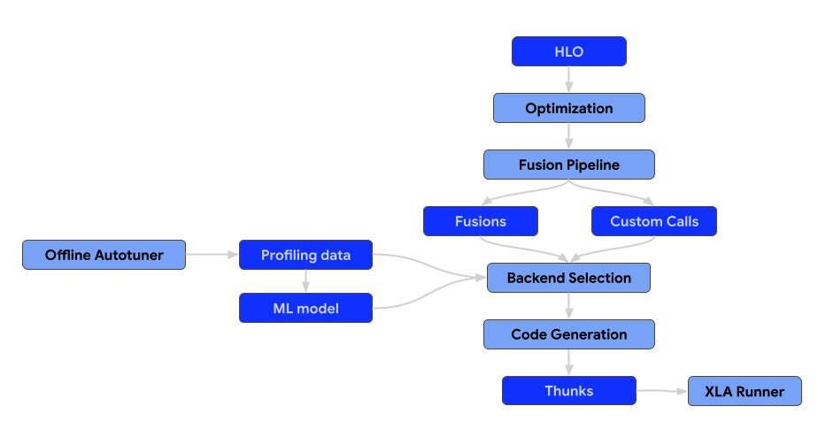
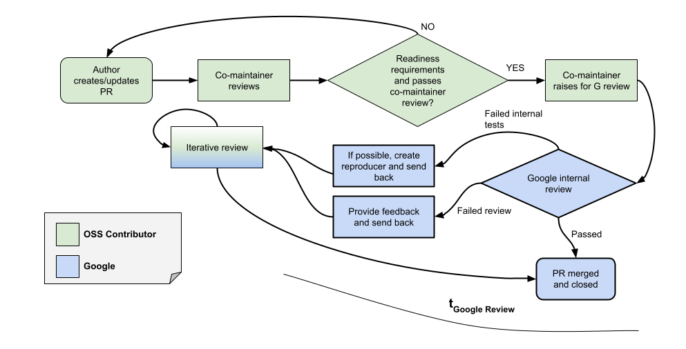

# Contributing to OpenXLA

Everyone can contribute to OpenXLA, and we value everyone’s contributions. There
are several ways to contribute, including:

*   Answering questions on OpenXLA’s discussions forums (openxla-discuss)

*   Improving or expanding OpenXLA’s documentation

*   Contributing to OpenXLA’s code-base

*   Contributing in any of the above ways to the broader ecosystem of libraries
built on OpenXLA

The OpenXLA project follows
[Google’s Open Source Community Guidelines](https://opensource.google/conduct/).

## Before you begin

### Sign the Contributor License Agreement

Contributions to this project must be accompanied by a
[Contributor License Agreement](https://cla.developers.google.com/about) (CLA).
You (or your employer) retain the copyright to your contribution; this simply
gives us permission to use and redistribute your contributions as part of the
project.

If you or your current employer have already signed the Google CLA (even if it
was for a different project), you probably don't need to do it again.

Visit <https://cla.developers.google.com/> to see your current agreements or to
sign a new one.

### Review the Code of Conduct

This project follows
[Tensorflow's Code of Conduct](https://github.com/tensorflow/tensorflow/blob/master/CODE_OF_CONDUCT.md).

## Contribution process

### Developer Guide

For a guide on how to setup a development environment for OpenXLA, including
getting code, building it, running tests and submitting changes, please refer to
the [Developer guide](./developer_guide.md).

### Contribution guide

The architecture of the compiler consists of the following components.



#### Optimization passes
Optimization passes execute transformations on the HLO to enhance computational
efficiency. These transformations span from architecture-agnostic, high-level
improvements to hardware-specific adjustments (e.g., for NVIDIA GPUs).

##### What we generally accept:

* Passes that generalize across multiple workloads and demonstrate a clear and
significant positive impact on performance benchmarks.

##### What we generally reject:

* Passes that perform unique optimizations targeting specific models.

#### Fusion passes
Fusion is a critical optimization that combines multiple HLO operations into a
single kernel to reduce memory I/O and kernel launch overhead.

All fusion passes should be added to the fusion pipeline only, not before or
after. That also means that the pre-optimized HLO module should not contain
fusion instructions. If the fusion is formed early in the pipeline, it becomes a
barrier for the optimization passes. If the fusion is formed late, then we lose
an ability to select and tune the backend for the generated fusion.

Fusion into the custom calls, i.e. pattern-matching custom calls with the
producers/consumers and rewriting them into the new custom calls is not allowed.
In that case, it should be replaced with a proper fusion pass.

#### Backends & Autotuning
Backends for the unnested ops, e.g. custom calls and fusions, should implement
[CodegenBackend](https://github.com/openxla/xla/blob/main/xla/backends/autotuner/codegen_backend.h)
interface.

This interface is necessary to enable optimal backend selection, because it
provides the methods to include the parameters for the given HLO instructions
into the search space of the autotuner.

```
// Returns all supported configs for the given HLO instruction.
virtual absl::StatusOr<std::vector<std::unique_ptr<BackendConfig>>>
  GetSupportedConfigs(const HloInstruction& instr);

// Returns a default config for the given HLO instruction.
virtual absl::StatusOr<std::unique_ptr<BackendConfig>> GetDefaultConfig(
  const HloInstruction& instr);
```

#### Runtime
The end result of the XLA compilation pipeline is a thunk sequence that can be
serialized.

All of the new thunk types should be serializable, i.e. `GpuCompiler` or
`CpuCompiler` should be able to compile the program, serialize it, so that later
the XLA runner could load and execute the program. That means that there should
be no pointers to `HloInstruction` or to other parts of the compiler or the
`StreamExecutor`.

### Code standards

*   *Coding style*: We follow [Google's code style guide](https://google.github.io/styleguide/).
    Specifically see the [C/C++](https://google.github.io/styleguide/cppguide.html) and [Python](https://google.github.io/styleguide/pyguide.html) guides. All
    code submitted must strictly conform to these style guides.

*   *Compact changes*: We follow
    [Google's engineering practices](https://google.github.io/eng-practices/).
    In particular, please observe the
    [guide on writing compact changes](https://google.github.io/eng-practices/review/developer/small-cls.html).
    Doing so will greatly increase the speed at which you can get your code
    merged due to improve reviewability, and reducing the likelihood of
    unintentional side effects of change. Even if you have a large change, there
    are many strategies for breaking it up into more incremental changes. If
    your PR is too large, it will receive an automated comment asking you to
    break it down into smaller PRs.

*   *Test Coverage*: All changes should include appropriate unit tests. Unit
    tests should not be dependent on specific hardware (CPU, GPU, etc.) timings,
    and should make liberal use of mocks and fakes in order to make
    deterministic and focused tests. Changes seeking to extend existing code
    that’s currently hard to test should make appropriate improvements to
    testability.

    All changes should include appropriate benchmark results as well in the
    change title to ensure the benefits are clearly understood.

*   *Feature Flags*: All somewhat complicated new features should be guarded
    with a flag first (e.g., via `DebugOptions`). This allows for easy rollback
    of the flag flip if problems arise, and affected users can temporarily
    set the flag themselves before a rollback is performed.

*   When in doubt as to conventions within the code, it is always a good idea to
    examine pre-existing code and to try to follow the patterns already in place
    in OpenXLA.


### Review Process

All submissions, including submissions by project members, require review. We
use GitHub pull requests for this purpose. Consult
[GitHub Help](https://help.github.com/articles/about-pull-requests/) for more
information on using pull requests.

*   Code must follow all standards listed above prior to review. These are not
    optional and it is critical that the submitter ensure their code conforms
    before requesting review in order to assure timely acceptance of changes.

*   *All tests and additional checks on GitHub must pass*. If you find that a
    test is broken and the issue is not related to your build environment or
    otherwise your changes, please contact the maintainers.

*   Avoid scope creep during the review process. This is the
    responsibility of both the submitter and the reviewer. If a change starts to
    get too large, consider breaking it up into multiple changes.

*   After a change is approved on GitHub but before it is merged, it will
    undergo internal testing that uses code
    internal to Google and other hardware vendors. This can potentially add extra
    steps to the review process if there are failures on internal tests that our
    public CI doesn't catch. The Googler reviewing your change will communicate
    any internal test failures and describe what needs to be fixed. The overall
    state of the internal checks is visible in the checks list on GitHub:
    - *import/copybara — Change imported to the internal review system*:
    Your PR has been imported in Google's internal system and checks are
    running.
    - *import/copybara — An error happened while migrating the change*: Your PR
    could not be imported into Google's internal system. This very rarely
    happens. If you see this state please ping your reviewer.
    - *feedback/copybara — Google internal checks PASS for runs with create time...*:
    All internal checks pass. Your PR should be merged soon.
    - *feedback/copybara — Google internal checks FAILED for runs with create time ...*:
    Some internal checks failed. A Google engineer will soon post a comment with
    more details. If you don't get any info about the failures within a day
    please ping your reviewer.


## Frequently asked questions (FAQ)

### "This infrastructure change is not related to my PR. Why should I do it?"

The XLA team doesn't have a dedicated infrastructure team, so it's up to us all
to build helper libraries and avoid technical debt. We consider it to be a
regular part of making changes to XLA, and everyone is expected to participate.
We generally build infrastructure as needed when writing code.

XLA reviewers may ask you to build some infrastructure (or otherwise make a
large change to a PR) along with a PR that you've written. This request may seem
unnecessary or orthogonal to the change you're trying to make. This is likely
because of a mismatch between your expectations about how much infra you need to
build and your reviewer's expectations for the same.

A mismatch in expectations is okay! That's expected when you're new to a project
(and it sometimes even happens to us old hats). It's likely that projects you've
worked on in the past have different expectations. That's also okay and
expected! It doesn't mean either one of these projects has the wrong approach;
they're just different. We invite you to take infra requests alongside all other
review comments as an opportunity to learn what we expect on this project.

### "Can I address your comment in a future PR?"

A frequent question with respect to infrastructure requests (or other large
requests) in PRs is whether or not the change must be made in the original PR,
or whether it can be done as a follow-up in a future PR.

In general, XLA does not allow PR authors to address review comments with a
follow-up PR. When a reviewer decides that something needs to be addressed in a
given PR, we generally expect authors to address it in that PR, even if what's
requested is a large change. This standard applies externally and also
internally within Google.

There are a few reasons that XLA takes this approach.

*   *Trust:* Having earned the reviewer's trust is a key component. In an
    open-source project, contributors can appear or disappear at will. After we
    approve a PR, reviewers have no way to ensure that any promised follow-ups
    actually get done.

*   *Impact on other developers:* If you have sent a PR touching a particular
    part of XLA, there's a good chance other people are looking at the same
    part. If we accept technical debt in your PR, then everyone who's looking at
    this file will be impacted by this debt until the follow-up is submitted.

*   *Reviewer bandwidth:* Deferring a change to a follow-up imposes multiple
    costs on our already overloaded reviewers. Reviewers will probably forget
    what the first PR was about while waiting for the follow-up, making the next
    review more difficult. Also, reviewers will have to keep track of expected
    follow-ups, making sure that they actually happen. If the change can be made
    such that it is truly orthogonal to the original PR so that some other
    reviewer could review it, bandwidth would be less of a problem. In our
    experience, this is rarely the case.

### What is the turn around time for code review and merge?

The OpenXLA project has a large contributor base. While we strive for quick
reviews and code merges, there are delays due to peaks of work.

In order to empower our partner teams to contribute high quality features and
fixes to the codebase, and to get quicker reviews and merges, we have
established the co-maintainer program. In this program, selected trusted partner
contributors ensure that the PRs submitted by those partners meet OpenXLA
quality requirements as specified in this contributing guide.

If co-maintainers from external partner teams have approved a PR, the Google XLA
team commits to reviewing and merging (if approved) within a controlled SLO
(**t<sub>Google Review</sub>** in the diagram below). If the PR is not approved,
the Google XLA team will provide a documented justification and where available
a reproducer of the failure.

At this moment the list of co-maintainers from our partner teams is:

*   [@Tixxx](https://github.com/Tixxx)
*   [@sergachev](https://github.com/sergachev)
*   [@jreiffers](https://github.com/jreiffers)
*   [@ezhulenev](https://github.com/ezhulenev)
*   [@mminutoli](https://github.com/mminutoli)
*   [@pemeliya](https://github.com/pemeliya)



| Percentile | Target for **t<sub>Google Review</sub>** |
| --- | --- |
| 50 percentile | 3 business days |
| 80 percentile | 4 business days |
| 90 percentile | 5 business days |
| 95 percentile | 6 business days |

When Google reviews the PR, it may fail due to an internal test. In this case,
Google will try to generate a reproducer and share it with the partner. In other
cases, the review may fail for technical, architectural or stylish reasons -
Google will share the feedback with the author. We expect that if the PR is
rejected in the first pass, we will enter a tight loop iteration between the
partner team and Google (“Iterative review”) to bring the PR to the desired
state.

The OpenXLA project is committed to strengthening its co-maintainer program and
adding more contributors to this list. We plan to review on a monthly basis the
target turnaround times and report back to the participating teams.
