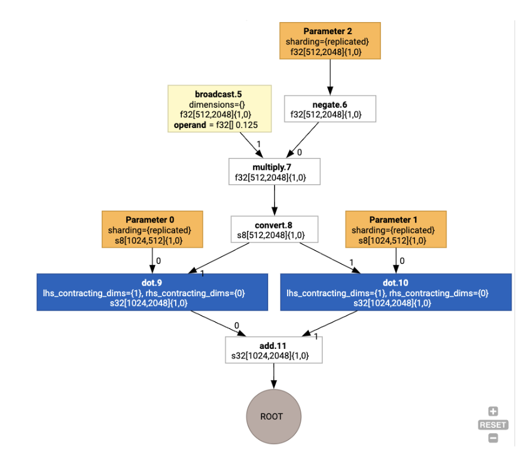

# XLA:GPU Architecture Overview

# Introduction

XLA is a hardware- and framework- domain-specific compiler for linear algebra,
offering best-in-class performance. JAX, TF, Pytorch and others use XLA by
converting the user input to
[StableHLO](https://github.com/openxla/stablehlo/tree/main) (“high-level
operation”: a set of \~100 statically shaped instructions like addition,
subtraction, matmul, etc) operation set, from which XLA produces optimized code
for a variety of backends:


During the execution, the frameworks invoke the
[PJRT runtime](https://opensource.googleblog.com/2023/05/pjrt-simplifying-ml-hardware-and-framework-integration.html)
API, which lets the frameworks perform the operation “populate the specified
buffers using a given StableHLO program on a specific device”.

# XLA:GPU Pipeline

XLA:GPU uses a combination of “native” (PTX, via LLVM) emitters and TritonIR
emitters to generate high-performance GPU kernels (blue color indicates 3P
components):


## Running Example: JAX

To illustrate the pipeline, let’s start with a running example in JAX, which
computes a matmul combined with multiplication by a constant and negation:

```
def f(a, b):
    return -((a @ b) * 0.125)
```

We can inspect the HLO generated by the function:

```
M = 1024
K = 512
N = 2048
key = jax.random.PRNGKey(1701)
a = jax.random.randint(key, (M, K), dtype=jax.numpy.int8, minval=0, maxval=255)
b = jax.random.normal(key, (K, N), dtype=jax.dtypes.bfloat16)

print(jax.xla_computation(f)(a, b).as_hlo_text())
```

which generates:

```
HloModule xla_computation_f, entry_computation_layout={(s8[1024,512]{1,0}, bf16[512,2048]{1,0})->(bf16[1024,2048]{1,0})}

ENTRY main.10 {
  Arg_0.1 = s8[1024,512]{1,0} parameter(0)
  convert.5 = bf16[1024,512]{1,0} convert(Arg_0.1)
  Arg_1.2 = bf16[512,2048]{1,0} parameter(1)
  dot.6 = bf16[1024,2048]{1,0} dot(convert.5, Arg_1.2), lhs_contracting_dims={1}, rhs_contracting_dims={0}
  constant.3 = bf16[] constant(0.125)
  broadcast.4 = bf16[1024,2048]{1,0} broadcast(constant.3), dimensions={}
  multiply.7 = bf16[1024,2048]{1,0} multiply(dot.6, broadcast.4)
  ROOT negate.8 = bf16[1024,2048]{1,0} negate(multiply.7)
}
```

We can visualize the input HLO computation as well, using
`jax.xla_computation(f)(a, b).as_hlo_dot_graph()`:


## Optimizations on HLO: Key Components

A number of notable optimization passes happen on HLO, as HLO->HLO rewrites.

### SPMD Partitioner

The XLA SPMD partitioner, as described in the GSPMD
[publication](https://arxiv.org/pdf/2105.04663.pdf%C3%AF%C2%BC%E2%80%B0%C3%A3%E2%82%AC%E2%80%B9%C3%A5%E2%80%99%C5%92),
consumes HLO with sharding annotations (produced e.g. by `jax.pjit`), and
produces a sharded HLO which can then run on a number of hosts and devices.
Apart from partitioning, the SPMD attempts to optimize HLO for an optimal
execution schedule,
[overlapping](https://dl.acm.org/doi/pdf/10.1145/3567955.3567959) computation
and communication between the nodes.

#### Example

Consider starting from a simple JAX program sharded across two devices:

```
# Defines a mesh with two axes called ‘x’ and ‘y’,
# sharded across two devices: first and second CPU.
with jax.sharding.Mesh(
      [['cpu:0', 'cpu:1']], ('x', 'y')):

    @pjit
    def f(a, b):
        out = -((a @ b) * 0.125)
        # Shard output matrix access across ‘x’
        # and ‘y’ respectively. Generates ‘Sharding’
        # custom call.
        out = with_sharding_constraint(
          out, jax.lax.PartitionSpec('x', 'y'))
        return out

# Random inputs to call our function.
a = jax.random.randint(key, (1024, 512), jnp.int8)
b = jax.random.normal(key, (512, 2048), jnp.float32)

print(f.lower(a, b).compiler_ir())
```

Visualizing it, the sharding annotations are presented as custom calls:


To check how the SPMD partitioner expands the custom call, we can look at HLO
after optimizations:

```
print(f.lower(np.ones((8, 8)).compile().as_text())
```

Which generates HLO with a collective:


### Layout Assignment

HLO decouples logical shape and physical layout (how tensors are laid out in
memory). For example, a matrix `f32[32, 64]` can be represented either in
row-major or column-major order, represented as `{1,0}` or `{0,1}` respectively.
In general, layout is represented as a part of shape, showing a permutation over
the number of dimensions indicating physical layout in memory.

For each operation present in the HLO, the Layout Assignment pass chooses an
optimal layout (e.g. NHWC for a convolution on Ampere). For example, an
`int8xint8->int32`  matmul operation prefers `{0,1}` layout for the RHS of the
computation. Similarly, “transposes” inserted by the user are ignored, and
encoded as a layout change.

The layouts are then propagated through the graph, and conflicts between layouts
or at graph endpoints are materialized as `copy` operations, which perform the
physical transposition. For example, starting from the graph



Running the layout assignment we see the following layouts and `copy` operation
inserted:


### Fusion

Fusion is XLA’s single most important optimization, which groups multiple
operations (e.g. addition into exponentiation into matmul) to a single kernel.
Since many GPU workloads tend to be memory-bound, fusion dramatically speeds up
the execution by avoiding the writing of intermediate tensors to HBM and then
reading them back, and instead passes them around in either registers or shared
memory.

Fused HLO instructions are blocked together in a single fusion computation,
which establishes the following invariants:

-   No intermediate storage inside the fusion is materialized in HBM (it has to
    be all passed through either registers or shared memory).

-   A fusion is always compiled to exactly one GPU kernel

## HLO Optimizations on Running Example

We can inspect the post-optimization HLO using `jax.jit(f).lower(a,
b).compile().as_text()`, and verify that a single fusion got generated:

```
HloModule jit_f, is_scheduled=true, entry_computation_layout={(s8[3,2]{1,0}, bf16[2,3]{1,0})->bf16[3,3]{1,0}}, allow_spmd_sharding_propagation_to_output={true}

%triton_gemm_dot.6_computation (parameter_0: s8[3,2], parameter_1: bf16[2,3]) -> bf16[3,3] {
  %parameter_0 = s8[3,2]{1,0} parameter(0)
  %convert.0 = bf16[3,2]{1,0} convert(s8[3,2]{1,0} %parameter_0)
  %parameter_1 = bf16[2,3]{1,0} parameter(1)
  %dot.0 = bf16[3,3]{1,0} dot(bf16[3,2]{1,0} %convert.0, bf16[2,3]{1,0} %parameter_1), lhs_contracting_dims={1}, rhs_contracting_dims={0}
  %convert.1 = f32[3,3]{1,0} convert(bf16[3,3]{1,0} %dot.0)
  %constant_0 = bf16[] constant(0.125)
  %broadcast.0 = bf16[3,3]{1,0} broadcast(bf16[] %constant_0), dimensions={}
  %convert.2 = f32[3,3]{1,0} convert(bf16[3,3]{1,0} %broadcast.0)
  %multiply.0 = f32[3,3]{1,0} multiply(f32[3,3]{1,0} %convert.1, f32[3,3]{1,0} %convert.2)
  %negate.0 = f32[3,3]{1,0} negate(f32[3,3]{1,0} %multiply.0)
  ROOT %convert.6 = bf16[3,3]{1,0} convert(f32[3,3]{1,0} %negate.0)
}

ENTRY %main.9 (Arg_0.1: s8[3,2], Arg_1.2: bf16[2,3]) -> bf16[3,3] {
  %Arg_1.2 = bf16[2,3]{1,0} parameter(1), sharding={replicated}
  %Arg_0.1 = s8[3,2]{1,0} parameter(0), sharding={replicated}
  ROOT %triton_gemm_dot.6 = bf16[3,3]{1,0} fusion(s8[3,2]{1,0} %Arg_0.1, bf16[2,3]{1,0} %Arg_1.2), kind=kCustom, calls=%triton_gemm_dot.6_computation, backend_config={"kind":"__triton_gemm","triton_gemm_config":{"block_m":"64","block_n":"64","block_k":"64","split_k":"1","num_stages":"2","num_warps":"4"}}
}
```

Note that the fusion `backend_config` tells us that Triton will be used as a
code generation strategy, and it specifies the chosen tiling.

We can also visualize the resulting module:


## Buffer Assignment and Scheduling

A buffer assignment pass takes into account the shape information, and aims to
produce an optimal buffer allocation for the program, minimizing the amount of
intermediate memory consumed. Unlike TF or PyTorch immediate-mode (non-compiled)
execution, where the memory allocator does not know the graph in advance, the
XLA scheduler can “look into the future” and produce an optimal computation
schedule.

## Compiler Backend: Codegen and Library Selection

For every HLO instruction in the computation, XLA chooses whether to run it
using a library linked into a runtime, or to codegen it to PTX.

### Library Selection

For many common operations, XLA:GPU uses fast-performance libraries from NVIDIA,
such as cuBLAS, cuDNN, and NCCL. The libraries have an advantage of verified
fast performance, but often preclude complex fusion opportunities.

### Direct code generation

The XLA:GPU backend generates high-performance LLVM IR directly for a number of
operations (reductions, transposes, etc).

### Triton code generation

For more advanced fusions which include matrix multiplication or softmax,
XLA:GPU uses [Triton](https://github.com/openai/triton) as a code-generation
layer. HLO Fusions are converted to TritonIR (an MLIR dialect which serves as an
input to Triton), selects tiling parameters and invokes Triton for PTX
generation:


We have observed the resulting code to perform very well on Ampere, at
near-roofline performance with properly tuned tile sizes.

## Runtime

XLA Runtime converts the resulting sequence of CUDA kernel calls and library
invocations into a RuntimeIR (an MLIR dialect in XLA), on which CUDA graph
extraction is performed. CUDA graph is still work in progress, only some nodes
are currently supported. Once CUDA graph boundaries are extracted, RuntimeIR is
compiled via LLVM to a CPU executable, which can then be stored or transferred
for Ahead-Of-Time compilation.
