# From HLO to Thunks

This document outlines the journey of an XLA *High Level Optimizer* (HLO) module
from its initial state to a final executable. Sometimes we will omit the
"module" and refer to it just as "HLO".



## Pre-optimization HLO

We start with pre-optimization HLO module. Pre-optimization HLO does not contain
operations (*ops*) that are considered internal to XLA, such as `fusion` or
`bitcast`. Ops don't have a layout at this stage, or if they do, it will be
ignored. Pre-optimization HLO is usually produced by higher-level frameworks
like TensorFlow and JAX. When using the XLA flag `-xla_dump_to`, the
pre-optimization HLO is dumped to a file with file name suffix
“before_optimizations.txt”.

## Optimize HLO Module

The XLA:GPU pipeline turns the pre-optimization HLO into optimized HLO by
running a sequence of passes. The passes can be grouped together semantically
and run in the following order:

### Sharding related passes

This includes passes like the [Shardy
Partitioner](https://openxla.org/shardy/overview) or those for SPMD sharding.

### Optimization passes

This can include both legalization passes and simplification passes.

### Collective optimization passes

Similar to **Optimization passes**, but focuses on collective ops.

### Layout assignment passes

Each HLO op is assigned a layout which is a part of the instruction shape. The
layout controls how the tensor is laid out physically in memory.

Example of a shape with layout:

```
f32[10,20,30]{2,0,1}
```

After the element type, there are the logical dimensions of the shape, followed
by the layout permutation in minor to major order. In this example, the most
minor dimension is 30, the second most minor dimension is 10, and the major
dimension is 20.

The goal of layout assignment is to minimize the number of required physical
transpositions using a greedy strategy. It starts with certain layout
constraints (e.g., cuDNN/cuBLAS libraries expect consecutive dimensions) and
propagates layouts “down” and then “up” the HLO graph. At the
end of layout propagation, some instructions may have conflicting layouts, one
propagated from an operand, one propagated from a user. To resolve this
conflict, a `copy` HLO instruction is inserted that changes the layout from the
operand layout to the instruction layout.

### Layout normalization passes

Given that it is somewhat difficult to figure out the physical shape, layout
normalization attempts to rewrite the shape such that it uses the default layout
`{rank-1, rank-2, …, 0}`. In the example above, the normalized shape would be
`f32[20,10,30]{2,1,0}`. Copy ops that change layouts are rewritten as a
combination of `transpose` and `bitcast`. Given that currently we cannot
normalize all ops, there are still some ops that may have non-default layouts,
most notably `gather` and `dot`. At the boundaries between normalized ops and
non-normalized ops there will be `bitcast` ops that represent a transpose, i.e.
a transpose with a layout assigned that makes it a no-op physically.

Layout normalization also makes some implicit transposes explicit which is
important because codegen can handle explicit transposes with a dedicated
emitter. For example, a reshape is technically allowed to have a different
physical layout between operand and result (e.g. due to different rank). The
`ReshapeDecomposer` pass that runs as part of the layout normalization passes
turns a reshape into a sequence of `transpose`, reshape `bitcast` and
`transpose`.

### Post layout assignment optimization passes

The most important passes here are Triton fusions (GEMM fusions +
Softmax/Layernorm fusions) or rewrites to library calls. Autotuning also runs in
this step, where XLA chooses chooses between different emitters, picks the best
algorithm for convolutions or dots, finds the best tiling for fusions handled by
the Triton emitter etc.

### Fusion passes

The two main passes are `PriorityFusion` and `Multi-Output` fusion.

In `PriorityFusion`, we form fusions guided by the cost model. When fusing we
would allow duplicating ops with several users if the op can be fused into all
users. We would also allow extending existing Triton Softmax fusions if
possible.

`Multi-Output` fusion is a separate pass that allows fusing ops/fusions that
share an operand. It can also fuse operands/operand fusions into users without
duplication by adding extra output(s), so other users of the op to be fused can
be redirected to these outputs. This pass needs to be careful not to introduce
cycles into the HLO graph.

After Multi-Output fusion, common subexpression elimination (`HloCSE` pass)
runs, potentially merging previously duplicated ops back together if they ended
up in the same fusion.

### Several post-fusion passes

Several passes related to collectives (like turning them to async, or enforcing
a certain relative order of collectives).

Finally we run `CopyInsertion` where copies are added to ensure that in-place
operations don't overwrite data that is still needed elsewhere.

At the end of optimization, the optimized HLO is dumped if using the flag
`-xla_dump_to` to a file that has the file name suffix
"after_optimizations.txt". If you want to dump the HLO after intermediate
passes that actually change the HloModule, you can use the flag
`-xla_dump_hlo_pass_re=.*` (or a specific regular expression to restrict it to
certain passes).

## Scheduling

An HLO Module without a schedule still has some degree of freedom in the order
in which ops are processed. Any topological sort respecting operand/result
relationships and control dependencies is valid. Scheduling determines what
specific order to use. The main concern at this stage is the maximum memory
consumption that depends on the lifetime of tensors. In an initial step, we try
different scheduler algorithms and pick the schedule that should minimize the
peak memory consumption. Note that at this point we don't work with a physical
buffers yet (that will happen in "Buffer Assignment") and simulate the memory
usage.

Then `LatencyHidingScheduler` pass runs and tries to maximize
compute-communication overlap. But that may increase memory usage again.

Finally, in case peak memory consumption is higher than the amount of memory we
have available we run `HloRematerialization`. This pass attempts to reduce
memory usage at the cost of performance, as e.g. some fusions might be split and
some ops might be duplicated to have shorter buffer lifetimes. If
rematerialization occurs, it might be beneficial to investigate ways to reduce
memory requirements on the model side (e.g., using smaller batch sizes).

## Buffer Assignment

Immediately before we lower to LLVM IR, we run the buffer assignment passes that
will assign buffer slices to each instruction in the HLO graph. The buffer
assignment runs in several steps:

1. `HloDataflowAnalysis` assigns `HloValues` (essentially logical buffers) to
instructions. For in-place ops, the `HloValue` of an operand can be reused. An
op may define more than one `HloValue` (e.g. with a tuple result shape).

2. `HloAliasAnalysis` attempts to combine buffers for aliasing operations, and
computes a mapping from `HloValue` to `HloBuffer`.

3. `BufferAssignment` computes a mapping of `HloBuffers` to buffer slices inside
a big buffer in such a way that the same buffer slice is not used for different
`HloBuffers` with overlapping life times. For ops that may alias, it is ok that
there is a slight overlap (the end time of the one `HloBuffer` may coincide with
the start time of the other `HloBuffer`). When using the flag `-xla_dump_to`,
some information about buffer assignment is dumped to a file with the name
suffix "after_optimizations-buffer-assignment.txt".

## Thunks

After an HLO graph is optimized and scheduled, it is lowered into a
linear sequence of thunks for a specific backend (CPU or GPU).

In XLA, a **Thunk** is an abstraction of a self-contained unit of work that the
runtime executes. It might be a compiled kernel launch, specific operation,
library call, control-flow construct, collective communication, and so on. A
**Thunk Sequence** represents the entire executable for a specific backend.

### Thunk Emission

The process of converting a scheduled HLO computation into a thunk sequence is
called "thunk emission". This is handled by a dedicated emitter class in each
backend.

For the GPU Backend, this is handled by
[IrEmitterUnnested](https://github.com/openxla/xla/tree/main/xla/service/gpu/ir_emitter_unnested.h).
`EmitHloComputation` iterates through the scheduled list of HLO Instructions in
a computation and dispatches to a specialized `Emit...` method (e.g.,
`EmitFusion`, `EmitConvolutionThunk`, `EmitWhile`). Each of these methods
constructs the appropriate Thunk object(s) and appends them to the
thunk sequence.

For the CPU Backend,
[ThunkEmitter](https://github.com/openxla/xla/tree/main/xla/service/cpu/thunk_emitter.h)
performs this role and is organized in a similar manner. Final `ThunkSequence`
is embedded in the `CpuExecutable`.

Note that each instruction in the entry computation of an HLO module might
correspond to no (`kTuple`, `kConstant`, ..), one, or multiple (for example
sort instruction) thunks in the final thunk sequence.

### Command Buffers: Optimizing Execution on the GPU

Modern GPU hardware allows recording a sequence of GPU operations (kernel
launches, memory copies, etc.) once and then replaying the sequence multiple
times with minimal CPU overhead. This is a critical performance optimization,
especially for workloads with many small, fast-launching kernels. XLA uses
**Command Buffer** as an abstraction of CUDA Graphs or HIP Graphs. The core
interface is defined in
[GpuCommandBuffer](https://github.com/openxla/xla/tree/main/xla/stream_executor/gpu/gpu_command_buffer.h).

A command buffer is represented in a thunk sequence by
[CommandBufferThunk](https://github.com/openxla/xla/tree/main/xla/backends/gpu/runtime/command_buffer_thunk.h).

The emitter does not produce this thunk directly from HLO instructions. Instead,
this is done by
[CommandBufferConversionPass](https://github.com/openxla/xla/tree/main/xla/backends/gpu/runtime/command_buffer_conversion_pass.h)
that runs on the ThunkSequence itself.

The pass identifies contiguous sub-sequences of compatible thunks (e.g., a
series of `KernelThunk`s and `GemmThunk`s). It then replaces the found
sub-sequence with a single `CommandBufferThunk`. The new thunk encapsulates the
logic of the original thunks as a list of lightweight CommandBufferCmd objects.
When a `CommandBufferThunk` executes for the first time on a given GPU stream,
it "records" its sequence of commands into a hardware command buffer. On all
subsequent executions, it simply issues a single command to the GPU to "replay"
the recorded sequence. This avoids the CPU overhead of launching each individual
kernel.

## Executable

The final product of the XLA compilation pipeline is a self-contained,
platform-specific
[Executable](https://github.com/openxla/xla/tree/main/xla/service/executable.h).
This object encapsulates all the information needed to run the compiled program
on a target device, such as a CPU or GPU. It is the bridge between the compiler
and the runtime. Modern runtimes like PJRT use slightly higher-level
abstractions (see
[PjRtExecutable](https://github.com/openxla/xla/tree/main/xla/pjrt/pjrt_executable.h)),
but these ultimately wrap a backend-specific executable.

An `Executable` contains several key pieces of information generated
during compilation. While the exact contents vary by backend, they generally
include:

- Compiled Code: This is the low-level machine code that will run on the device.
  For CPUs, this is typically one or more object files. For GPUs, this is the
  compiled device code in PTX or HSACO format, which is loaded onto the GPU at
  runtime.

- Execution Plan (ThunkSequence): The core of the runtime logic. This is a
  linear sequence of Thunk objects. Each thunk represents a single unit of work,
  such as launching a kernel, calling a library function (e.g., cuBLAS), or
  handling control flow. The runtime executes the program by iterating through
  this sequence.

- Memory Layout (BufferAssignment): This critical piece of metadata, produced by
  the BufferAssigner, describes the complete memory layout for the computation.
  It specifies the size of every buffer and how memory is allocated and reused
  for parameters, outputs, and temporary values. The runtime uses this to
  allocate device memory and pass the correct pointers to each thunk.

- (optional) HLO Module: For debugging and profiling, the executable often
  retains a reference to the final, optimized HloModule that it was compiled
  from.

The creation of the final executable is orchestrated by the compiler for each
specific backend. The `RunBackend` method of a Compiler implementation is the
final step in the compilation process, which packages all the compiled artifacts
into an Executable object.
[GpuCompiler](https://github.com/openxla/xla/tree/main/xla/service/gpu/gpu_compiler.cc)
and
[CpuCompiler](https://github.com/openxla/xla/tree/main/xla/service/cpu/cpu_compiler.cc)
target GPU and CPU respectively.

When a user calls `Execute...` on an executable, the runtime uses the
`BufferAssignment` to allocate memory, and then invokes the `ThunkSequence` to
launch the operations on the device using the compiled code.
