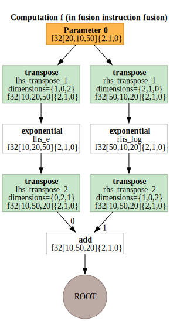
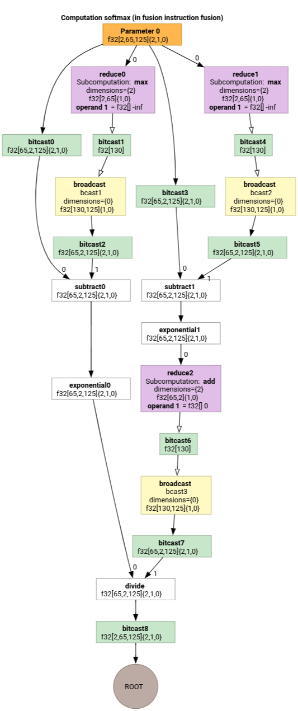

# Indexing Analysis

HLO indexing analysis is a [dataflow analysis](https://en.wikipedia.org/wiki/Data-flow_analysis)
that describes how elements of one tensor relate to another via "indexing
maps". For example, how indices of an HLO instruction output map to indices of
HLO instruction operands.

#### Example

For a broadcast from `tensor<20xf32>` to `tensor<10x20x30xf32>`

```c
p0 = f32[20] parameter(0)
bc0 = f32[10, 20, 30] broadcast(p0), dimensions={1}
```

the indexing map from the output to input is `(i, j, k) -> (j)` for `i in
[0, 10]`, `j in [0, 20]` and `k in [0, 30]`.

## Motivation

XLA uses several bespoke solutions to reason about coalescing, operand
utilization, and tiling schemes (more details below). The goal of indexing
analysis is providing a reusable component for such use cases. Indexing analysis
is built on MLIR's Affine Map infrastructure and adds HLO semantics.

### Coalescing

Reasoning about memory coalescing becomes feasible for non-trivial cases, when
we know what elements/slices of the inputs are read to compute an element of the
output.

### Operand Utilization

Operand utilization in XLA indicates how much each input of the instruction is
used assuming its output is fully used. Currently, utilization is also not
computed for a generic case. Indexing analysis allows us to compute utilization
precisely.

### Tiling

A tile/slice is hyper-rectangular subset of a tensor parameterized by offsets,
sizes and strides. Tile propagation is a way to compute tile parameters of the
producer/consumer of the op using the tiling parameters of the op itself. There
is already a
[library](https://github.com/openxla/xla/blob/main/xla/service/gpu/triton_tiling_propagation.h)
that does it for softmax and dot. Tile propagation can be made more generic and
robust if it is expressed via indexing maps.

## Indexing map

An *indexing map* is a combination of

- a symbolically expressed function that maps every element of one tensor `A` to
  ranges of elements in tensor `B`;
- constraints on valid function arguments, including function's domain.

Function arguments are split into 3 categories to better communicate their
nature:

- *dimension* variables of the tensor `A` or a GPU grid we are mapping from;
  values are known statically. Index elements are also called *dimension
  variables*.

- *range* variables. They define a one-to-many mapping and specify a set of
  elements in `B` used to compute a single value of `A`; values are known
  statically. The contracting dimension of a matrix multiplication is an example
  of a range variable.

- *runtime variables* that are only known at during execution. For example,
  indices argument of [gather](https://openxla.org/xla/operation_semantics#gather)
  operation.

Result of the function is an index of the target `B` tensor.

In short, an indexing function from tensor `A` to tensor `B` for operation `x`
is

`map_ab(index in A, range variables, runtime variables) -> index in B`.

To better separate the types of mapping arguments we write them as:

`map_ab(index in A)[range variables]{runtime variables} -> (index in B)`

For example, let's look at the indexing maps for the reduce operation
`f32[4, 8] out = reduce(f32[2, 4, 8, 16] in, 0), dimensions={0,3}`:

- to map elements of `in` to `out` our function can be expressed as
  `(d0, d1, d2, d3) -> (d1, d2)`. The constraints of the variables
  `d0 in [0, 1], d1 in [0, 3], d2 in [0, 7], d3 in [0, 15]` are defined by the
  shape of `in`.

- To map elements of `out` to `in`: `out` has only two dimensions, and reduction
  introduces two range variables that cover reducing dimensions. Thus the
  mapping function is `(d0, d1)[s0, s1] -> (s0, d0, d1, s1)`, where `(d0, d1)`
  is index of `out`. `s0`, `s1` are ranges defined by operation's semantics and
  span dimension 0 and 3 of the `in` tensor. The constraints are
  `d0 in [0, 3], d1 in [0, 7], s0 in [0,1], s1 in [0, 15]`.

It's important to note that in most scenarios we are interested in mapping from
the elements of the *output*. For computation

```
C = op1(A, B)
E = op2(C, D)
```

we can talk about "indexing of B" meaning "mapping of elements of `E` into
the elements of `B`". This might be counter-intuitive compared to other types of
data-flow analysis that work from input toward outputs.

*Constraints* on variables enable optimization opportunities and help with
code generation. In the documentation and implementation constraints are also
referred to as *domain* as they define all valid combinations or argument values
of the mapping function. For many operation, constraints simply describe the
dimensions of tensors but for some operations they might be more complicated;
see examples below.

By having functions and argument constraints expressed symbolically and being
able to combine functions and constraints we can compute a compact indexing
mapping for an arbitrary large computation (fusion).

Expressiveness of symbolic function and constraints is a balance between
implementation complexity and optimization gains we get from having a more
precise representation. For some HLO operations we capture access patterns only
approximately.

## Implementation

Since we want to minimize recomputation, we need a library for symbolic
computations. XLA already depends on MLIR, so we use
[mlir::AffineMap](https://github.com/llvm/llvm-project/blob/main/mlir/include/mlir/IR/AffineMap.h)
instead of writing a yet-another symbolic arithmetic library.

A typical `AffineMap` looks like

```
(d0)[s0, s1] -> (s0 + 5, d0 * 2, s1 * 3 + 50)
```

`AffineMap` has two types of parameters: *dimensions* and *symbols*.
*Dimensions* correspond to the dimension variables *d*; *symbols* correspond to
the range variables *r* and runtime variables *rt*. `AffineMap` does not contain
any metadata about constraints of the parameters, so we have to provide them
separately.

```c
struct Interval {
 int64_t lower;
 int64_t upper;
};

class IndexingMap {
   // Variable represents dimension, range or runtime variable.
  struct Variable {
    Interval bounds;
    // Name of the variable is used for nicer printing.
    std::string name = "";
  };

  mlir::AffineMap affine_map_;

  // DimVars represent dimensions of a tensor or of a GPU grid.
  std::vector<Variable> dim_vars_;

  // RangeVars represent ranges of values, e.g. to compute a single element of
  // the reduction's result we need a range of values from the input tensor.
  std::vector<Variable> range_vars_;

  // RTVars represent runtime values, e.g. a dynamic offset in
  // HLO dynamic-update-slice op.
  std::vector<Variable> rt_vars_;
  llvm::DenseMap<mlir::AffineExpr, Interval> constraints_;
};
```

`dim_vars_` encode the **inclusive** box constraints for the dimension
variables **d** of the indexing map, which usually coincide with the
shape of the output tensor for ops like transpose, reduce, elementwise, dot, but
there are some exceptions like
[HloConcatenateInstruction](https://github.com/openxla/stablehlo/blob/main/docs/spec.md#concatenate).

`range_vars_` all values that range variables **s** take. The range variables
are needed when multiple values are necessary to compute a single element of the
tensor we are mapping from, e.g. for output->input indexing map of reductions or
input->output map for broadcasts.

`rt_vars_` encode the feasible values in runtime. For example, the offset is
dynamic for a 1D `HloDynamicSliceInstruction`. The corresponding `RTVar` will
have feasible values between `0` and `tensor_size - slice_size - 1`.

`constraints_` capture relations between values in form
`<expression> in <range>`, e.g. `d0 + s0 in [0, 20]`. Together with
`Variable.bounds` they define the "domain" of indexing function.

Let's study-by-example to understand what's all of the above actually means.

## Indexing Maps for Unfused Ops

### Elementwise

For elementwise ops the indexing map is an identity.

```c
  p0 = f32[10, 20] parameter(0)
  p1 = f32[10, 20] parameter(1)
  output = f32[10, 20] add(p0, p1)
```

The output to input map `output -> p0`:

```
(d0, d1) -> (d0, d1),
domain:
d0 in [0, 9],
d1 in [0, 19]
```

The input to output map `p0 -> output`:

```
(d0, d1) -> (d0, d1),
domain:
d0 in [0, 9],
d1 in [0, 19]
```

### [Broadcast](https://openxla.org/xla/operation_semantics#broadcastindim)

Broadcasting means that some of the dimensions will be removed when we map
output to input and added when we map input to output.

```c
p0 = f32[20] parameter(0)
bc0 = f32[10, 20, 30] broadcast(p0), dimensions={1}
```

The output to input map:

```
(d0, d1, d2) -> (d1),
domain:
d0 in [0, 9],
d1 in [0, 19],
d2 in [0, 29]
```

The input to output map:

```
(d0)[s0, s1] -> (s0, d0, s1),
domain:
d0 in [0, 19],
s0 in [0, 9],
s1 in [0, 29]
```

Note that now we have range variables **s** on the right side for the
input-to-output mapping. Those are the symbols that represent ranges of values.
For example, in this particular case every element of input with index `d0` is
mapped to a 10x1x30 slice of the output.

### [Iota](https://openxla.org/xla/operation_semantics#iota)

Iota has no input tensor operand, so there is no input index arguments.

```c
iota = f32[2,4] iota(), dimensions={1}
```

Output to input map:

```
(d0, d1) -> ()
domain:
d0 in [0, 1]
d1 in [0, 3]
```

Input to output map:

```
()[s0, s1] -> (s0, s1)
domain:
s0 in [0, 1]
s1 in [0, 3]
```

### [DynamicSlice](https://openxla.org/xla/operation_semantics#dynamicslice)

DynamicSlice has offsets known only at runtime.

```c
src = s32[2, 2, 258] parameter(0)
of1 = s32[] parameter(1)
of2 = s32[] parameter(2)
of3 = s32[] parameter(3)
ds = s32[1, 2, 32] dynamic-slice(src, of1, of2, of3), dynamic_slice_sizes={1, 2, 32}
```

The output to input map from `ds` to `src`:

```
(d0, d1, d2){rt0, rt1, rt2} -> (d0 + rt0, d1 + rt1, d2 + rt2),
domain:
d0 in [0, 0],
d1 in [0, 1],
d2 in [0, 31],
rt0 in [0, 1],
rt1 in [0, 0],
rt2 in [0, 226]
```

Note that now we have **rt** on the right side for the input-to-output mapping.
Those are the symbols that represent runtime values. For example, in this
particular case for every element of the output with indices `d0, d1, d2` we
access slice offsets `of1`, `of2` and `of3` to compute the index of the input.
The intervals for the runtime variables are derived by assuming that the entire
slice stays in bounds.

The output to input map for `of1`, `of2` and `of3`:

```
(d0, d1, d2) -> (),
domain:
d0 in [0, 0],
d1 in [0, 1],
d2 in [0, 31]
```

### [DynamicUpdateSlice](https://openxla.org/xla/operation_semantics#dynamicupdateslice)

```c
src = s32[20,30] parameter(0)
upd = s32[5,10] parameter(1)
of1 = s32[] parameter(2)
of2 = s32[] parameter(3)
dus = s32[20,30] dynamic-update-slice(
    s32[20,30] src, s32[5,10] upd, s32[] of1, s32[] of2)
```

The output to input map for `src` is trivial. It can be made more precise by
restricting the domain to the not-updated indices, but right now indexing maps
do not support inequality constraints.

```
(d0, d1) -> (d0, d1),
domain:
d0 in [0, 19],
d1 in [0, 29]
```

The output to input map for `upd`:

```
(d0, d1){rt0, rt1} -> (d0 - rt0, d1 - rt1),
domain:
d0 in [0, 19],
d1 in [0, 29],
rt0 in [0, 15],
rt1 in [0, 20]
```

Note that now we have `rt0` and `rt1` that represent runtime values. In
this particular case for every element of the output with indices `d0, d1` we
access slice offsets `of1` and `of2` to compute the index of the input. The
intervals for the runtime variables are derived by assuming that the entire
slice stays in bounds.

The output to input map for `of1` and `of2`:

```
(d0, d1) -> (),
domain:
d0 in [0, 19],
d1 in [0, 29]
```

### [Gather](https://openxla.org/xla/operation_semantics#gather)

Only the simplified gather is supported. See [gather_simplifier.h](https://github.com/openxla/xla/blob/main/xla/hlo/transforms/simplifiers/gather_simplifier.h).

```c
operand = f32[33,76,70] parameter(0)
indices = s32[1806,2] parameter(1)
gather = f32[1806,7,8,4] gather(operand, indices),
  offset_dims={1,2,3},
  collapsed_slice_dims={},
  start_index_map={0,1},
  index_vector_dim=1,
  slice_sizes={7,8,4}
```

The output to input map for `operand`:

```
(d0, d1, d2, d3){rt0, rt1} -> (d1 + rt0, d2 + rt1, d3),
domain:
d0 in [0, 1805],
d1 in [0, 6],
d2 in [0, 7],
d3 in [0, 3],
rt0 in [0, 26],
rt1 in [0, 68]
```

Note that now we have **rt** symbols that represent runtime values.

The output to input map for `indices`:

```
(d0, d1, d2, d3)[s0] -> (d0, s0),
domain:
d0 in [0, 1805],
d1 in [0, 6],
d2 in [0, 7],
d3 in [0, 3],
s0 in [0, 1]
```

The range variable `s0` shows that we need the entire row (d0, *) of the
`indices` tensor to compute an element of the output.

### [Transpose](https://openxla.org/xla/operation_semantics#transpose)

Indexing map for transpose is a permutation of input/output dimensions.

```c
p0 = f32[3, 12288, 6, 128] parameter(0)
transpose = f32[3, 6, 128, 12288] transpose(p0), dimensions={0, 2, 3, 1}
```

The output to input map:

```
(d0, d1, d2, d3) -> (d0, d3, d1, d2),
domain:
d0 in [0, 2],
d1 in [0, 5],
d2 in [0, 127],
d3 in [0, 12287],
```

The input to output map:

```
(d0, d1, d2, d3) -> (d0, d2, d3, d1),
domain:
d0 in [0, 2],
d1 in [0, 12287],
d2 in [0, 5],
d3 in [0, 127]
```

### [Reverse](https://openxla.org/xla/operation_semantics#rev_reverse)

Indexing map for reverse changes the reverted dimensions to `upper_bound(d_i) -
d_i`:

```c
p0 = f32[1, 17, 9, 9] parameter(0)
reverse = f32[1, 17, 9, 9] reverse(p0), dimensions={1, 2}
```

The output to input map:

```
(d0, d1, d2, d3) -> (d0, -d1 + 16, -d2 + 8, d3),
domain:
d0 in [0, 0],
d1 in [0, 16],
d2 in [0, 8],
d3 in [0, 8]
```

The input to output map:

```
(d0, d1, d2, d3) -> (d0, -d1 + 16, -d2 + 8, d3),
domain:
d0 in [0, 0],
d1 in [0, 16],
d2 in [0, 8],
d3 in [0, 8]
```

### [(Variadic)Reduce](https://openxla.org/xla/operation_semantics#reduce)

Variadic reduction have several inputs and several initial values, the map from
output to input adds the reduced dimensions.

```c
p0 = f32[256,10] parameter(0)
p0_init = f32[] constant(-inf)
p1 = s32[256,10] parameter(1)
p1_init = s32[] constant(0)
out = (f32[10], s32[10]) reduce(p0, p1, p0_init, p1_init),
  dimensions={0}, to_apply=max
```

The output to input maps:

- `out[0]` -> `p0`:

```
(d0)[s0] -> (s0, d0),
domain:
d0 in [0, 9],
s0 in [0, 255]
```

- `out[0]` -> `p0_init`:

```
(d0) -> (),
domain:
d0 in [0, 9]
```

The input to output maps:

- `p0` -> `out[0]`:

```
(d0, d1) -> (d1),
domain:
d0 in [0, 255],
d1 in [0, 9]
```

- `p0_init` -> `out[0]`:

```
()[s0] -> (s0),
domain:
s0 in [0, 9]
```

### [Slice](https://openxla.org/xla/operation_semantics#slice)

Indexing from output to input for slice results in a strided indexing map which
is valid for every element of the output. Mapping from the input to output is
restricted to a strided range of the elements in the input.

```c
p0 = f32[10, 20, 50] parameter(0)
slice = f32[5, 3, 25] slice(f32[10, 20, 50] p0),
  slice={[5:10:1], [3:20:7], [0:50:2]}
```

The output to input map:

```
(d0, d1, d2) -> (d0 + 5, d1 * 7 + 3, d2 * 2),
domain:
d0 in [0, 4],
d1 in [0, 2],
d2 in [0, 24]
```

The input to output map:

```
(d0, d1, d2) -> (d0 - 5, (d1 - 3) floordiv 7, d2 floordiv 2),
domain:
d0 in [5, 9],
d1 in [3, 17],
d2 in [0, 48],
(d1 - 3) mod 7 in [0, 0],
d2 mod 2 in [0, 0]
```

### [Reshape](https://openxla.org/xla/operation_semantics#reshape)

Reshapes come in different flavors.

#### Collapse shape

This is a "linearizing" reshape from N-D to 1D.

```c
p0 = f32[4,8] parameter(0)
reshape = f32[32] reshape(p0)
```

The output to input map:

```
(d0) -> (d0 floordiv 8, d0 mod 8),
domain:
d0 in [0, 31]
```

The input to output map:

```
(d0, d1) -> (d0 * 8 + d1),
domain:
d0 in [0, 3],
d1 in [0, 7]
```

#### Expand shape

This is an inverse "collapse shape" op, it reshapes a 1D input into N-D output.

```c
p0 = f32[32] parameter(0)
reshape = f32[4, 8] reshape(p0)
```

The output to input map:

```
(d0, d1) -> (d0 * 8 + d1),
domain:
d0 in [0, 3],
d1 in [0, 7]
```

The input to output map:

```
(d0) -> (d0 floordiv 8, d0 mod 8),
domain:
d0 in [0, 31]
```

#### Generic reshape

These are the reshape ops that cannot be represented as a single expand or
collapse shape. They can be only represented as a composition of 2 or more
expand or collapse shapes.

##### Example 1: Linearization-delinearization.

```c
p0 = f32[4,8] parameter(0)
reshape = f32[2, 4, 4] reshape(p0)
```

This reshape can be represented as a composition of collapse shape of
`tensor<4x8xf32>` to `tensor<32xf32>` and then a shape expansion to
`tensor<2x4x4xf32>`.

The output to input map:

```
(d0, d1, d2) -> (d0 * 2 + d1 floordiv 2, d2 + (d1 mod 2) * 4),
domain:
d0 in [0, 1],
d1 in [0, 3],
d2 in [0, 3]
```

The input to output map:

```
(d0, d1) -> (d0 floordiv 2, d1 floordiv 4 + (d0 mod 2) * 2, d1 mod 4),
domain:
d0 in [0, 3],
d1 in [0, 7]
```

##### Example 2: Expanded and collapsed subshapes

```c
p0 = f32[4, 8, 12] parameter(0)
reshape = f32[32, 3, 4] reshape(p0)
```

This reshape can be represented as a composition of two reshapes. The first one
collapses the outermost dimensions `tensor<4x8x12xf32>` to `tensor<32x12xf32>`
and the second one expand the innermost dimension `tensor<32x12xf32>` into
`tensor<32x3x4xf32>`.

The output to input map:

```
(d0, d1, d2) -> (d0 floordiv 8, d0 mod 8, d1 * 4 + d2),
domain:
d0 in [0, 31],
d1 in [0, 2]
d2 in [0, 3]
```

The input to output map:

```
(d0, d1, d2) -> (d0 * 8 + d1, d2 floordiv 4, d2 mod 4),
domain:
d0 in [0, 3],
d1 in [0, 7],
d2 in [0, 11]
```

### Bitcast

A bitcast op can be represented as a
[sequence of transpose-reshape-transpose](https://github.com/openxla/xla/blob/578b6df240be94c3c84129fd83f34487efc623a5/xla/shape_util.h#L813).
Therefore, its indexing maps are just a composition of indexing maps for this
sequence.

### [Concatenate](https://openxla.org/xla/operation_semantics#concatenate)

Output-to-input mapping for concat is defined for all inputs, but with
non-overlapping domains, i.e. only one of the inputs will be used at a time.

```c
p0 = f32[2, 5, 7] parameter(0)
p1 = f32[2, 11, 7] parameter(1)
p2 = f32[2, 17, 7] parameter(2)
ROOT output = f32[2, 33, 7] concatenate(f32[2, 5, 7] p0, f32[2, 11, 7] p1, f32[2, 17, 7] p2), dimensions={1}
```

The output to inputs maps:

- `output` -> `p0`:

```
(d0, d1, d2) -> (d0, d1, d2),
domain:
d0 in [0, 1],
d1 in [0, 4],
d2 in [0, 6]
```

- `output` -> `p1`:

```
(d0, d1, d2) -> (d0, d1 - 5, d2),
domain:
d0 in [0, 1],
d1 in [5, 15],
d2 in [0, 6]
```

- `output` -> `p2`:

```
(d0, d1, d2) -> (d0, d1 - 16, d2),
domain:
d0 in [0, 1],
d1 in [16, 32],
d2 in [0, 6]
```

The inputs to output maps:

- `p0` -> `output`:

```
(d0, d1, d2) -> (d0, d1, d2),
domain:
d0 in [0, 1],
d1 in [0, 4],
d2 in [0, 6]
```

- `p1` -> `output`:

```
(d0, d1, d2) -> (d0, d1 + 5, d2),
domain:
d0 in [0, 1],
d1 in [0, 10],
d2 in [0, 6]
```

- `p2` -> `output`:

```
(d0, d1, d2) -> (d0, d1 + 16, d2),
domain:
d0 in [0, 1],
d1 in [0, 16],
d2 in [0, 6]
```

### [Dot](https://openxla.org/xla/operation_semantics#dot)

Indexing maps for dot are very similar to the ones of reduce.

```c
p0 = f32[4, 128, 256] parameter(0)
p1 = f32[4, 256, 64] parameter(1)
output = f32[4, 128, 64] dot(p0, p1),
  lhs_batch_dims={0}, rhs_batch_dims={0},
  lhs_contracting_dims={2}, rhs_contracting_dims={1}
```

The output to inputs maps:

- output -> p0:

```
(d0, d1, d2)[s0] -> (d0, d1, s0),
domain:
d0 in [0, 3],
d1 in [0, 127],
d2 in [0, 63],
s0 in [0, 255]
```

- output -> p1:

```
(d0, d1, d2)[s0] -> (d0, s0, d2),
domain:
d0 in [0, 3],
d1 in [0, 127],
d2 in [0, 63],
s0 in [0, 255]
```

The inputs to output maps:

- p0 -> output:

```
(d0, d1, d2)[s0] -> (d0, d1, s0),
domain:
d0 in [0, 3],
d1 in [0, 127],
d2 in [0, 255],
s0 in [0, 63]
```

- p1 -> output:

```
(d0, d1, d2)[s0] -> (d0, s0, d1),
domain:
d0 in [0, 3],
d1 in [0, 255],
d2 in [0, 63],
s0 in [0, 127]
```

### [Pad](https://openxla.org/xla/operation_semantics#pad)

Indexing of PadOp is the inverse of SliceOp indexing.

```c
p0 = f32[4, 4] parameter(0)
p1 = f32[] parameter(1)
pad = f32[12, 16] pad(p0, p1), padding=1_4_1x4_8_0
```

The padding config `1_4_1x4_8_0` denotes `lowPad_highPad_interiorPad_dim_0 x lowPad_highPad_interiorPad_dim_1`.

The output to input maps:

- output -> p0:

```
(d0, d1) -> ((d0 - 1) floordiv 2, d1 - 4),
domain:
d0 in [1, 7],
d1 in [4, 7],
(d0 - 1) mod 2 in [0, 0]
```

- output -> p1:

```
(d0, d1) -> (),
domain:
d0 in [0, 11],
d1 in [0, 15]
```

### [ReduceWindow](https://openxla.org/xla/operation_semantics#reducewindow)

ReduceWindow in XLA also performs padding. Therefore, the indexing maps can be
computed as a composition of ReduceWindow indexing that does not do any padding
and PadOp's indexing.

```c
c_inf = f32[] constant(-inf)
p0 = f32[1024, 514] parameter(0)
outpu = f32[1024, 3] reduce-window(p0, c_inf),
  window={size=1x512 pad=0_0x0_0}, to_apply=max
```

The output to input maps:

- `output -> p0`:

```
(d0, d1)[s0] -> (d0, d1 + s0),
domain:
d0 in [0, 1023],
d1 in [0, 2],
s0 in [0, 511]
```

- `output -> c_inf`:

```
(d0, d1) -> (),
domain:
d0 in [0, 1023],
d1 in [0, 2]
```

## Indexing Maps for Fusion

Indexing map for fusion op is a composition of indexing maps for every op in the
cluster. It can happen that some inputs are read several times with different
access patterns.

### One input, several indexing maps

Here is an example for `p0 + transpose(p0)`.

```c
f {
  p0 = f32[1000, 1000] parameter(0)
  transpose_p0 = f32[1000, 1000]{0, 1} transpose(p0), dimensions={1, 0}
  ROOT a0 = f32[1000, 1000] add(p0, transpose_p0)
}
```

The output-to-input indexing maps for `p0` will be `(d0, d1) -> (d0, d1)` and
`(d0, d1) -> (d1, d0)`. It means that to compute one element
of the output we might need to read the input parameter twice.

### One input, deduplicated indexing map



There are cases when the indexing maps are actually the same, even though it is
not immediately obvious.

```c
f {
  p0 = f32[20, 10, 50] parameter(0)
  lhs_transpose_1 = f32[10, 20, 50] transpose(p0), dimensions={1, 0, 2}
  lhs_e = f32[10, 20, 50] exponential(lhs_transpose_1)
  lhs_transpose_2 = f32[10, 50, 20] transpose(lhs_e), dimensions={0, 2, 1}
  rhs_transpose_1 = f32[50, 10, 20] transpose(p0), dimensions={2, 1, 0}
  rhs_log = f32[50, 10, 20] exponential(rhs_transpose_1)
  rhs_transpose_2 = f32[10, 50, 20] transpose(rhs_log), dimensions={1, 0, 2}
  ROOT output = f32[10, 50, 20] add(lhs_transpose_2, rhs_transpose_2)
}
```

The output-to-input indexing map for `p0` in this case is just
`(d0, d1, d2) -> (d2, d0, d1)`.

### Softmax



The output-to-input indexing maps for `parameter 0` for softmax:

```
(d0, d1, d2)[s0] -> (d0, d1, s0),
domain:
d0 in [0, 1],
d1 in [0, 64],
d2 in [0, 124],
s0 in [0, 124]
```

and

```
(d0, d1, d2) -> (d0, d1, d2),
domain:
d0 in [0, 1],
d1 in [0, 64],
d2 in [0, 124]
```

where `s0` refers to the innermost dimension of the input.

For more examples see [indexing_analysis_test.cc](https://github.com/openxla/xla/blob/main/xla/hlo/analysis/indexing_analysis_test.cc).

## Indexing Map Simplifier

The default simplifier for `mlir::AffineMap` upstream cannot make any
assumptions about the ranges of dimensions/symbols. Therefore, it cannot
simplify expressions with `mod` and `div`efficiently.

We can leverage the knowledge about lower and upper bounds of the
sub-expressions in the affine maps to simplify them even more.

The simplifier can rewrite the following expressions.

1.  `(d0, d1) -> (d0 + d1 floordiv 16, d1 mod 16)` for **d** in `[0,
    6] x [0, 14]` becomes `(d0, d1) -> (d0, d1)`
2.  `(d0, d1, d2) -> ((100d0 + 10d1 + d2) floorDiv 100, ((100d0 + 10d1 +
    d2) mod 100) floordiv 10, d2 mod 10)` for `di in [0, 9]` becomes `(d0, d1,
    d2) -> (d0, d1, d2)`.
3.  `(d0, d1, d2) -> ((16d0 + 4d1 + d2) floordiv 8, (16d0 + 4d1 + d2) mod
    8)` for `d_i in [0, 9]` becomes `(d0, d1, d2) -> (2d0 + (4d1 +
    d2) floordiv 8,(4d1 + d2) mod 8)`.
4.  `(d0, d1) -> (-(-11d0 - d1 + 109) floordiv 11 + 9)` for **d**
    in `[0, 9] x [0, 10]` becomes `(d0, d1) -> (d0)`.

Indexing map simplifier allows us to understand that some of the chained
reshapes in HLO cancel each other.

```c
p0 = f32[10, 10, 10] parameter(0)
reshape1 = f32[50, 20] reshape(p0)
reshape2 = f32[10, 10, 10] reshape(reshape1)
```

After the composition of indexing maps and their simplification we will get

`(d0, d1, d2) -> (d0, d1, d2)`.

Indexing map simplification also simplifies the constraints.

1. Constraints of type
`lower_bound <= affine_expr (floordiv, +, -, *) constant <= upper_bound` are
rewritten as `updated_lower_bound <= affine_expr <= updated_upped_bound`.
2. Constraints that are always satisfied, e.g. `d0 + s0 in [0, 20]`
for `d0 in [0, 5]` and `s0 in [1, 3]` are eliminated.
3. Affine expressions in the constraints are optimized as the indexing affine
map above.

For more examples see [indexing_map_test.cc](https://github.com/openxla/xla/blob/main/xla/hlo/analysis/indexing_map_test.cc).
