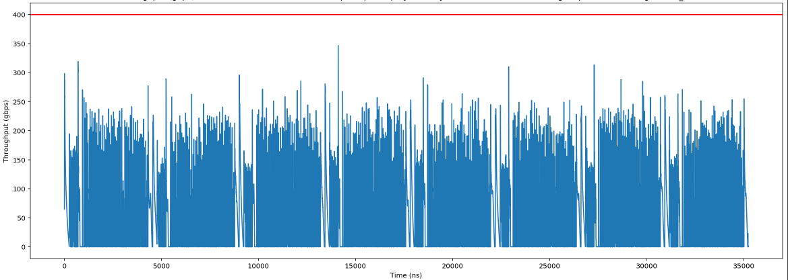
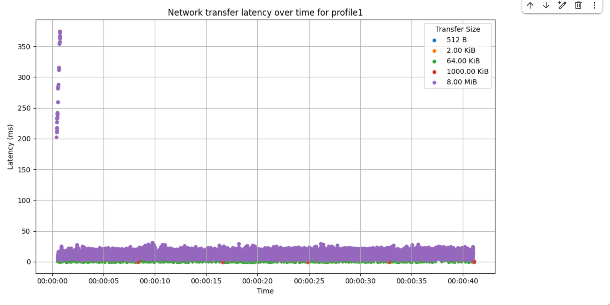

# Debugging Workflow

This document describe a general workflow for debugging MXLA issues.

## Prerequisite

1.  Use JAX 0.6 or up, and enable JAX distributed service. This version of JAX
    contains additional logging that can help identify which workers are
    experiencing issues.
2.  (Optional) Generate an HLO dump using the --xla_dump_to flag when
    initializing your workload. This is discussed in the [XLA
    documentation](https://openxla.org/xla/hlo_dumps).
3.  (Optional) Set --vmodule=real_program_continuator=1 to enable verbose
    logging for the TPU program execution status.

## Flow chart

The flowchart below illustrates the debugging process. To access detailed
playbooks for each step, click on the corresponding item in the chart.

<iframe src="flow_chart.svg" width="1000" height="2000" style="border: none;"></iframe>

<!-- linter style off -->

## Hangs

### Locate the Megascale Hang Detected Error

If you see the following error message in your TPU worker logs, this means that
MXLA timed out after detecting no progress:

```text
Megascale hang detected: Timed out waiting for 4 graphs to complete at launch_id 13650. Already completed: 100. StepGloballyInProgress: true. Timeout: 1m
```

1.  Workers will report errors to a coordinator for processing.
    *   For **Pathways** jobs: the digest can be found in the logs of
        `resource_manager` job.
    *   For **McJAX** jobs: the logs can be found on MXLA Coordinator. This is
        typically task 0 of slice 0.
2.  Check logs around time of error detection, and look for `Megascale detects a
    hang`.
3.  Follow steps below to diagnose the issue based on the identified cause.

### Diagnosis

#### Bad TPU Chip (tensor core or sparse core)

```text
Megascale detects a hang that is likely caused by bad TPU chips on the following hosts. Please remove the hosts from the fleet and restart the workload. If problem persists please contact Megascale XLA team.
  The host that have bad TPUs are: <host_name>
  Full error digest:
    Potential cause: Bad TPU chips
    Potential culprit workers: <job_name>/<task_id>:<host_name>
```

This error means that the issue is potentially caused by a faulty TPU chip. The
error message should include the job information and host name of the faulty
chip. In the example above, the faulty chip is on host `<host_name>`, affecting
task `<task_id>` of the job `<job_name>`. You can configure your job to avoid
that host.

**Note:** There are some cases that the hang was caused by a XLA or custom
pallas kernel bug, but if you see the same host appearing multiple times (for
example more than 3 times) in multiple hang events, the TPU on that host is very
likely faulty.

#### Networking issue

```text
Megascale detects a hang that is likely caused by a networking issue. Please examine the underlying networking stack for the following hosts.
  The hosts are: <host_name>
  Full error digest:
    Potential cause: Networking issue
    Potential culprit workers: <host_name_1>, <host_name_2>
```

This error indicates that your job has encountered a failed network link. The
error message should include a single or pair of job name, task id, host name of
the faulty network link. In the example above, the faulty network link is
between host `host_name_1` and `host_name_2`. Sometimes RapidEye can further
localize the faulty host if a single host appears in multiple broken network
links.

#### Different modules

```text
Megascale detects a hang that is likely caused by running different modules on different devices. Please confirm that all workers is running the exact same program. It can also be caused by a hang in a subset of devices and the unaffected devices have moved on to the next program. Please inspect the digest below to further root cause the hang.
Example hosts that have different HLO modules: <host_name>
Full error digest:
  Potential cause: Different module
  Potential culprit workers: <host_name>
  TPU stats:
    <host_name>: <pc>
  TPU states:
    Module: jit_loss_and_grad
    Fingerprint: <fingerprint>
    Launch ID: 193
      <tag>:<pc>(<hlo>): <host_name>
    Module: jit_optimizer_apply
    Fingerprint: <fingerprint>
    Launch ID: 0
      <tag>:<pc>(<hlo>): <host_name>
```

This error may indicate that a hang has occurred in a subset of workers, causing
those workers to be stuck at the current module while unaffected workers advance
to the next module. To identify the root cause, inspect the digest printed by
RapidEye in the logs.

The `TPU states` section of the logs shows which modules are running on which
workers. In the example above, workers are running different modules:
`jit_loss_and_grad` and `jit_optimizer_apply`.

#### Fingerprint mismatch for HLO module

```text
Megascale detects a hang that is likely caused by inconsistent HLO module compilation across workers. This is likely a bug in JAX tracing or XLA compiler. Please inspect the HLO dumps to confirm the root cause.
  Example hosts that have different HLO fingerprints: <host_name>
  Full error digest:
    Potential cause: Fingerprint mismatch
  Potential culprit workers: <host_name>
  TPU stats:
    Module: reduce.31
    Fingerprint: <fingerprint_1>
    Launch ID: 37
      <tag>:<pc>(<hlo>): <host_name>
    Module: reduce.31
    Fingerprint: <fingerprint_2>
    Launch ID: 40
      <tag>:<pc>(<hlo>): <host_name>
```

This log message indicates the hang was likely caused by inconsistent HLO module
compilation across workers, possibly due to an issue with JAX tracing or the XLA
compiler. If you see this log, follow [these
steps](https://openxla.org/xla/hlo_dumps) to collect HLO dumps from the culprit
workers for further debugging.

#### Data input stall

**Note:** This error is not yet implemented.

```text
Megascale detects a hang that is likely caused by data input stall on the
following hosts. Please check the workers to make sure the data input pipeline
is working properly.
  The host that have data input stalls are: <host_name>
```

This error means that all devices launched the same program, but that input data
was not provided to the program before the system timed out. To fix this issue,
confirm that:

1.  The identified hosts can access the input datasource.
2.  The identified hosts are properly loading/parsing the input datasource.
3.  Confirm identified hosts are not throttled on reads to the input datasource.

#### Unrecoverable error

```text
Some workers have halted with an unrecoverable error:
  <worker> : {some error}
  Please inspect the error log of these workers:
  <worker>
```

This error means that there was an issue that prevented the program from
properly executing and could not be recovered automatically. This error was
unable to be specifically categorized. Further information can be obtained from
checking the logs of the worker(s) mentioned in the error report.

If the error appears to be specific to the given machine (ex. failure to copy
data from TPU to host), then you can configure your job to avoid those hosts.

#### Unknown Error

```text
Megascale detects a hang but cannot determine the root cause. Please inspect the
full digest below.
```

This error means that there was an issue that prevented the program from
properly executing and could not be recovered automatically. This error was
unable to be specifically categorized and there is no further error information
available.

<!-- linter style on -->

## Performance

### Get an XProf session

Follow the instructions in the [XProf
documentation](https://openxla.org/xprof/capturing_profiles) to generate an
XProf trace for your problematic run.

### Check for shortage of mapped DMA buffers

The Megascale XLA runtime needs to register host memory before it can be used
for DMAs to and from the TPU. This happens early after the process starts. If
you see these registrations (`MapDmaBuffer` calls) at steady-state then it
indicates that something is wrong. Look for the presence of these calls in XProf
Trace Viewer. See the screenshot below for reference.

**Tip:** Search for the exact worker name, because there can be other workers
with similar or close names. You also search for the term “MapDmaBuffer” on the
page.


If the issue is observed then try to increase the size of the premapped memory
region by increasing the value of `--megascale_grpc_premap_memory_bytes`,
restarting the job, then checking again.

### Check for memory copies during network transfers

Megascale XLA network transfers are zero-copy by design. However, there are
cases where memory copies will occur and cause degraded performance. Look for
memory copies in Megascale's "Communication Transport" traces as shown in the
example screenshot below.


If the issue is observed then try to increase the size of the premapped memory
region by increasing the value of `--megascale_grpc_premap_memory_bytes`,
restarting the job, then checking again.

### Network Analysis

MegaScale also provides a Colab
[notebook](https://github.com/openxla/xla/blob/main/xla/megascale/tools/network_analysis_oss.ipynb)
to help analyze network performance using an XProf trace.

This tool can be used to do the following:

*   Examine transfer latencies to identify potential network slowdowns or host
    slowness.
*   Examine transfer sizes to identify if your workload is optimized to use a
    smaller number of larger transfers as opposed to a large number of small
    transfers.
*   Determine if your workload is unoptimized and produces bursty
    collectives/always has a large number of pending collectives.
*   Visualize the network throughput timeline to see if the workload is network
    bound.
*   Examine {source, destination} pairs to identify possible bad hardware on
    individual hosts.

#### Collective Slack Too Small

One indicator that your workload is not optimized for compute/communication
overlap is seeing small slack times for a subset of collectives. This can
manifest as longer than expected `recv-done` traces in the trace viewer, or as
collectives with zero or near-zero [slack
time](https://cloud.google.com/tpu/docs/troubleshooting/troubleshoot-multislice#slack_time).

If this is the case, look towards identifying bottlenecks in your workload that
may be causing parts of your program to not overlap compute and network
communication.

#### High Network Bandwidth Demand

If you are observing long `recv-done` op latencies within your model XProf, this
could be an indication that the model is 'Bandwidth Bound' in those portions of
the step function (is blocked by available network bandwidth in the system).

You can generate a timeline of network usage for your model. If you see
consistently high network usage throughout the step, or specific regions with
large spikes, then your model may be bandwidth bound in those regions.

Use the [Network Analysis](#network-analysis) to generate a timeline of network
usage: 

To mitigate bandwidth bound models, you can:

1.  Check the [Collective Slack](#collective-slack-too-small) of your model.
    Models with many collectives with low slack will have bandwidth bound
    regions.
2.  Confirm that the network settings are optimized.
3.  Examine your model structure and data sharding to see if there are ways to
    increase computation/communication overlap.
4.  (Data parallel models) Confirm that you have sufficient batch size in each
    local replica to overlap with the communication.

#### High Network Latency

If the bandwidth is not saturated, you may want to generate the RPC latency
timeline. If you see high RPC latencies is constantly or sporadically high, this
means that there are some issues with the MXLA RPCs.

Use the [Network Analysis](#network-analysis) to generate the RPC latency
timeline, the following example shows that there is some sporadic 200ms long
tail RPC latencies. 

#### Confirm Optimal Network Settings

High RPC latencies on Cloud environment are often caused by suboptimal TCP
configuration. Please confirm if all TCP parameters are configured
properly within the container.

If any of the TCP parameters are not correctly configured, consult Google Cloud
ML Compute Services (CMCS) team on how to configure them properly.

#### HLO Dump

Please follow [these steps](https://openxla.org/xla/hlo_dumps) to dump HLO to
the local filesystem on the TPU worker. You may need to upload the dump to GCS
in order to share them with the XLA or Megascale team.

## Straggler

**Note on Future Tooling:** Google is actively working on open-sourcing versions
of diagnostic dashboards to provide a more streamlined experience for Cloud TPU
customers to identify and diagnose stragglers. These will be available soon.