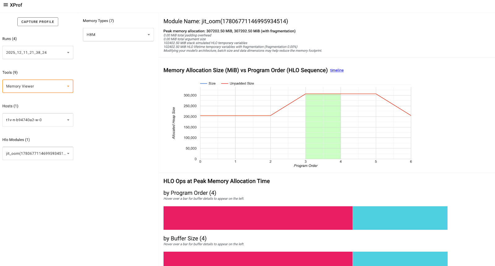

# Debug OOM errors with XProf

Out Of Memory (OOM) errors occur when the accelerator's (GPU or TPU) High
Bandwidth Memory (HBM) capacity is exhausted. Some common causes for OOM issues
and debugging techniques are detailed in
[E1000 - Compile Time HBM OOM documentation](./errors/error_1000.md) and
[JAX documentation on GPU memory allocation](https://docs.jax.dev/en/latest/gpu_memory_allocation.html#common-causes-of-oom-failures).

This page describes how to use **XProf's Memory Viewer tool** to visualize your
JAX program's memory usage, identify peak usage instances, and debug OOM errors.
This involves the following steps:

1.  Run your program with
    [`jax.profiler.trace`](https://docs.jax.dev/en/latest/_autosummary/jax.profiler.trace.html#jax.profiler.trace)
    to capture the profile.
2.  Start XProf in the background, and use the
    [Memory Viewer tool](https://openxla.org/xprof/memory_viewer) to view memory
    utilization details.

## Example program

The following JAX program leads to an OOM error:

```python
import jax
from jax import random
import jax.numpy as jnp


@jax.profiler.trace("/tmp/xprof")
@jax.jit
def oom():
    a = random.normal(random.PRNGKey(1), (327680, 327680), dtype=jnp.bfloat16)
    return a @ a


if __name__ == "__main__":
    oom()
```

**Note:** Prefer `jax.profiler.trace` instead of
`jax.profiler.start_trace`/`jax.profiler.stop_trace` because the
`jax.profiler.trace` context manager handles profiling in an exception safe
manner.

On a TPU-machine, this program fails with:

```shell
XlaRuntimeError: RESOURCE_EXHAUSTED: Allocation (size=107374182400) would exceed memory (size=17179869184) :: #allocation7 [shape = 'u8[327680,327680]{1,0:T(8,128)(4,1)}', space=hbm, size = 0xffffffffffffffff, tag = 'output of xor_convert_fusion@{}'] :: <no-hlo-instruction>
```

(On a GPU-machine, the error looks like: `XlaRuntimeError: RESOURCE_EXHAUSTED:
Out of memory while trying to allocate 214748364800 bytes.`)

## Run XProf

Install `xprof` (`pip install xprof`), and start an XProf instance specifying
the directory where the profile is stored:

```shell
xprof --logdir=/tmp/xprof/ --port=6006
```

Go to the instance (on a local machine, at `http://localhost:6006`). In the
*Tools* dropdown, select *Memory Viewer*, and in the Memory Viewer tool window,
select *HBM* in the *Memory Types* dropdown (usually selected by default).



The
[XProf: Memory Viewer tool documentation](https://openxla.org/xprof/memory_viewer#memory_viewer_components)
describes the components of the tool and the information presented.

Focus on the *HLO Ops at Peak Memory Allocation* section that shows three buffer
charts at the peak memory usage point. The buffer includes: * Program Inputs and
Outputs: Training batches, optimizer states, etc. * TensorCore and SparseCore
Temporaries: Dynamic memory required for intermediate calculations (like
activations, gradients, etc.)

You can hover on the buffer charts to get more details about the Op like it's
size, shape, allocation type, and more. This can help you identify and evaluate
Ops that may have high or long-lasting temporaries, any large
input/intermediate/output tensors that have inefficient padding, etc., that are
contributing to the peak memory and need to be adjusted or optimized.

Learn specific debugging techniques in
[E1000: Debugging](https://openxla.org/xla/errors/error_1000#debugging).
