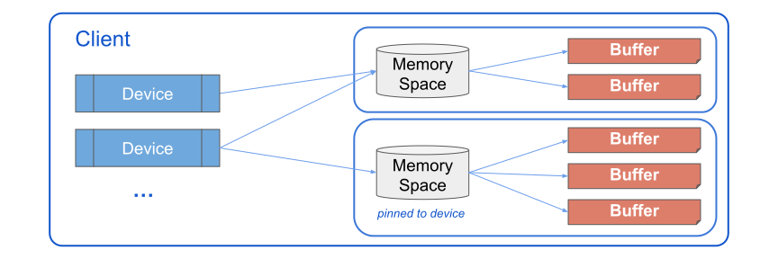

# PJRT C++ Device API Overview

## Background

[PJRT](https://github.com/openxla/xla/blob/c23fbd601a017be25726fd6d624b22daa6a8a4e5/xla/pjrt/c/pjrt_c_api.h)
is the uniform Device API that we want to add to the ML ecosystem. The long term
vision is that:

1. Frameworks (JAX, TF, etc.) will call PJRT, which has device-specific
   implementations that are opaque to the frameworks;
2. Each device focuses on implementing PJRT APIs, and can be opaque to the
   frameworks.

PJRT offers both a C API and C++ API. Plugging in at either layer is OK, the C++
API uses classes to abstract away some concepts, but also has stronger ties to
XLA datatypes. This page focuses on the C++ API.

## PJRT Components



Note: Most items in this diagram also have backpointers, memory spaces know
their device(s) and client, devices know their client, buffers know their memory
space.

### PjRtClient

_Full reference at [`pjrt_client.h > PjRtClient`](https://github.com/openxla/xla/blob/924b74d84de3760cc589fd1525c7346691d51df5/xla/pjrt/pjrt_client.h#L486)._

Clients manage all communication between the device and framework, and
encapsulate all state used in the communication. They have a generic set of APIs
for interacting with a PJRT plugin, and they own the devices and memory spaces
for a given plugin.

### PjRtDevice

_Full references at [`pjrt_client.h > PjRtDevice`](https://github.com/openxla/xla/blob/3e448cf9e86775a37ec5f7d3c69dfb20e0c760df/xla/pjrt/pjrt_client.h#L102),
and [`pjrt_device_description.h`](https://github.com/openxla/xla/blob/main/xla/pjrt/pjrt_device_description.h)_

A device class is used to describe a single device. A device has a device
description to help identify its kind (unique hash to identify GPU/CPU/xPU), and
location within a grid of devices both locally and globally.

Devices also know their associated memory spaces and the client it is owned by.

A device does *not* necessarily know the buffers of actual data associated with
it, but it can figure that out by looking through its associated memory spaces.

### PjRtMemorySpace

_Full reference at [`pjrt_client.h > PjRtMemorySpace`](https://github.com/openxla/xla/blob/3e448cf9e86775a37ec5f7d3c69dfb20e0c760df/xla/pjrt/pjrt_client.h#L72)._

Memory spaces can be used to describe a location of memory. These can either be
unpinned, and are free to live anywhere but be accessible from a device, or they
can be pinned and must live on a specific device.

Memory spaces know their associated buffers of data, and the devices (plural)
that a memory space is associated with, as well as the client it is a part of.

### PjRtBuffer

_Full reference at [`pjrt_client.h > PjRtBuffer`](https://github.com/openxla/xla/blob/3e448cf9e86775a37ec5f7d3c69dfb20e0c760df/xla/pjrt/pjrt_client.h#L1111)._

A buffer holds data on a device in some format that will be easy to work with
inside the plugin, such as an MLIR elements attr or a proprietary tensor format.
A framework may try to send data to a device in the form of an `xla::Literal`,
i.e. for an input argument to the module, which must be cloned (or borrowed), to
the device's memory. Once a buffer is no longer needed the `Delete` method is
invoked by the framework to clean up.

A buffer knows the memory space it is a part of, and transitively can figure out
which devices are able to access it, but buffers don't necessarily know their
devices.

For communicating with frameworks, buffers know how to convert to and from an
`xla::Literal` type:

```cpp
// Literal to Buffer
absl::StatusOr<std::unique_ptr<PjRtBuffer>> BufferFromHostBuffer(...) {...}

// Buffer to Literal
xla::PjRtFuture<> ToLiteral(xla::MutableLiteralBase* literal) override {...}
```

APIs for creating a buffer have [Buffer Semantics](https://github.com/openxla/xla/blob/3e448cf9e86775a37ec5f7d3c69dfb20e0c760df/xla/pjrt/pjrt_client.h#L858)
which help dictate if literal data from the host buffer can be shared or copied
or mutated.

Lastly, a buffer may need last longer than the scope of its execution, if it is
assigned to a variable in the framework layer `x = jit(foo)(10)`, in these cases
buffers allow building external references which provide a temporarily owned
pointer to the data held by the buffer, along with metadata (dtype / dim sizes)
for interpreting the underlying data.

### PjRtCompiler

_Full reference at [`pjrt_compiler.h > PjRtCompiler`](https://github.com/openxla/xla/blob/3e448cf9e86775a37ec5f7d3c69dfb20e0c760df/xla/pjrt/pjrt_compiler.h#L157)._

The `PjRtCompiler` class provides useful implementation details for XLA
backends, but is not necessary for a plugin to implement. In theory, the
responsibility of a `PjRtCompiler`, or the `PjRtClient::Compile` method, is to
take an input module and return a `PjRtLoadedExecutable`.

### PjRtExecutable / PjRtLoadedExecutable

_Full reference at [`pjrt_executable.h > PjRtExecutable`](https://github.com/openxla/xla/blob/3e448cf9e86775a37ec5f7d3c69dfb20e0c760df/xla/pjrt/pjrt_executable.h#L306),
and [`pjrt_client.h > PjRtLoadedExecutable`](https://github.com/openxla/xla/blob/3e448cf9e86775a37ec5f7d3c69dfb20e0c760df/xla/pjrt/pjrt_client.h#L1506)._

A `PjRtExecutable` knows how to take a compiled artifact and execution options
and serialize/deserialize them so an executable can be stored and loaded as
needed.

The `PjRtLoadedExecutable` is the in-memory compiled executable which is ready
for input arguments to execute, it is a subclass of `PjRtExecutable`.

Executables are interfaced with via one of the client's `Execute` methods:

```cpp
// Execute on addressable devices
absl::StatusOr<std::vector<std::vector<std::unique_ptr<PjRtBuffer>>>>
Execute(absl::Span<const std::vector<PjRtBuffer*>> argument_handles, ...) {...}

// Execute assigned replica/partition on the specified device
absl::StatusOr<std::vector<std::unique_ptr<PjRtBuffer>>>
ExecuteSharded(absl::Span<PjRtBuffer* const> argument_handles,
              PjRtDevice* device, ...) {...}

// Execute on specified device, single replica / partition
absl::StatusOr<std::vector<std::unique_ptr<PjRtBuffer>>>
ExecutePortable(absl::Span<PjRtBuffer* const> argument_handles,
                PjRtDevice* device, ...) {...}
```

Before calling `Execute` the framework will transfer all required data to
`PjRtBuffers` owned by the executing client, but returned for the framework to
reference. These buffers are then provided as arguments to the `Execute` method.

## PJRT Concepts

### PjRtFutures & Async Computations

If any part of a plugin is implemented asynchronously, it _must_ properly
implement futures.

Consider the following program:

```py
@jax.jit
def foo(x): return x + 1

x = foo(1)
# [...] other logic not using `x`
print(x + 1)
```

An async plugin would be able to enqueue the computation `x`, and immediately
return a buffer which isn't ready to be read yet, but execution will populate
it. Execution can continue to enqueue necessary computations after `x`, that
don't require `x`, including execution on other PJRT devices. Once the value of
`x` is needed, execution will block until the buffer declares itself ready via
the future returned by `GetReadyFuture`.

Futures can be useful to determine when an object becomes available, including
devices and buffers.

### Advanced concepts

Extending beyond implementing the base APIs will expand the features of JAX that
can be used by a plugin. These are all opt-in features in the sense that at
typical JIT and execute workflow will work without them, but for a production
quality pipeline some thought should likely be put into the degree of support
for any of these features supported by PJRT APIs:

- Memory spaces
- Custom layouts
- Communication ops like send/recv
- Host offloading
- Sharding

## Typical PJRT framework-device communication

### Example Log

The following is a log of the methods called to load the PJRT plugin and
execute `y = jax.jit(lambda x: jnp.power(x, jnp.int32(2)))(1)`. In this case
we log JAX interacting with the StableHLO Reference PJRT plugin.

<details>
<summary>Example log</summary>
<br>
<pre>

```
//////////////////////////////////
// Load the plugin
//////////////////////////////////

I client_cpp_pjrt.cc:55] StablehloReferencePjrtClient(0x23bac400)
I device.cc:53] StablehloReferenceDeviceDescription(0x23bac4f8)
I device.cc:104] StablehloReferenceDevice(0x23bac4e0)
I device.cc:123] client(0x23bac4e0)
I device.cc:123] client(0x23bac4e0)
I client_cpp_pjrt.cc:71] process_index(0x23bac400)
I client_cpp_pjrt.cc:67] platform_name(0x23bac400)
I device.cc:143] AttachDefaultMemorySpace(0x23bac4e0)
I client_cpp_pjrt.cc:67] platform_name(0x23bac400)
I client_cpp_pjrt.cc:86] devices(0x23bac400)
I client_cpp_pjrt.cc:81] addressable_device_count(0x23bac400)
I device.cc:168] description(0x23bac4e0)
I device.cc:168] description(0x23bac4e0)
I device.cc:86] Attributes(0x23bac4f8)
I device.cc:128] IsAddressable(0x23bac4e0)
I device.cc:168] description(0x23bac4e0)
I device.cc:61] process_index(0x23bac4f8)
I device.cc:123] client(0x23bac4e0)
I client_cpp_pjrt.cc:71] process_index(0x23bac400)
I client_cpp_pjrt.cc:81] addressable_device_count(0x23bac400)
I client_cpp_pjrt.cc:95] memory_spaces(0x23bac400)
I device.cc:128] IsAddressable(0x23bac4e0)
I device.cc:168] description(0x23bac4e0)
I device.cc:61] process_index(0x23bac4f8)
I device.cc:123] client(0x23bac4e0)
I client_cpp_pjrt.cc:71] process_index(0x23bac400)
I device.cc:148] memory_spaces(0x23bac4e0)
Creating PJRT Client from client
I client_cpp_pjrt.cc:108] platform_version(0x23bac400)
I client_cpp_pjrt.cc:67] platform_name(0x23bac400)
I device.cc:57] id(0x23bac4f8)
I device.cc:70] device_kind(0x23bac4f8)
I device.cc:70] device_kind(0x23bac4f8)
I device.cc:80] ToString(0x23bac4f8)
I device.cc:80] ToString(0x23bac4f8)
I device.cc:75] DebugString(0x23bac4f8)
I device.cc:75] DebugString(0x23bac4f8)
I device.cc:61] process_index(0x23bac4f8)
I device.cc:128] IsAddressable(0x23bac4e0)
I device.cc:168] description(0x23bac4e0)
I device.cc:61] process_index(0x23bac4f8)
I device.cc:123] client(0x23bac4e0)
I client_cpp_pjrt.cc:71] process_index(0x23bac400)
I device.cc:153] default_memory_space(0x23bac4e0)
I client_cpp_pjrt.cc:71] process_index(0x23bac400)

//////////////////////////////////
// RUN: `y = jax.jit(lambda x: jnp.power(x, jnp.int32(2)))(1)`
//////////////////////////////////

I executable.cc:309] num_partitions(0x240bab70)
I executable.cc:305] num_replicas(0x240bab70)
I executable.cc:309] num_partitions(0x240bab70)
I client_cpp_pjrt.cc:233] BufferFromHostBuffer(0x23bac400)
I buffer.cc:285] CreateMlirBufferFromLiteral
I buffer.cc:98] CreateFromLiteral
I buffer.cc:99] CreateFromLiteral: s32[] 2
I buffer.cc:64] MlirPjrtBuffer(0x240bb050)
I buffer.cc:102] CreateFromLiteral -> 0x240bb050
I buffer.cc:158] device(0x240bb050)
I buffer.cc:154] memory_space(0x240bb050)
I buffer.cc:154] memory_space(0x240bb050)
I executable.cc:328] GetHloModules(0x240bab70)
I executable.cc:240] Execute(0x240bab70)
I executable.cc:197] ExecuteWithReferenceInterpreter(0x240bab70)
I buffer.cc:303] GetAttributeFromBuffer
I buffer.cc:229] IsDeleted(0x240bb050)
I buffer.cc:311] GetAttributeFromBuffer(0x240bb050) -> dense<2> : tensor<i32>
I executable.cc:205] EvalModule:
module @jit attributes {mhlo.num_partitions = 1 : i32, mhlo.num_replicas = 1 : i32} {
  func.func public @main(%arg0: tensor<i32> {mhlo.layout_mode = "default"}) -> (tensor<i32> {jax.result_info = "", mhlo.layout_mode = "default"}) {
    // ...
    return %3 : tensor<i32>
  }
}
I executable.cc:206] Inputs: [dense<2> : tensor<i32>]
I executable.cc:213] Results: [dense<2> : tensor<i32>]
I device.cc:153] default_memory_space(0x23bac4e0)
I buffer.cc:291] CreateMlirBufferFromAttribute
I buffer.cc:116] CreateFromAttribute
I buffer.cc:64] MlirPjrtBuffer(0x22cea630)
I buffer.cc:122] CreateFromAttribute(dense<2> : tensor<i32>) -> 0x22cea630

//////////////////////////////////
// RUN: `print(y)`
//////////////////////////////////

I buffer.cc:263] GetReadyFuture(0x22cea630)
I buffer.cc:264] GetReadyFuture(0x22cea630)
I buffer.cc:154] memory_space(0x22cea630)
I buffer.cc:154] memory_space(0x22cea630)
I buffer.cc:158] device(0x22cea630)
I buffer.cc:158] device(0x22cea630)
I buffer.cc:154] memory_space(0x22cea630)
I buffer.cc:154] memory_space(0x22cea630)
I buffer.cc:229] IsDeleted(0x22cea630)
I buffer.cc:129] on_device_shape(0x22cea630)
I buffer.cc:129] on_device_shape(0x22cea630)
I buffer.cc:129] on_device_shape(0x22cea630)
I buffer.cc:158] device(0x22cea630)
I buffer.cc:154] memory_space(0x22cea630)
I buffer.cc:154] memory_space(0x22cea630)
I client_cpp_pjrt.cc:71] process_index(0x23bac400)
I buffer.cc:229] IsDeleted(0x22cea630)
I buffer.cc:129] on_device_shape(0x22cea630)
I buffer.cc:129] on_device_shape(0x22cea630)
I buffer.cc:269] IsOnCpu(0x22cea630) # Returns true, allows external references.
I buffer.cc:129] on_device_shape(0x22cea630)
I buffer.cc:129] on_device_shape(0x22cea630)
I buffer.cc:129] on_device_shape(0x22cea630)
I buffer.cc:129] on_device_shape(0x22cea630)
I buffer.cc:129] on_device_shape(0x22cea630)
I buffer.cc:168] AcquireExternalReference(0x22cea630)
I buffer.cc:73] MlirClonedExternalReference(0x2404d560)
I buffer.cc:303] GetAttributeFromBuffer
I buffer.cc:229] IsDeleted(0x22cea630)
I buffer.cc:311] GetAttributeFromBuffer(0x22cea630) -> dense<2> : tensor<i32>
I buffer.cc:291] CreateMlirBufferFromAttribute
I buffer.cc:116] CreateFromAttribute
I buffer.cc:64] MlirPjrtBuffer(0x240bb050)
I buffer.cc:122] CreateFromAttribute(dense<2> : tensor<i32>) -> 0x240bb050
I buffer.cc:168] AcquireExternalReference(0x22cea630)
I buffer.cc:73] MlirClonedExternalReference(0x240b6010)
I buffer.cc:303] GetAttributeFromBuffer
I buffer.cc:229] IsDeleted(0x22cea630)
I buffer.cc:311] GetAttributeFromBuffer(0x22cea630) -> dense<2> : tensor<i32>
I buffer.cc:291] CreateMlirBufferFromAttribute
I buffer.cc:116] CreateFromAttribute
I buffer.cc:64] MlirPjrtBuffer(0x23b2db60)
I buffer.cc:122] CreateFromAttribute(dense<2> : tensor<i32>) -> 0x23b2db60
I buffer.cc:263] GetReadyFuture(0x22cea630)
I buffer.cc:264] GetReadyFuture(0x22cea630)
```
</pre>
</details>
