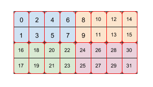

# Tiled layout

XLA TPU uses a variety of tile-based formats due to the two-dimensional nature
of its vector registers.

## Tiled formats

A tiled format breaks down a shape into tiles (usually 1D or 2D). Tiles are laid
out in memory in major to minor order (row major layout). Within a tile,
elements are also laid out in major to minor order.

 Figure 1

Figure 1 shows how an array F32[3,5] is laid out in memory with 2x2 tiling. A
shape with this layout is written as F32[3,5]{1,0:T(2,2)}, where 1,0 relates to
the physical order of dimensions (`minor_to_major` field in Layout) while (2,2)
after the colon indicates tiling of the physical dimensions by a 2x2 tile.

Intuitively, tiles are laid out to cover the shape and then within each tile,
elements are then laid out without tiling, as in the example above, where the
right part of the example shows the layout in memory, including the white
padding elements that are added in order to have complete 2x2 tiles even though
the original array bounds are not even.

The extra elements in the padding are not required to contain any particular
value.

## Linear index formulas for tiling given a shape and a tile

Without tiling, an element e=(en, en-1, ... ,
e1) in an array with array bounds d=(dn, dn-1,
... , d1) (d1 is the most minor dimension) is laid out by major to
minor order at position:

&nbsp;&nbsp; linear_index(e, d)  
= linear_index((en, en-1, ... , e1),
(dn, dn-1, ... , d1))  
= endn-1...d1 +
en-1dn-2...d1 + ... + e1

For simplicity of notation in this document we assume a tile has the same number
of dimensions as the array. In XLA's implementation of tiling, this is
generalized to tilings with fewer dimensions by leaving the initial most-major
dimensions unchanged and applying the tiling only to the most minor dimensions,
so that the tiling that is specified mentions a suffix of the physical
dimensions of the shape being tiled.

When tiling of size (tn, tn-1, ... , t1) is
used, an element in the array with indices (en, en-1, ...
, e1) is mapped to this position in the final layout:

&nbsp;&nbsp; linear_index_with_tile(e, d, t)  
= linear_index((⌊e/t⌋, e mod t), (⌈d/t⌉, t)) &nbsp; &nbsp; (arithmetic is
elementwise, (a,b) is concatenation)  
= linear_index((⌊en/tn⌋, ... ,
⌊e1/t1⌋, en mod tn, ... ,
e1 mod t1), (⌈dn/tn⌉, ... ,
⌈d1/t1⌉, tn, tn-1, ... ,
t1))  
= linear_index((⌊en/tn⌋, ... ,
⌊e1/t1⌋), (⌈dn/tn⌉, ... ,
⌈d1/t1⌉))∙tntn-1...t1 +
linear_index((en mod tn, ... , e1 mod
t1), (tn, tn-1, ... , t1))

The layout can be thought of as having two parts:
(⌊en/tn⌋, ... , ⌊e1/t1⌋), which
corresponds to a tile index in an array of tiles of size
(⌈dn/tn⌉, ... , ⌈d1/t1⌉), and
(en mod tn, ... , e1 mod t1), which
corresponds to a within-tile index. The ceil function appears in
⌈di/ti⌉ because if tiles overrun the bounds of the larger
array, padding is inserted as in Figure 1. Both the tiles and elements within
tiles are laid out recursively without tiling.

For the example in Figure 1, element (2,3) has tile index (1,1), and within-tile
index (0,1), for a combined coordinate vector of (1,1,0,1). The tile indices
have bounds (2,3) and the tile itself is (2,2) for a combined vector of
(2,3,2,2). The linear index with tile for the element with index (2,3) in the
logical shape is then

&nbsp;&nbsp; linear_index_with_tile((2,3), (3,5), (2,2))  
= linear_index((1,1,0,1), (2,3,2,2))  
= linear_index((1,1), (2,3)) ∙ 2 ∙ 2 + linear_index((0,1), (2,2))  
= (1 ∙ 3 + 1) ∙ 2 ∙ 2 + (0 ∙ 2 + 1)  
= 17.

$$ LinearIndexWithTile((2,3), (3,5), (2,2)) \\ = LinearIndex((1,1,0,1),
(2,3,2,2)) \\ = LinearIndex((1,1), (2,3)) \cdot 2 \cdot 2 + LinearIndex((0,1),
(2,2)) \\ = (1 \cdot 3 + 1) \cdot 2 \cdot 2 + (0 \cdot 2 + 1) \\ = 17 $$

## Tiling as pad-reshape-transpose

Tiling-based layout operates as follows:  
Consider an array of dimensions (dn, dn-1, ... , d1) (d1
is the most minor dimension). When it’s laid out with tiling of size
(tn, tn-1, ... , t1) (t1 is the most
minor dimension), that tiling can be described in terms of pad-reshape-transpose
in the following way.

1. The array is padded to (⌈dn/tn⌉∙tn, ... ,
   ⌈d1/t1⌉∙t1).
2. Each dimension i is broken into (⌈di/ti⌉,
   ti), i.e. the array is reshaped to  
   &nbsp; &nbsp; (⌈dn/tn⌉, tn, ... ,
   ⌈d1/t1⌉, t1).  
   There is no physical layout change in this reshape by itself, so this
   reshape is a bitcast. If one is not explicitly thinking of a tiling, this
   reshape could express any shape with the same number of elements as the
   padded shape - the example here is of how to express a tile in this way.
3. A transpose happens by moving tn, ... , t1 to the most
   minor dimensions while keeping their relative order, so that the order of
   dimensions from most major to most minor becomes  
   &nbsp; &nbsp; (⌈dn/tn⌉, ... ,
   ⌈d1/t1⌉, tn, ... , t1).

The final shape has the prefix  
&nbsp; &nbsp; (⌈dn/tn⌉, ... ,
⌈d1/t1⌉), which describes the number of tiles in each
dimension. An element in the array (en, ... , e1) is
mapped to this element in the final shape:  
&nbsp; &nbsp; (⌊en/tn⌋, ... ,
⌊e0/t0⌋, en mod tn, ... ,
e1 mod t1). It is easy to see that the linear index of the
element follows the formula above as expected.

## Repeated tiling

XLA's tiling becomes even more flexible by applying it repeatedly.

 Figure 2

Figure 2 shows how an array of size 4x8 is tiled by two levels of tiling (first
2x4 then 2x1). We represent this repeated tiling as (2,4)(2,1). Each color
indicates a 2x4 tile and each red border box is a 2x1 tile. The numbers indicate
the linear index in memory of that element in the tiled format. This format
matches the format used for BF16 on TPU, except that the initial tile is bigger,
namely the tiling is (8,128)(2,1), where the purpose of the second tiling by 2x1
is to collect together two 16-bit values to form one 32-bit value in a way that
aligns with the architecture of a TPU.

Note that a second or later tile can refer to both the minor within-tile
dimensions, which just rearranges data within the tile, as in this example with
(8,128)(2,1), but can also refer to the major cross-tile dimensions from the
prior tiling.

## Combining dimensions using tiles

XLA's tiling also supports combining dimensions. For example, it can combine
dimensions in F32[2,7,8,11,10]{4,3,2,1,0} into F32[112,110]{1,0} first before
tiling it with (2,3). The tile used is (&lowast;,&lowast;,2,&lowast;,3). Here an
asterisk in a tile implies taking that dimension and combining it with the next
more minor dimension. Multiple adjacent dimensions can be subsumed together into
one dimension. A subsumed dimension is represented by a tile value of -1 in that
dimension of the tile, which is not otherwise valid in a tile as a dimension
size.

More precisely, if dimension i of the shape is eliminated via an asterisk in the
tile, then before the prior definition of tiling is applied, that dimension is
removed from both the shape being tiled and the tile vector, and what was
dimension i-1 of the shape has its array bound increased from di-1 to
didi-1. This step is repeated for each asterisk in the
tile vector.

## Examples of tiling formats

This section shows examples of popular XLA formats.

1.  **Untiled format** - Most arrays not on the TPU use an untiled linear
    format, same as in e.g. C++.
2.  **TPU tile format** - The most common format in XLA/TPU is tiling by
    `8x128`, which matches the 32-bit `8x128` vector registers on a TPU.
3.  **TPU small tile format** (a.k.a. "Compact 2nd Minor Layout") - When the
    second most minor dimension size is 1 or 2, XLA/TPU instead tiles by `2x128`
    to save memory since a `2x128` tile is smaller than an `8x128` tile. When
    the second most minor dimension size is 3 or 4, XLA/TPU tiles by `4x128`.
4.  **TPU 16 bit tile format** - When array element type is BF16, the tiles we
    use are typically (8,128)(2,1). The second level of tiling does the
    so-called BF16 packing. See Figure 2 above, one element from an even row and
    one element from an odd row are laid out together and put in one 32-bit
    element. This format is used because TPUs work with 32 bit values natively
    and it is much more efficient to move data across the second most minor
    dimension than across the most minor dimension, so collecting two 16 bit
    values to get 32 bits from the same column is much more efficient than doing
    it in the more obvious fashion of taking two 16 bit values from the same
    row.
5.  **TPU 8 bit tile format** - The format here is very similar to the 16 bit
    format, the difference is just that we need to collect together 4 elements
    to get 32 bits instead of just the two, so the tiling becomes
    `(8,128)(4,1)`.
6.  **TPU 1 bit tile format** - TPUs currently use 1 byte for one boolean value,
    i.e. the size in bytes of the PRED element type is 1. It would be less
    wasteful to use a tiling by `(32,128)(32,1)` and use only 1 bit per element.
